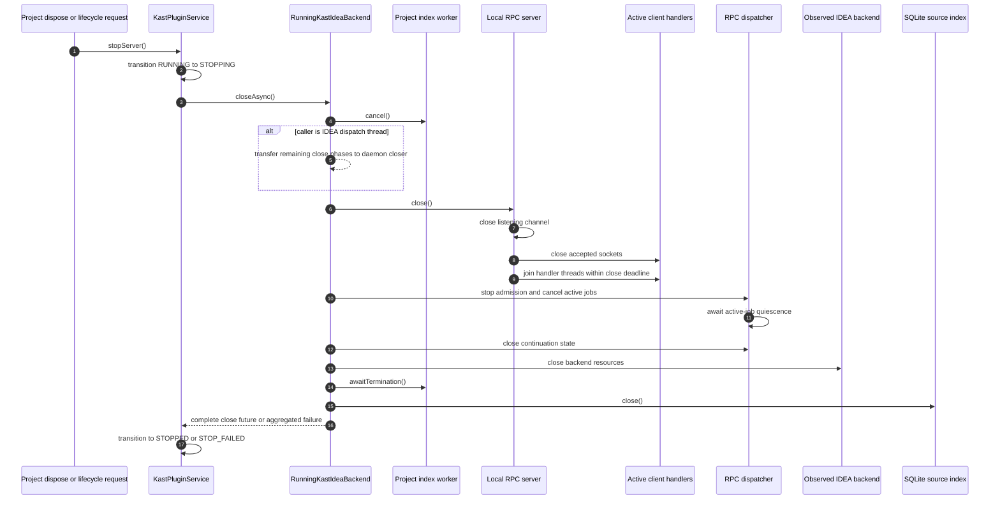
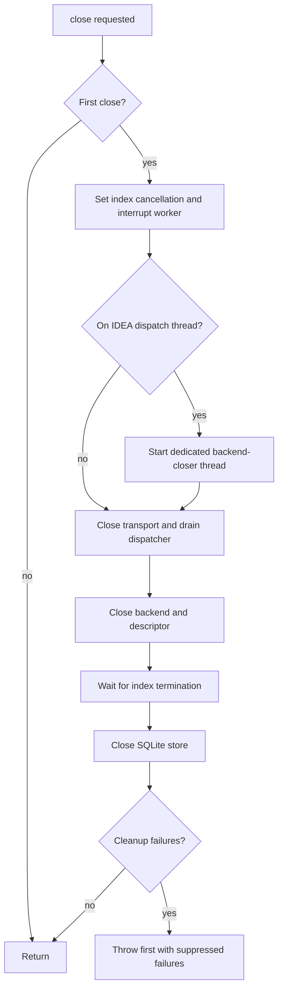

# IDEA Runtime Shutdown

`KastPluginService` is the project-level lifecycle owner.
`KastPluginBackendLifecycle` serializes start, stop, restart, and
configuration-driven transitions. Stop records `STOPPING` and retains the
backend close future until every drain phase completes. Only then can the
state become `STOPPED` or start a queued replacement.

The close path separates request ownership from index-store ownership. The
analysis server owns transport, dispatcher state, and the backend. The project
indexer shares the SQLite store, so the store must remain open until that
worker has terminated.

## Server close order

`RunningAnalysisServer.close()` is idempotent and executes four phases in
order:

1. Close the local transport. This closes the listening channel, prevents new
   accepted clients, closes active client sockets, and waits for their handler
   threads within the transport deadline.
2. Close the dispatcher. It rejects new work, cancels every admitted request,
   waits until those request jobs leave the backend, and then releases
   server-held continuation state.
3. Close the backend.
4. Remove the matching daemon descriptor.

The implementation retains the first close failure and adds later failures as
suppressed causes. One failed cleanup phase therefore does not skip the
remaining owned resources.

Lifecycle requests follow the same path after their success response is
flushed. The transport invokes the one-shot after-response action only after it
writes the response, so a shutdown request cannot cut off its own
acknowledgement.

## Index-worker close order

`RunningKastIdeaBackend.close()` cancels the index worker before it closes the
analysis server. Cancellation sets an atomic flag and interrupts the worker.
The worker signals a latch from its final block.

The source-index close then waits for that latch. If stop runs on IDEA's event
dispatch thread, Kast moves the complete blocking sequence—transport close,
request drain, backend close, index wait, and store close—to a dedicated daemon
thread. That avoids freezing the user interface while preserving the rule that
no admitted request or index worker can use a closed dependency.

## Restart

Restart records one replacement request while the current backend drains. The
replacement retains the current Gradle admission and starts only after the
close future succeeds. At most one server and one index worker can therefore
be registered as the service's active runtime.

Dynamic plugin unload uses IDEA's veto extension. The first unload request
starts every open Kast project drain and returns a clear retry message. Unload
remains vetoed while any service is `RUNNING`, `STOPPING`, or `STOP_FAILED`; a
later retry succeeds only when every service owns no live backend resources.
