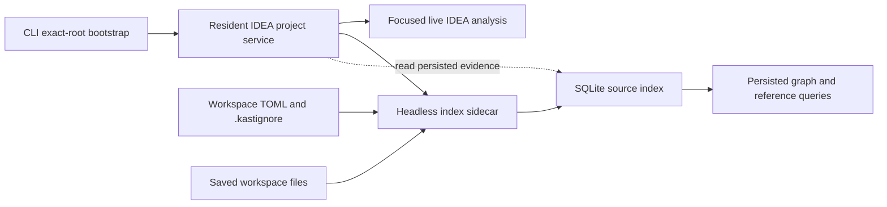

# VFS-Resilient Headless Indexing

**Status:** Proposed for review. The sections from **Proposed ownership** through
**Migration** are normative if this proposal is accepted.

**Audience:** Maintainers of the Kast runtime, index store, CLI, IDEA plugin,
headless backend, and release packages.

This proposal separates durable indexing from the interactive IDEA virtual file
system. It also makes partial graph and reference evidence useful without
claiming complete results.

## Problem

Users observe repeated incomplete graph failures when interactive IDEA virtual
file system activity cancels or invalidates graph and reference work. This is a
reported production symptom. This proposal does not claim a local reproduction.

The current implementation has nine relevant constraints:

1. macOS rejects explicit local headless runtime selection.
2. Semantic graph refresh runs in the requesting coroutine and checks both
   coroutine cancellation and IDEA progress cancellation.
3. Native graph source selection requires complete relationship indexing even
   though graph extraction reads PSI and Kotlin compiler facts directly.
4. Native graph reads reject globally incomplete persisted graph evidence.
5. Release setup bundles contain the headless backend, but the normal macOS
   installer downloads only the native CLI and IDEA plugin. It does not install
   or activate the bundled headless component.
6. The headless backend archive has no Java runtime. Its launchers select
   `JAVA_HOME` or `java` from `PATH`, so it is not a self-contained macOS
   sidecar.
7. Normal macOS setup disables public headless-backend selection, and the CLI
   process that starts headless does not remain as a supervisor.
8. Headless loads one configuration snapshot at startup, while semantic graph
   refresh still routes to the selected IDEA runtime and writes there.
9. The release builds one Linux headless archive with native IDEA libraries and
   reuses that archive in macOS setup bundles.

These constraints couple graph availability to interactive IDEA work and to a
separate reference-index stage. One cancelled or failed file can therefore make
all native graph operations unavailable.

## Goals

- Isolate durable graph and reference indexing from the interactive IDEA
  virtual file system.
- Preserve committed batches across cancellation, restart, and configuration
  changes.
- Let non-critical gaps produce qualified evidence instead of a global failure.
- Let a workspace opt into strict coverage for configured critical paths.
- Exclude generated output before it reaches any source-taking Kast operation.
- Apply indexing scope and batch-size changes without a runtime restart.
- Keep runtime readiness separate from graph and reference coverage.
- Start the managed sidecar without system Java or the interactive IDE runtime.

## Non-goals

- Merge unsaved IDEA document content into the persisted index.
- Add readiness rules for individual graph or reference operations.
- Let IDEA and headless backends write the same index.
- Replace generation-pinned SQLite reads.
- Add graph parallelism controls.
- Change the semantic implementation of focused IDEA analysis for admitted
  source paths.

## Proposed ownership

On macOS, the CLI bootstraps or reuses the exact-root IDEA project and returns.
The resident IDEA project service then manages one exact-root headless index
sidecar. The sidecar runs in a separate JVM with a separate virtual file system.
The macOS setup bundle combines the release-matched headless component with an
architecture-matched Java 21 runtime. The normal macOS install path installs
that self-contained sidecar.



The headless sidecar is the sole persistent writer. It indexes saved disk state
only. The IDEA backend keeps focused live analysis and may read persisted
evidence. It does not perform persistent graph or reference writes.

The managed sidecar starts automatically with the exact-root IDEA runtime even
when public `backends.headless.enabled` is `false`. This proposal makes that
setting authoritative for explicit standalone headless selection. When it is
`false`, automatic semantic backend selection excludes public headless
descriptors and a new explicit start or semantic request fails with
`HEADLESS_BACKEND_DISABLED`. Read-only lifecycle inspection and explicit stop
can still discover an existing standalone descriptor, so a live process is not
stranded when the setting changes. When it is `true`, the existing standalone
path remains available subject to the exact-root writer lease. The setting does
not gate the internal sidecar role. The sidecar remains available until the
resident project service stops.

Managed and standalone headless roles use the same exact-root writer lock and
admission-record locations. The first role to hold the writer lease remains the
sole writer; there is no automatic lock stealing. A standalone start while the
managed sidecar holds the lease fails with a typed writer-conflict error that
names the managed incumbent. If a standalone runtime already holds the lease,
the resident service does not start a second sidecar; persisted readers continue
to use the incumbent's admission endpoint and global coverage. The service
watches for an explicit standalone drain and stop, then rechecks host claims
before acquiring the released lock.
Switching in the other direction requires the resident project service to drain
and stop its managed sidecar before standalone startup can acquire the lease.

The internal sidecar does not publish a public runtime descriptor, register as
a semantic backend, or participate in automatic backend selection. The
exact-root IDEA runtime remains the public backend candidate. Explicit
standalone headless selection keeps its existing descriptor and discovery path.

The resident IDEA project service supervises the sidecar. A sidecar crash does
not stop the IDEA runtime. The service reports unavailable graph and reference
coverage, preserves the last committed generation, and restarts the sidecar
with bounded backoff.

The `index-store` exact-root coordination authority owns the writer-lease and
host-claim paths, schema, compare-and-set rules, and monotonic generation. IDEA
and Android Studio project services register live claims through that authority;
the Rust bootstrap, managed sidecar, and standalone sidecar are clients. Managed
startup requires exactly one claim and binds the supervisor lease to that claim
identity and generation. The generation advances when the live claim-identity
set changes, not when an unchanged claim renews its heartbeat.

The service and sidecar both watch the authority. When a second supported host
claims the root, the authority records ambiguity before the second service can
start a sidecar. A running managed sidecar stops admitting reads and work,
discards its uncommitted unit, releases the writer lock, and exits; the resident
service does not restart it. Both host runtimes report graph and reference
coverage unavailable, and bootstrap returns `IDEA_HOST_AMBIGUOUS`. When one live
claim remains, that service can start a new managed sidecar only after the old
writer lock is free.

The admission barrier synchronously reads the coordination authority; it does
not rely on delivery of the watch notification. A managed sidecar treats any
claim-identity or generation change as terminal. A standalone incumbent is not
bound to one host claim: on a non-ambiguous zero-to-one, one-to-zero, or
single-host replacement it rejects old tokens, discards its uncommitted unit,
and rebinds to the new generation. It pauses admission and work while claims are
ambiguous, then rebinds when the authority becomes non-ambiguous.

Before a sidecar commits a batch, it acquires a shared host-claim commit guard,
revalidates the permitted generation, and holds the guard through the SQLite
commit. Claim publication requires the incompatible exclusive guard. A claim
therefore publishes either before validation and rejects the batch, or after a
completed batch; it cannot appear between validation and commit.

The sidecar exposes an exact-root read-admission endpoint beside the database.
Every persisted graph and reference reader checks this endpoint before and
after a generation-pinned SQLite read. The admission token binds the sidecar
instance, store generation, scope fingerprint, project-model semantic
fingerprint, filesystem event epoch, host-claim generation,
resolved-configuration fingerprint, committed critical-path acceptance-ledger
generation, and evidence-family state. A missing endpoint, a changed token, or
failed revalidation makes that evidence family `UNAVAILABLE`; SQLite coverage
alone never admits a persisted read. This authority is separate from IDEA
runtime readiness.

The private admission record is
`<database-parent>/sidecar/admission.json`; its default endpoint is
`<database-parent>/sidecar/admission.sock`. When that Unix-domain-socket path
exceeds Kast's existing 100-byte safe threshold, the shared workspace-path
resolver selects its deterministic short hashed socket path. The admission
record always contains the actual endpoint. The CLI derives these locations
from the same database and workspace-path authorities; it does not use backend
discovery.

After it owns the writer lock and opens the store, the sidecar atomically
publishes the canonical-root digest, release, instance and supervisor lease
identifiers, socket path, and protocol version. The directory and files are
owner-only. A reader validates the owner, root digest, release, and protocol
before it connects. Graceful exit unlinks both `admission.json` and the socket
node. After a crash, the resident service can unlink both stale paths only after
the endpoint is unreachable and the writer lock is free. A replacement sidecar
then publishes a new identity.

Before it issues or revalidates a token, the sidecar performs a synchronous
filesystem event barrier on its own platform watcher. It asks each native event
producer for a sequence fence and waits until the watcher consumes the marker
that follows every earlier filesystem mutation; draining the current queue is
not sufficient. It then hashes affected compiler inputs, rescans affected
compiler-input roots, and commits fingerprint invalidation before it advances
the event epoch and replies. A save completed before the fence request is
therefore processed before admission. The post-read check takes a second
producer fence; a save during the SQLite read changes the epoch and rejects that
result.

If a producer cannot prove the fence, reports dropped or coalesced history, or
crosses a mount generation, the sidecar compares a complete deterministic
snapshot of the watched input set with its committed Merkle root. It issues no
token when that comparison cannot complete. This barrier does not use the
interactive IDEA virtual file system.

The watch set is independent of source admission. It covers every compiler
input in a semantic cohort and every filesystem model input recorded by the
last complete Gradle import, including inputs outside admitted roots or an
external included build. Model-input provenance includes custom files read
during configuration, not only known Gradle filenames. If the import cannot
provide complete provenance or the sidecar cannot watch an input, both evidence
families remain `UNAVAILABLE`.

A model-affecting saved input includes any file in that provenance. Gradle build
and settings scripts, `gradle.properties`, version catalogs, `buildSrc`, and
convention-plugin sources are common examples. When the barrier observes one,
it atomically marks the project model stale and both evidence families
`UNAVAILABLE` before it can reply. The sidecar requests a model refresh and
issues no admission token until a completed model snapshot is reconciled and
its fingerprint is committed. Existing facts remain stored but cannot be
served against the old model.

The service establishes an exact-root, lease-bound local control channel when
it starts the sidecar. Persistent graph and reference refresh requests enqueue
an evidence-family refresh through that channel; the IDEA request handler no
longer performs the write.

Rust remains the sole TOML, `.kastignore`, and configuration-precedence parsing
authority. A configuration mutation projects and sends one complete resolved
JSON snapshot through the control channel. For external edits, the resident
service watches the global configuration file at
`$KAST_CONFIG_HOME/config.toml`, the workspace TOML, and `.kastignore`, then
invokes the release-matched Rust projection and forwards its snapshot. The
sidecar also watches those raw inputs and their parent directories only to
fence create, replace, save, and delete events; it does not parse them or
recompute precedence. Such an event makes configuration pending and both
evidence families `UNAVAILABLE` before the admission barrier replies. The Rust
snapshot carries canonical input paths, content digests, and a resolved
configuration fingerprint. The sidecar issues no token until those digests
match its barrier view and scope and coverage reconciliation commits the new
fingerprint. `analysis-api` owns the snapshot schema, including the new ignored
and critical collections.

Shutdown sends drain and waits for acknowledgment before the service closes
shared state. Request cancellation can stop waiting for an acknowledgment, but
it cannot cancel work after the sidecar accepts it.

The service is the sole holder of the supervisor end of the control channel.
The sidecar treats control-channel EOF or supervisor-lease expiry as terminal.
It stops accepting work, discards any uncommitted unit, closes the store,
releases the writer lock, and exits. Lease expiry is the fallback when process
death does not deliver EOF. A replacement service waits for that lock release
before it starts a new sidecar.

## Source admission

A model-owned candidate is a canonical exact-root Kotlin source file that the
complete headless IDEA and Gradle model assigns to a source set. A symbolic link
must resolve inside the exact root. An unowned file is not a candidate.

If the project model is missing or stale, the worker does not reconcile the
store. It preserves the last committed generation and reports graph and
reference coverage as `UNAVAILABLE` until the model is complete.

The worker computes one effective source set in this order:

1. Normalize the candidate under the exact workspace root.
2. Reject hard-excluded output.
3. Detect ignore-critical overlap against the remaining model-owned candidates.
4. Apply repository and workspace ignore rules.
5. Classify the remaining path as critical or non-critical.
6. Attach Gradle module and source-set ownership.

A candidate that completes all six steps is an eligible file.

### Hard exclusions

Hard exclusions apply to source inventory, graph, reference, diagnostics,
symbol, and mutation path admission. Commands that do not admit a source path
are unaffected. No configuration can re-include a hard-excluded path.

The hard-exclusion authority combines:

- Gradle and IDEA model output or excluded roots;
- `.gradle` cache roots owned by the workspace or a declared Gradle build;
- the `build` output root of each declared Gradle project and the `out` output
  root of each IDEA content root;
- built plugin output below those roots.

A directory name alone does not prove that a path is output. An explicit Gradle
or IDEA output or excluded root always wins over any nested source root. If no
explicit output root covers the path, a more-specific independent Gradle build
root is classified before the conventional name of its parent directory. For
example, an included build rooted at `build/` can admit
`build/src/main/kotlin` only when the parent model does not mark `build/` as
output; that build's own `build/build/` output remains hard-excluded. This rule
prevents generated classes, packaged plugins, sandboxes, and copied sources
from entering semantic operations without rejecting an independent build by
name alone.

### User ignore rules

The repository root can contain `.kastignore`. Its path separator is `/`. A
leading slash is an anchor token, not a filesystem-root marker. Exactly one
leading slash anchors a pattern at the workspace root. A trailing slash matches
directories. `**` matches across directory boundaries. `#` starts a comment,
`!` re-includes a prior match, and the last matching pattern wins. Hard
exclusions still win over negation. URI schemes, drive or volume prefixes,
network-root prefixes with two leading slashes, and parent traversal are
invalid.

The machine-local workspace TOML can add `indexing.ignoredPaths`. Repository
and workspace ignore rules affect graph and reference indexing only. They do
not change focused diagnostics, mutation, or other interactive analysis.
The effective ignore set is the union of the final `.kastignore` result and
all matching workspace ignore patterns. A `.kastignore` negation cannot
re-include a workspace-ignored path.

All effective configuration inputs and `.kastignore` are watched. A valid
change reconciles the persisted inventory without a restart. Newly ignored
files lose current graph and reference facts. Newly admitted files become
pending.

### Critical paths

The machine-local workspace TOML owns one shared
`indexing.criticalPaths` collection. It applies to graph and reference
coverage. The default collection is empty.

Workspace ignored and critical collections accept positive repository-relative
patterns. They use the same anchoring, directory, and wildcard rules as
`.kastignore`, but do not accept comments or negation.

A model-owned candidate that survives hard exclusion cannot match both ignored
and critical rules. Conflict validation uses the post-hard-exclusion,
pre-ignore candidate inventory, not abstract pattern intersection or the final
filtered inventory. A future file that creates a conflict makes the new
inventory invalid and leaves the last valid physical scope active. Both graph
and reference coverage immediately become `INCOMPLETE` with limitation
`IGNORE_CRITICAL_CONFLICT`; persisted-evidence operations remain rejected until
the conflict is resolved. Existing committed facts are not deleted by this
validation failure.

Adding a critical pattern that matches no current eligible file is a typed
configuration error. After a pattern is accepted, deleting or renaming its
last match does not invalidate the configuration. It makes graph and reference
coverage `INCOMPLETE` with a typed unmatched-critical-path limitation until a
file matches again or the pattern is removed.

The Rust workspace mutation authority keeps a critical-path acceptance ledger
beside the machine-local workspace TOML, outside both raw user configuration
and the rebuildable index store. Each Rust-issued receipt binds a normalized
pattern to the source-inventory fingerprint under which it first matched, the
exact resolved-configuration fingerprint, and a ledger generation. A new CLI or
external-edit pattern remains pending behind the configuration admission fence.

Rust first forwards a typed candidate snapshot through the control channel. The
sidecar drains its filesystem barrier and uses its current eligible inventory to
return either an unmatched error or an inventory proof bound to the sidecar
instance, candidate configuration fingerprint, model fingerprint, filesystem
event epoch, and store generation. Rust does not recompute eligibility. It
durably records a `PENDING` receipt only from that proof, then forwards the
prepared resolved snapshot and ledger generation. The sidecar revalidates every
proof binding, commits the prepared ledger generation with the scope
fingerprint, and returns that durable store commit as acknowledgment. A changed
binding makes Rust abort the pending receipt and restart the exchange.

Rust promotes a receipt to `COMMITTED` only after that acknowledgment; this
promotion is the acceptance linearization point. It then forwards the committed
ledger state. The sidecar issues no admission token until its prepared scope and
the Rust `COMMITTED` generation agree. After a crash, Rust promotes a pending
receipt only when the store still proves its prepared commit. Otherwise it
aborts and reproves the candidate. A cold rebuild reapplies only committed
receipts; it reproves pending receipts instead of treating them as acceptance.

Removal atomically replaces the receipt with a durable revocation tombstone
before Rust forwards the snapshot that omits the pattern. The tombstone survives
restart and remains until a future current match produces a new receipt. After a
crash, Rust replays the pending ledger generation, and admission stays blocked
until the ledger, resolved configuration, and committed scope generations agree.
Only the Rust authority can issue or revoke receipts. A missing database or cold
schema rebuild therefore preserves the distinction between a rejected new
unmatched pattern and an accepted obligation that later became unmatched.

Each accepted pattern is a critical obligation. The obligation is fulfilled
only while it matches at least one eligible file. Every file matched by a
fulfilled obligation is critical. Deletion, hard exclusion, or loss of source
ownership can therefore make an accepted obligation unmatched.

If a new live configuration snapshot is syntactically invalid, the worker keeps
the last valid scope and reports the error. It does not apply a partial
configuration and does not stop. A resolved ignore-critical conflict follows
the `INCOMPLETE` rule above even while the last physical scope remains active.

The CLI provides idempotent collection mutations:

```shell
kast config add indexing.criticalPaths 'module/src/main/**' --workspace-root "$PWD"
kast config remove indexing.criticalPaths 'module/src/main/**' --workspace-root "$PWD"
kast config add indexing.ignoredPaths 'samples/**' --workspace-root "$PWD"
kast config remove indexing.ignoredPaths 'samples/**' --workspace-root "$PWD"
```

Adding an existing value and removing an absent value are successful no-ops.
Malformed patterns, URI schemes, drive or volume prefixes, network-root
prefixes, parent traversal, and ignore-critical conflicts fail with typed
configuration errors.

## Work order

Graph and reference indexing are independent pipelines. Graph work does not
wait for relationship outcomes. Reference work does not wait for graph
outcomes.

Semantic graph pending-work selection, source progress, coverage fingerprints,
and coverage classification must not read relationship-stage terminality.
Reference-derived topology remains reference evidence; removing these gates
does not make that topology independent of reference indexing.

Each pipeline uses this stable priority order:

1. critical paths;
2. `main` source sets;
3. `testFixtures` source sets;
4. `test` source sets;
5. the existing module-priority order;
6. normalized path order.

The worker uses bounded batches and short SQLite transactions. Existing
`indexing.relationships.enabled`, `indexing.relationships.batchSize`,
`indexing.relationships.parallelism`, and
`indexing.relationships.modulePriorityDepth` settings remain authoritative for
references. Module priority depth computes step 5 only for work with an
active-module anchor. An explicit saved-path refresh uses the owning module as
that anchor. Startup, file-watch reconciliation, and whole-workspace refresh
have no anchor and skip step 5; they continue with normalized path order. A new
positive integer `indexing.graph.batchSize` replaces the hard-coded semantic
graph batch size. The worker reloads these values with the other watched scope
settings.

When `indexing.relationships.enabled` changes to `false`, the worker discards
uncommitted reference work and schedules no new reference work. It retains
committed reference facts but does not serve them. Reference coverage becomes
`UNAVAILABLE` with limitation `REFERENCE_INDEXING_DISABLED`; graph scheduling
and graph coverage do not change. When the setting changes to `true`, the
worker schedules current reference work from the persisted inventory and
normal reference coverage computation resumes.

## Cancellation and retry

Cancellation is a scheduling result, not a file failure. The worker stops the
current uncommitted unit, keeps it pending, and retries it with bounded
backoff. Earlier committed batches remain available.

Three consecutive non-cancellation failures for one complete stage input
fingerprint make that stage `LIMITED`. The fingerprint includes source content,
admitted membership and ownership, project model, and semantic cohort. The
worker retries limited work at a slower periodic interval. A change to any
fingerprint component or an explicit refresh starts a new failure sequence and
makes that work immediately eligible again.

Only facts or boundary evidence tied to the complete current stage input
fingerprint and a current `COMPLETE`, `LIMITED`, or `EXTERNAL_BOUNDARY` outcome
are queryable. Prior facts for any changed input are stale and cannot appear in
a qualified result.

A reference `EXTERNAL_BOUNDARY` remains a distinct terminal outcome for its
complete current stage input fingerprint. It preserves the externalized failure
identity and exposes the existing limited unknown boundary; it does not migrate
to `LIMITED`. It is re-evaluated after that fingerprint changes, or after
explicit refresh. On a critical file it makes reference coverage `INCOMPLETE`.
On a non-critical file it makes reference coverage `QUALIFIED`. It does not
affect semantic graph coverage.

The retry policy has one owner in the workspace worker. Request handlers do not
implement their own retry loops.

## Global coverage

Runtime readiness, graph coverage, and reference coverage are three separate
facts. One cannot imply another.

Graph and reference pipelines each publish one global coverage state:

| State | Meaning | Operation behavior |
| --- | --- | --- |
| `COMPLETE` | Every eligible file has current complete evidence, and every critical obligation is fulfilled. | Run with current evidence. |
| `QUALIFIED` | Every critical obligation is fulfilled and all critical files are complete, but non-critical work is pending, stale, limited, external-boundary, or failed. | Run and return global coverage limitations. |
| `INCOMPLETE` | A critical obligation is unmatched, a critical file lacks current complete evidence, or an ignore-critical conflict is active. | Reject operations for that evidence family. |
| `UNAVAILABLE` | No admissible persisted generation can be served, including while the project model is unavailable or that evidence family is explicitly disabled. | Reject operations for that evidence family. |

State precedence is `UNAVAILABLE`, `INCOMPLETE`, `COMPLETE`, then `QUALIFIED`.
After availability is established, active ignore-critical conflicts, unmatched
critical obligations, and incomplete critical files are evaluated before the
empty or fully complete inventory cases.

All operations that read persisted semantic graph evidence use the global graph
state. All operations that read persisted reference evidence or
reference-derived topology use the global reference state. Reference-derived
topology remains reference evidence even when a result presents it beside
graph facts. It does not gate semantic graph construction or graph coverage.
The design does not compute path-specific or operation-specific readiness.

Focused live IDEA reference search remains a runtime semantic operation. It can
use the existing live PSI fallback when persisted reference evidence is
unavailable or empty, and it retains its per-request relationship coverage. It
does not write persisted evidence and does not derive a new global reference
state. Runtime readiness, not persisted reference coverage, admits that live
operation.

A graph result admits its semantic graph section from the global graph state.
It includes reference-derived topology only when the global reference state is
`COMPLETE` or `QUALIFIED`. If reference coverage is `INCOMPLETE` or
`UNAVAILABLE`, the result omits that topology, attaches the corresponding
reference error and counts, and retains the graph operation exit status.

A qualified positive result is usable. A qualified empty result is not proof
that no matching fact exists. Results must retain the generation, global state,
counts, and limitation codes that explain that boundary.

Availability depends on committed inventory and stage outcomes, not on a
non-empty fact table. A compatible store without a committed current inventory
is `UNAVAILABLE`. After inventory commit, zero eligible files is `COMPLETE` only
when there is no unmatched critical obligation. An accepted obligation that
lost its last match keeps the state `INCOMPLETE`.
With eligible files and no critical obligations, non-critical pending work is
`QUALIFIED`. A complete stage can emit zero facts and still counts as complete.

`COMPLETE` and `QUALIFIED` persisted-evidence operations exit successfully.
`INCOMPLETE` and `UNAVAILABLE` graph operations retain
`GRAPH_EVIDENCE_INCOMPLETE` and `GRAPH_EVIDENCE_UNAVAILABLE`. Persisted
reference operations use the corresponding `REFERENCE_EVIDENCE_INCOMPLETE` and
`REFERENCE_EVIDENCE_UNAVAILABLE` typed errors. These errors exit non-zero.
Errors and qualified results include total, complete, critical-file,
critical-obligation, unmatched-critical-obligation, pending, stale, limited,
ignore-critical-conflict, external-boundary, and failed counts. No operation
computes a different global readiness state from its requested symbol or path.

Graph and reference states can differ. For example, graph coverage can be
`COMPLETE` while reference coverage is `QUALIFIED`.

## Persistence and consistency

The sidecar preserves the existing exact-root SQLite database and generation
contract. It scans outside transactions and serializes short writes. Readers
pin one generation and reject mixed-generation results.

The project-model semantic fingerprint contributes to both stage input
fingerprints, together with source content, admitted membership, and source
ownership. The model fingerprint represents the source's Gradle dependency
closure, compiler arguments, content-addressed classpath or ABI entries,
language settings, and source-set identity. A completed model refresh compares
those per-source fingerprints and, in one transaction, marks affected graph and
reference outcomes pending before it advances the model generation. Unchanged
modules retain their facts. If a hard-excluded dependency has no complete
classpath or ABI fingerprint, affected evidence remains `UNAVAILABLE`; the
sidecar does not ingest that path as source.

Each stage input also contains a semantic cohort fingerprint: a normalized
Merkle root of compiler-input source content hashes for the source's compilation
unit and its transitive Gradle source-dependency closure. It includes model-owned
user-ignored sources that can contribute declarations, while graph and reference
outcomes remain restricted to admitted sources. A peer declaration change
therefore invalidates unchanged admitted sources in the same compilation unit
and every downstream compilation unit whose closure changed. One short
transaction marks both stage outcomes pending before the filesystem event epoch
and store generation advance. The shared fingerprint does not make either
pipeline wait for the other pipeline's outcome.

A change to `.kastignore`, ignored paths, hard exclusions, or source ownership
invalidates only affected stage work. A critical-path change updates priority
and coverage metadata without invalidating current facts.

The exact-root writer lease centralizes cross-mode arbitration. Managed and
standalone writers cannot overlap, while read-only CLI and IDEA consumers can
continue to use SQLite generation checks as the incumbent commits later
batches.

The shared `index-store` coordination authority owns the writer-lock protocol
and lock-file path beside the exact-root database. A managed or standalone
sidecar acquires the operating-system lock and holds its file descriptor before
it opens the store for writes. IDEA opens persisted evidence read-only in
sidecar mode. Startup fails the contender with a typed writer-conflict error if
another process holds the lock.

The release cutover first asks the old IDEA index worker to stop and drain. The
resident service requires confirmation that the worker closed its writable
store; an older writer is not assumed to honor the new lock. Without
confirmation, the sidecar does not start or migrate and the service reports
`INDEX_WRITER_CUTOVER_FAILED`. After confirmation, the sidecar can acquire the
lock and open the store. The operating system releases the lock when the
sidecar exits, so a matching service can recover after a crash without guessing
writer liveness.

One scope-reconciliation transaction removes excluded graph and reference
facts, records the new scope fingerprint, acceptance-ledger generation, and
coverage metadata, and advances the store generation. New admissions remain
pending after that commit. A reader therefore cannot observe removed facts with
the new coverage claim.

## macOS distribution and lifecycle

The macOS setup bundle includes a release-matched headless component and an
architecture-matched Java 21 runtime. The component uses its own IntelliJ
libraries, plugin files, and Java runtime. It does not reuse the interactive
IDEA application files and does not download a runtime on first use.

The launcher assigns workspace-keyed `idea.config.path`, `idea.system.path`,
log, and temporary directories below machine-local Kast state. The key is a
stable digest of the canonical exact root and sidecar release identity. Two
concurrent roots therefore do not share IntelliJ caches or locks. One exact
root still owns only one sidecar.

The sidecar uses only its bundled Java runtime. Its launcher resolves `java`
inside the installed sidecar and fails with a typed installation error when
that runtime is absent or has the wrong architecture. It does not fall back to
`JAVA_HOME`, `java` from `PATH`, or the interactive IDE Java runtime.

The release pipeline currently places one Linux-built headless backend archive
in every setup bundle. That archive contains platform-native libraries and no
JVM. This design builds separate macOS arm64 and x64 headless archives on
matching macOS runners, combines each with its matching Java runtime, and
changes the public install and runtime routes to use the complete payload.
Setup verification must prove:

- the bundled sidecar matches the installed Kast release;
- the headless archive and native libraries match the setup-bundle platform;
- the bundled Java runtime matches the setup-bundle architecture;
- the sidecar starts with `JAVA_HOME` unset and no system `java` on `PATH`;
- the sidecar starts on macOS for one exact workspace root;
- IDEA and the sidecar have distinct process and virtual file system state;
- only the sidecar opens the index for writes;
- stopping the exact-root runtime drains the sidecar before shared state closes.

The release produces and records separate macOS arm64 and x64 headless backend
artifacts before it assembles the setup bundles. Release checksum and provenance
checks cover each native backend, matching Java runtime, and final setup bundle.
Release review must also confirm the IntelliJ and Java runtime redistribution
terms and report the setup-bundle and resident-memory increase.

The Rust bundle manifest records the native sidecar and Java runtime as separate
components with their checksums, architecture, release identity, and install
paths. Rust packaging and install operations validate and activate the pair in
one transaction, write both components to the installation receipt, and roll
both back on failure. `install.sh` remains a delegate to that authority.

General runtime readiness remains independent of sidecar indexing progress.
Status output reports runtime readiness, graph coverage, and reference coverage
as separate fields.

## Migration

The implementation adds an explicit online migration from the current
production schema to the sidecar schema. One transaction adds the required
scope and coverage metadata and preserves admitted inventory and raw legacy rows
as non-queryable lineage. Legacy model provenance is absent from the current
schema, so the migration does not assign a new model fingerprint to those rows.
It marks graph and reference work pending for every admitted source, applies the
legacy-boundary transformation below, advances the generation, and commits
before the sidecar serves queries. Reindexing under the completed current model
makes new outcomes queryable. A failed supported migration rolls back,
preserves the old database, and reports coverage as `UNAVAILABLE`; it does not
fall through to destructive rebuild.

Any other unsupported schema version follows the existing cold rebuild path.
That path makes graph and reference coverage `UNAVAILABLE`, recreates the
schema, commits a new inventory, and then computes coverage normally. It makes
no retained-fact claim. The Rust-owned critical-path acceptance ledger remains
beside the workspace TOML and is reapplied to the new inventory; the rebuilt
store does not infer or erase committed acceptance. Pending receipts are
reproved, not reapplied. Migration does not infer complete coverage from old
module summaries.

For a current relationship `EXTERNAL_BOUNDARY`, the online migration preserves
the relationship outcome and reason identity as non-queryable lineage and
queues relationship re-evaluation. It removes the legacy semantic-graph boundary
that relationship externalization projected as `UNKNOWN`, marks semantic graph
work pending for the new complete stage input fingerprint, and queues graph
extraction. The legacy projection does not become graph evidence or graph
coverage. A re-evaluated external boundary follows the normal current-model
coverage contract.

The initial scope reconciliation removes hard-excluded inventory and removes
graph and reference facts for user-ignored files. It retains current admitted
lineage, including relationship external-boundary outcomes and their reason
identity, and queues both stages. Only outcomes produced under the complete
current stage input fingerprint become queryable. Existing generation checks
remain active during this transition.

macOS keeps the current IDEA backend as the interactive default. The change
removes the local headless prohibition only for the managed index-sidecar path.
It does not make public mutation commands select an unleased headless backend.

## Verification plan

Implementation is complete only when the following checks exist and pass:

1. Configuration tests cover the Rust resolved JSON snapshot, `.kastignore`,
   collection mutations, global and workspace precedence, external-edit live
   reload and admission fencing, Rust-issued critical-path acceptance receipts
   across a cold rebuild, pending-receipt recovery, stale candidate-proof
   rejection, add and removal crashes, tombstone replay, relationship disable
   and re-enable, anchored and unanchored module priority depth, semantic
   output-root classification, hard-exclusion precedence over nested generated
   source roots, independent builds named `build`, and pre-ignore conflict
   detection with hard-exclusion precedence.
2. Index-store tests cover independent graph and reference progress, the
   fact-preserving current-schema migration, unsupported-schema cold rebuild,
   legacy rows remaining non-queryable until reindex, external-boundary graph
   cleanup, model-only dependency, compiler argument, and classpath changes,
   admitted and user-ignored peer declaration changes invalidating unchanged
   callers in the same and downstream compilation units, scope reconciliation,
   global coverage states, and retained generations.
3. A RED worker integration test injects request cancellation and proves the
   current request-owned path stops remaining graph work. The same test then
   proves the workspace-owned worker continues. This proves isolation without
   claiming reproduction of the reported production contention.
4. Worker tests prove cancellation remains pending, three repeated failures for
   one complete stage input become a retryable limited outcome, a model or peer
   change starts a new failure sequence, current external-boundary evidence
   keeps its reason identity, and stale prior facts stay unqueryable.
5. Runtime tests under each supported macOS host—IntelliJ IDEA 2026.2/build 262
   and Android Studio 2026.1.2/build 261—prove startup owns one exact-root
   sidecar and one persistent writer even when public headless selection is
   disabled. Refresh forwarding, scope reload, crash, and cutover cases must
   prove acknowledgment, lock release, restart, drain, and generation
   preservation. Focused live reference tests retain PSI fallback without
   persisted-reference admission. Discovery tests prove the internal sidecar
   publishes no runtime descriptor and automatic backend selection still
   selects only the exact-root host runtime. Selection tests prove public
   headless disablement returns `HEADLESS_BACKEND_DISABLED` without blocking the
   internal role. Lifecycle tests prove a disabled existing standalone runtime
   remains inspectable and stoppable but is not selected for semantic work.
   Writer-arbitration tests cover managed-first and standalone-first startup,
   typed incumbent errors, explicit standalone drain and stop, and lock handoff
   without overlapping writers. Standalone tests cover zero-to-one, one-to-zero,
   and single-host-replacement generation rebinding. Dual-host tests cover
   simultaneous claims and a second host arriving after managed indexing starts.
   They require `IDEA_HOST_AMBIGUOUS`, immediate admission refusal,
   supervisor-lease revocation, sidecar exit, and writer-lock release before
   either host can restart managed indexing. A commit-race test injects the
   second claim between generation validation and SQLite commit and proves the
   claim or batch completes first under the coordination guard, never both
   concurrently.
   Persisted-reader tests reject a missing or changed admission token and a
   sidecar that fails post-read revalidation. They also cover long-path fallback,
   record identity validation, graceful unlink, and stale record and socket
   cleanup. Watcher tests prove the pre-read filesystem barrier invalidates a
   completed fingerprint, a delayed producer delivery is consumed before token
   issue, dropped history falls back to a complete snapshot comparison, a
   concurrent save fails post-read revalidation, and raw configuration saves
   block admission until the matching Rust snapshot and scope reconciliation
   commit.
   Supervisor-crash tests prove control-channel EOF or lease expiry stops the
   orphan, releases its lock, and permits replacement.
6. Packaging tests prove native macOS arm64 and x64 headless artifacts contain
   matching native libraries and that the normal install path installs the
   matching Java 21 runtime. A launch test unsets `JAVA_HOME`, removes system
   `java` from `PATH`, and proves the installed sidecar selects its bundled
   runtime. Transaction tests prove the bundle manifest, installation receipt,
   and rollback cover both the native sidecar and Java runtime.
7. Under each supported host, a macOS integration check edits a saved Kotlin
   file while the host is active, attempts reads both before and during sidecar
   reconciliation, and proves no stale generation is admitted without using the
   host virtual file system for persistence. It also saves a model-affecting
   input and proves both evidence families become unavailable before admission
   and remain unavailable until a completed model refresh is reconciled. Cases
   cover external included-build inputs, custom Gradle configuration inputs, and
   incomplete provenance.
8. A macOS integration check opens two exact-root projects concurrently and
   proves their sidecars use distinct IntelliJ config, system, log, and
   temporary directories.

## Implementation ownership

| Contract | Owning area |
| --- | --- |
| Exact-root bootstrap | `cli-rs/src/execution/runtime/` |
| Resident host-claim registration, supervision, refresh forwarding, and writer cutover | `backend-idea/` |
| Sidecar control, runtime status, and typed result contracts | `analysis-api/`, `backend-headless/`, and `cli-rs/src/semantics/` |
| Saved-file project model and background worker | `backend-headless/` |
| Focused live analysis and read-only persisted access | `backend-idea/` |
| Exact-root coordination, host-claim CAS, writer lease, stage state, scope reconciliation, and generations | `index-store/` |
| Workspace collections, `.kastignore`, precedence, and resolved JSON projection | `cli-rs/src/configuration/`, `backend-idea/`, and `analysis-api/` |
| Critical-path receipt and ledger authority | `cli-rs/src/configuration/` |
| Critical-path inventory proof and prepared scope-generation commit | `backend-headless/` and `index-store/` |
| Native macOS component and Java runtime manifest, packaging, installation, receipt, and rollback | `cli-rs/src/configuration/bundle.rs`, `cli-rs/src/operations/package.rs`, `cli-rs/src/operations/install/`, `install.sh`, `.github/workflows/release.yml`, and `.github/scripts/release/actions/build-setup-bundle/` |

## Consequences

- Interactive IDEA virtual file system pressure cannot directly cancel durable
  index ownership.
- Non-critical failures no longer make all graph or reference evidence
  unavailable.
- Projects can opt into strict global coverage without changing default
  usability.
- The worker consumes memory for a second IntelliJ JVM on macOS.
- Saved disk state, not unsaved editor state, becomes the persistent evidence
  authority.
- Operators must inspect three independent states instead of treating runtime
  readiness as graph readiness.

## Rejected alternatives

- **Run a background job inside IDEA.** It still shares the interactive virtual
  file system and cancellation environment.
- **Let both backends write.** This adds writer election and recovery without a
  second required writer.
- **Keep graph refresh request-owned.** A cancelled client can still stop
  durable progress.
- **Make graph wait for references.** The graph extractor does not consume the
  persisted relationship stage.
- **Compute readiness per operation.** One global state per evidence family is
  sufficient until a measured use case requires finer scope.
- **Persist unsaved document overlays.** This would mix interactive and durable
  source authority.
- **Reuse system Java or the interactive IDE runtime.** This would make sidecar
  startup depend on workstation or host-application state.
- **Download the sidecar on demand.** Startup would depend on network state and
  could install a release-mismatched backend.

## Related current-state references

- [IDEA indexing and generation](flows/indexing-and-generation.md)
- [Native graph refresh and queries](flows/graph-queries.md)
- [IDEA integration architecture decisions](architecture-decisions.md)
- [IDEA shutdown](flows/shutdown.md)
