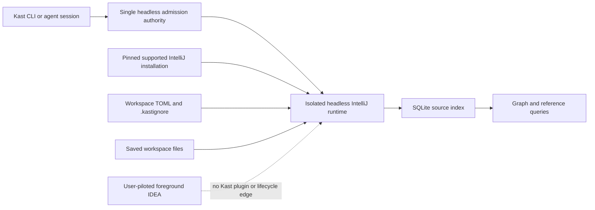

# Headless-Only VFS-Resilient Semantic Runtime

**Status:** Implemented on the PR 502 branch. This document remains the
acceptance record for the headless-only migration and supersedes the earlier
IDEA-coordinated sidecar design.

**Audience:** Maintainers of the Kast runtime, index store, CLI, headless
backend, installer, release workflow, and the retiring public IDEA plugin.

This plan makes one isolated headless JVM the sole semantic backend. Foreground
IntelliJ IDEA and Android Studio remain user-piloted applications. Kast does not
install a public plugin into them, open or close their projects, publish their
workspace metadata, bind a semantic endpoint inside them, or use them as a
fallback.

The private `kast-headless` IntelliJ plugin remains inside the isolated
headless distribution. It supplies the IntelliJ, Kotlin, and Gradle services
needed for compiler-backed analysis. It is not a public foreground plugin.

## Pre-migration problem

Before this implementation, the foreground plugin started a complete IDEA semantic backend during
project open. It indexes, imports Gradle state, publishes semantic capabilities,
and binds the same exact-root socket as headless. Socket startup and shutdown
delete that shared path without proving ownership.

The failure was observed on the review machine on 2026-08-01. In two cycles,
foreground IDEA started its backend, in-IDE indexing failed with
`ProcessCanceledException`, the IDEA backend stopped, and a replacement
headless runtime appeared. At inspection time, the descriptor registry had one
healthy `READY` headless runtime and no IDEA candidate, while agent readiness
still reported managed `idea`. No structured hydration event or direct process
termination signal was recorded, so this plan does not claim either as direct
log evidence.

The source establishes the outage mechanism:

1. `KastStartupActivity` enters `KastProjectOpenAutoIndexing`, which starts
   `KastPluginService` and the foreground analysis server.
2. IDEA and headless derive the same socket from the exact root.
3. `UnixDomainSocketRpcServer` unlinks that path before bind and on close.
4. A headless descriptor can therefore reach an IDEA server, fail backend
   identity validation, and be treated as an unusable headless candidate.
5. Runtime repair can then terminate and replace that headless process.
6. Headless also invokes plugin-profile initialization, which writes trusted
   metadata with `preparedBy = kast-intellij-plugin` and `backend = idea`.
7. Readiness prefers that plugin-authored metadata over installed headless
   evidence.

Configuration is not an adequate safety boundary. During inspection,
`runtime.defaultBackend` was `headless`, but IDEA was enabled despite the
reported disabled setting. The architecture must remain safe when configuration
or stale plugin state drifts.

## Goals

- Make headless the only semantic backend for reads, mutations, graph work,
  readiness, leases, and lifecycle commands.
- Put headless admission and retired-IDEA rejection behind one typed boundary.
- Remove all foreground IDEA semantic startup, routing, metadata, socket, and
  installation paths.
- Isolate durable graph and reference indexing from every foreground IDEA
  virtual file system.
- Preserve committed batches across cancellation, restart, and configuration
  changes.
- Let non-critical gaps produce qualified evidence instead of a global failure.
- Let a workspace opt into strict coverage for configured critical paths.
- Exclude generated output before it reaches any source-taking Kast operation.
- Apply indexing scope and batch-size changes without a runtime restart.
- Keep runtime readiness separate from graph and reference coverage.

## Non-goals

- Merge unsaved IDEA document content into the persisted index.
- Retain focused semantic analysis inside foreground IDEA.
- Use an IDEA project-open event to start or stop headless.
- Use filesystem or process watching to infer open workspace roots.
- Add a launchd coordinator before continuous crash supervision is a confirmed
  requirement.
- Delete or rename all shared implementation currently under `backend-idea/`
  in the first cut. It can remain only when unreachable from foreground IDEA.
- Add readiness rules for individual graph or reference operations.
- Replace generation-pinned SQLite reads.
- Add graph parallelism controls.

## Target ownership

Kast owns one exact-root headless runtime. Foreground IDEA has no Kast-owned
control or data path.



The headless runtime is the sole semantic server and persistent writer. It
indexes saved disk state. An agent session or explicit Kast command starts or
reuses it for one canonical root. Foreground IDEA opening or closing has no
effect on the headless PID, descriptor, endpoint, generation, or readiness.

The installed IntelliJ application is a versioned runtime input only. Kast may
use its JBR and platform files to run the isolated payload, but it does not
attach to the foreground process or its VFS. If more than one supported
installation exists, a persisted explicit host selection resolves the
ambiguity.

## Single admission boundary

`cli-rs/src/execution/runtime/backend/workspace_admission.rs` is the sole public
seam. It delegates to one owned private module,
`cli-rs/src/execution/runtime/backend/headless_authority.rs`, which contains the
policy and proof constructors and exposes one admission entrypoint:

```rust
pub(crate) fn admit_headless_runtime(
    request: SemanticRuntimeRequest,
) -> Result<AdmittedHeadlessRuntime, SemanticRuntimeRejection>;
```

`AdmittedHeadlessRuntime` has private fields and a private constructor. It
proves the canonical root, backend-qualified endpoint, descriptor schema, PID,
version, headless backend kind, required readiness, health, status identity,
and capability identity. It is the only value accepted by RPC session creation,
semantic read and mutation routes, leases, effective readiness, and semantic
lifecycle operations.

This entrypoint can delegate to private observation and lifecycle helpers. It
is not one god function. The invariant is that one private conversion is the
only production match that decides whether a semantic backend is headless or
retired IDEA. The private constructor makes a second policy decision
unrepresentable downstream.

The same module owns a pure legacy-config migration planner. It invokes that
same private conversion and returns either no change or a typed patch from the
retired IDEA value to headless. Setup can persist the returned patch, but it
cannot parse, compare, or classify a backend value itself. This is a second
consumer of the one policy decision, not a second decision point.

The boundary follows these hard rules:

1. Missing or automatic backend selection resolves to headless.
2. Explicit IDEA selection and legacy `defaultBackend = "idea"` return one
   typed `IDEA_SEMANTIC_BACKEND_RETIRED` rejection.
3. A stale IDEA descriptor or plugin metadata record is quarantined. It cannot
   create ambiguity, become selected, or cause a headless process to be killed.
4. Exact-root, backend-kind, health, readiness, and descriptor identity checks
   happen inside this boundary.
5. Downstream code cannot receive `BackendName`, `RuntimeBackendPreference`, a
   backend string, or an optional backend and make another semantic decision.
6. IDEA remains parseable only at legacy ingress so the boundary can return the
   typed retirement error.
7. More than one valid headless runtime for the canonical root returns
   `HEADLESS_RUNTIME_CONFLICT`; lifecycle code does not guess which PID owns the
   workspace.

This is a compiler-enforced cut. Delete distributed selection and fallback
logic instead of adding headless checks to each call site. In particular,
`raw_rpc_session*`, workspace admission, workspace lifecycle, leases,
readiness, status projection, workspace-file queries, graph refresh, and
mutation dispatch must consume the admitted proof type.

## Evidence method and freshness

This planning pass queried the private, ignored Graphify indexes for the Rust,
shell, workflow, packaging, test, and documentation corpus. Those graphs were
built at `36b8d302`; the reviewed source was `c8d7930e3`. The graph exposed the
distributed runtime-selection, lease, readiness, installer, release, and
documentation surfaces. Every retained graph-derived surface was then checked
against current source. Graph health warnings and the older build commit mean
the graph is a routing aid, not implementation proof.

Kotlin and Gradle relationships were checked through Kast and direct current
source. Graphify was not used as Kotlin semantic authority. The decisive Kotlin
fact is that `HeadlessRuntime` starts `KastIdeaBackendRuntime`; shared code under
`backend-idea/` therefore remains on the headless production path.

## Review finding reconciliation

The architecture simplifies routing, but it does not repair independent
indexing defects. No original finding becomes out of scope.

| # | Prior finding | New-scope status | Current proof and required disposition |
| --- | --- | --- | --- |
| 1 | Start and supervise the sidecar during normal IDEA bootstrap. | Simplified | `workspace.rs:110` still tries IDEA before headless, while `workspace.rs:193` only spawns and reaps headless. Delete IDEA bootstrap ownership and start or reuse headless directly. Add crash supervision only if it is an explicit requirement. |
| 2 | Route persistent refresh work to the sidecar. | Superseded by single admission | `external.rs:72` passes no backend and graph `entrypoint.rs:205` forwards an optional backend. Do not add checks there. Both must receive an admitted headless runtime. |
| 3 | Hold the writer lock for the writer process. | Retained | `WorkspaceLaunchLock` ends when the CLI invocation returns, while headless keeps the store open read-write. Add an exact-root lock held for the writer process lifetime. |
| 4 | Keep public mutations off the indexing sidecar. | Superseded with replacement | Foreground IDEA mutation authority is retired. Headless may expose mutation capabilities only through the same admitted runtime plus an exact authenticated lease. Remove plugin-metadata admission. |
| 5 | Require current inventory completeness before exact graph coverage. | Retained | `coverage/read/classify.rs:61` omits `SourceIndexProgressIncomplete`, and line 69 rejects a valid empty inventory. Fix both claims. |
| 6 | Apply hard exclusions relative to the workspace root. | Retained | `SourceIndexFilePolicy` accepts no root, while `IdeaProjectIndexer.kt:350` supplies absolute paths. Make the root-relative representation typed. |
| 7 | Remove graph evidence when files leave indexing scope. | Retained | `KastIdeaBackendRuntime.kt:250` still sends an empty removed-path list during automatic reconciliation. Commit tombstones for deleted and newly ignored files. |
| 8 | Hash the same representation during graph planning and extraction. | Retained | `SemanticGraphOperations.kt:250` hashes disk bytes; line 289 hashes PSI text. Use one content representation and hash type. |
| 9 | Preserve reference-index state instead of flattening it. | Retained | `KastDiagnosticsService.kt:221` maps both `READY` and `DEGRADED` to one Boolean. Carry the typed reference state and limitations. |
| 10 | Wait for the third repeated PSI failure before marking `LIMITED`. | Retained | `FileStageInventoryStore.kt:265` limits after one prior matching failure, so the second failure is promoted. Persist or derive the required attempt count. |
| 11 | Accept valid multiline TOML arrays. | Retained | `TomlConfigParser.kt:49` requires the current string to end with `]`. Use a real document-level TOML parse for arrays. |
| 12 | Prevent workspace ignored paths from undoing `.kastignore`. | Retained | `WorkspaceIndexingScope.kt:92` concatenates rules, and line 158 accepts configured negation. Reject negation in workspace ignored paths and preserve repository exclusion. |
| 13 | Reject invalid indexing patterns before writing configuration. | Retained | `mutation.rs:319` checks only blanks and control characters. Share the pattern parser at the mutation boundary before persistence. |
| 14 | Preserve leading-slash Gitignore anchoring. | Retained | `WorkspaceGlob.parse` removes the leading slash before it computes anchoring. Capture anchoring before normalization. |

The clean cut resolves the ownership assumptions behind findings 1, 2, and 4.
Finding 3 and findings 5 through 14 remain required because the headless
runtime executes the same persistent indexing implementation.

## Additional cross-pollution findings

| Finding | Current evidence | Required cut |
| --- | --- | --- |
| Foreground semantic startup is active. | Public `plugin.xml` registers startup, project services, settings, status, and tool-window extensions; `KastPluginService` calls `KastIdeaBackendRuntime.startPrepared`. | Remove the public plugin entrypoint and artifact. No inert semantic backdoor remains. |
| Headless publishes IDEA authority. | `HeadlessRuntime.kt:117` invokes profile auto-init; `PluginWorkspaceBootstrap.kt:121`, `:128`, and `:131` write IDEA identity. | Remove plugin-profile initialization from headless. Publish headless-owned typed evidence only. |
| Endpoint ownership is unsafe. | `WorkspacePaths` hashes only the root; `LocalRpcServer.kt:49` and `:90` unlink the shared path. | Use the headless endpoint exclusively and make bind and close ownership-safe against stale processes. |
| Readiness prefers plugin evidence. | `agent_readiness.rs:93` returns trusted plugin metadata before installed backend evidence. | Derive semantic readiness from the admitted live headless descriptor. |
| Setup revives IDEA. | `idea_plugin.rs:268` replaces a prior headless default with IDEA defaults at line 298. | Remove the migration and make existing IDEA settings non-authoritative. |
| Public delivery still requires the plugin. | Bundle/package code stages `plugins/kast.zip`; release builds and publishes IDEA assets. | Remove public plugin inputs, artifacts, jobs, feeds, tests, and documentation while retaining internal `kast-headless` packaging. |

## Source admission

An eligible file is a canonical exact-root Kotlin source file that the complete
headless IntelliJ and Gradle model assigns to a source set. A symbolic link must
resolve inside the exact root. An unowned file is not eligible.

If the project model is missing or stale, the worker does not reconcile the
store. It preserves the last committed generation and reports graph and
reference coverage as `UNAVAILABLE` until the model is complete.

The worker computes one effective source set in this order:

1. Normalize the candidate under the exact workspace root.
2. Reject hard-excluded output.
3. Apply repository and workspace ignore rules.
4. Classify the remaining path as critical or non-critical.
5. Attach Gradle module and source-set ownership.

### Hard exclusions

Hard exclusions apply to source inventory, graph, reference, diagnostics,
symbol, and mutation path admission. Commands that do not admit a source path
are unaffected. No configuration can re-include a hard-excluded path.

The hard-exclusion authority combines:

- Gradle and headless IntelliJ output or excluded roots;
- any path with a `.gradle`, `build`, or `out` directory component;
- built plugin output below those roots.

This rule prevents generated classes, packaged plugins, sandboxes, and copied
sources from entering semantic operations.

### User ignore rules

The repository root can contain `.kastignore`. Its path separator is `/`. A
leading slash anchors a pattern at the workspace root. A trailing slash matches
directories. `**` matches across directory boundaries. `#` starts a comment,
`!` re-includes a prior match, and the last matching pattern wins. Hard
exclusions still win over negation. Absolute patterns and parent traversal are
invalid.

The machine-local workspace TOML can add `indexing.ignoredPaths`. Repository
and workspace ignore rules affect graph and reference indexing only. They do
not change focused diagnostics, mutation, or other focused semantic operations.
The effective ignore set is the union of the final `.kastignore` result and
all matching workspace ignore patterns. A `.kastignore` negation cannot
re-include a workspace-ignored path.

The workspace worker compares the content fingerprints of both files on one
bounded poll interval and on explicit refresh. It does not subscribe to
filesystem events. A valid change reconciles the persisted inventory without a
restart. Newly ignored files lose current graph and reference facts. Newly
admitted files become pending.

### Critical paths

The machine-local workspace TOML owns one shared
`indexing.criticalPaths` collection. It applies to graph and reference
coverage. The default collection is empty.

Workspace ignored and critical collections accept positive repository-relative
patterns. They use the same anchoring, directory, and wildcard rules as
`.kastignore`, but do not accept comments or negation. A value such as
`/module/src/**` is a workspace-root-anchored pattern. It is not a filesystem
absolute path. Values with a volume or system root such as
`/Users/name/project/**`, or with `..`, are invalid.

A resolved eligible file cannot be both ignored and critical. Conflict
validation uses the current resolved source inventory, not abstract pattern
intersection. A future file that creates a conflict makes the new inventory
invalid and leaves the last valid scope active.

Adding a critical pattern that matches no current eligible file is a typed
configuration error. After a pattern is accepted, deleting or renaming its
last match does not invalidate the configuration. It makes graph and reference
coverage `INCOMPLETE` with a typed unmatched-critical-path limitation until a
file matches again or the pattern is removed.

Each accepted pattern is a critical obligation. The obligation is fulfilled
only while it matches at least one eligible file. Every file matched by a
fulfilled obligation is critical. Deletion, hard exclusion, or loss of source
ownership can therefore make an accepted obligation unmatched.

If a live configuration is invalid, the worker keeps the last valid scope and
reports the error. It does not apply a partial configuration and does not stop.

The CLI provides idempotent collection mutations:

```shell
kastctl config add indexing.criticalPaths 'module/src/main/**' --workspace-root "$PWD"
kastctl config remove indexing.criticalPaths 'module/src/main/**' --workspace-root "$PWD"
kastctl config add indexing.ignoredPaths 'samples/**' --workspace-root "$PWD"
kastctl config remove indexing.ignoredPaths 'samples/**' --workspace-root "$PWD"
```

Adding an existing value and removing an absent value are successful no-ops.
Malformed patterns, paths outside the root, and ignore-critical conflicts fail
with typed configuration errors.

## Work order

Graph and reference indexing are independent pipelines. Graph work does not
wait for relationship outcomes. Reference work does not wait for graph
outcomes.

Semantic graph pending-work selection, source progress, coverage fingerprints,
and coverage classification must not read relationship-stage terminality.
Reference-derived topology remains reference evidence; removing these gates
does not make that topology independent of reference indexing.

Each pipeline uses this stable priority order:

1. critical paths;
2. `main` source sets;
3. `testFixtures` source sets;
4. `test` source sets;
5. the existing module-priority order;
6. normalized path order.

The worker uses bounded batches and short SQLite transactions. Existing
`indexing.relationships.batchSize` and
`indexing.relationships.parallelism` settings remain authoritative for
references. A new positive integer `indexing.graph.batchSize` replaces the
hard-coded semantic graph batch size. The worker reloads this value with the
other live-reloaded scope settings.

## Cancellation and retry

Cancellation is a scheduling result, not a file failure. The worker stops the
current uncommitted unit, keeps it pending, and retries it with bounded
backoff. Earlier committed batches remain available.

Three consecutive non-cancellation failures for one content fingerprint make
that stage `LIMITED`. The worker retries limited work at a slower periodic
interval. A file change or explicit refresh makes that work immediately
eligible again.

Only facts or boundary evidence tied to the current content fingerprint and a
current `COMPLETE`, `LIMITED`, or `EXTERNAL_BOUNDARY` outcome are queryable.
Prior facts for changed content are stale and cannot appear in a qualified
result.

A reference `EXTERNAL_BOUNDARY` remains a distinct terminal outcome for its
current fingerprint. It preserves the externalized failure identity and exposes
the existing limited unknown boundary; it does not migrate to `LIMITED`. It is
re-evaluated after a content, scope, or project-model change, or after explicit
refresh. On a critical file it makes reference coverage `INCOMPLETE`. On a
non-critical file it makes reference coverage `QUALIFIED`. It does not affect
semantic graph coverage.

The retry policy has one owner in the workspace worker. Request handlers do not
implement their own retry loops.

## Global coverage

Runtime readiness, graph coverage, and reference coverage are three separate
facts. One cannot imply another.

Graph and reference pipelines each publish one global coverage state:

| State | Meaning | Operation behavior |
| --- | --- | --- |
| `COMPLETE` | Every eligible file has current complete evidence, and every critical obligation is fulfilled. | Run with current evidence. |
| `QUALIFIED` | All critical files are complete, but non-critical work is pending, stale, limited, external-boundary, or failed. | Run and return global coverage limitations. |
| `INCOMPLETE` | A critical obligation is unmatched, or at least one critical file lacks current complete evidence. | Reject operations for that evidence family. |
| `UNAVAILABLE` | No admissible persisted generation can be served, including while the project model is unavailable. | Reject operations for that evidence family. |

All semantic graph operations use the global graph state. All reference
operations use the global reference state. Reference-derived topology remains
reference evidence even when a result presents it beside graph facts. It does
not gate semantic graph construction or graph coverage. The design does not
compute path-specific or operation-specific readiness.

A graph result admits its semantic graph section from the global graph state.
It includes reference-derived topology only when the global reference state is
`COMPLETE` or `QUALIFIED`. If reference coverage is `INCOMPLETE` or
`UNAVAILABLE`, the result omits that topology, attaches the corresponding
reference error and counts, and retains the graph operation exit status.

A qualified positive result is usable. A qualified empty result is not proof
that no matching fact exists. Results must retain the generation, global state,
counts, and limitation codes that explain that boundary.

Availability depends on committed inventory and stage outcomes, not on a
non-empty fact table. A compatible store without a committed current inventory
is `UNAVAILABLE`. After the worker commits a current inventory, zero eligible
files is `COMPLETE`. With eligible files and no critical obligations,
non-critical pending work is `QUALIFIED`. A complete stage can emit zero facts
and still counts as complete.

`COMPLETE` and `QUALIFIED` operations exit successfully. `INCOMPLETE` and
`UNAVAILABLE` graph operations retain `GRAPH_EVIDENCE_INCOMPLETE` and
`GRAPH_EVIDENCE_UNAVAILABLE`. Reference operations use the corresponding
`REFERENCE_EVIDENCE_INCOMPLETE` and `REFERENCE_EVIDENCE_UNAVAILABLE` typed
errors. These errors exit non-zero. Errors and qualified results include total,
complete, critical-file, critical-obligation, unmatched-critical-obligation,
pending, stale, limited, external-boundary, and failed counts. No operation
computes a different readiness state from its requested symbol or path.

Graph and reference states can differ. For example, graph coverage can be
`COMPLETE` while reference coverage is `QUALIFIED`.

## Persistence and consistency

The headless runtime preserves the existing exact-root SQLite database and
generation contract. It scans outside transactions and serializes short
writes. Readers pin one generation and reject mixed-generation results.

Admitted source membership and source ownership contribute to the stage input
fingerprint. A change to `.kastignore`, ignored paths, hard exclusions, or
source ownership invalidates only affected stage work. A critical-path change
updates priority and coverage metadata without invalidating current facts.

The single-writer rule removes backend arbitration. The headless process
acquires an operating-system lock beside the exact-root database and holds its
file descriptor for the complete read-write store lifetime. Startup returns a
typed writer-conflict error if another writer owns that root. A CLI launch lock
that ends after process creation is not sufficient.

Endpoint ownership is independent of the database lock. Each launch creates a
random runtime instance identifier and records the process start identity,
owner UID, canonical root, backend, and endpoint in an atomically replaced
descriptor inside a mode-0700 runtime directory. A new server cannot unlink a
reachable endpoint. Under the exact-root launch lock, it may remove a stale
endpoint only after a no-follow descriptor read proves the expected owner,
root, backend, endpoint, and instance, the recorded process start identity is
gone, and a second descriptor read is unchanged. The server records the bound
socket device and inode. Close removes the socket only when its device and inode
and the descriptor instance still match that server. PID liveness alone is not
ownership proof. This protects the new runtime against PID reuse, descriptor
replacement, and time-of-check/time-of-use races while an old foreground
plugin remains loaded.

One scope-reconciliation transaction removes excluded graph and reference
facts, records the new scope fingerprint and coverage metadata, and advances
the generation. New admissions remain pending after that commit. A reader
therefore cannot observe removed facts with the new coverage claim.

## macOS distribution and lifecycle

The macOS install includes the release-matched headless payload. The isolated
runtime can use the JBR and platform files from one supported installed
IntelliJ application. Its configuration, system directory, log directory,
plugin directory, descriptor, socket, and VFS remain Kast-owned and separate
from the foreground application.

Lifecycle is demand-driven in the first cut:

1. A session or explicit command submits one canonical workspace root.
2. Kast reuses the matching admitted headless runtime or starts one.
3. The runtime remains alive across requests and can stop by explicit command
   or a later bounded idle policy.
4. The next demand can recover an exited runtime.

Do not use `WatchPaths`, filesystem events, or IDEA process polling. They cannot
prove exact-root project open and close state, and macOS documents filesystem
watch activation as race-prone. Foreground IDEA state is intentionally not a
headless lifecycle input.

If continuous crash restart becomes a measured requirement, add one per-user
coordinator supervised by one LaunchAgent. Clients send canonical roots over a
mode-0600 Unix socket. The coordinator owns the root-to-child map and bounded
restart policy. It does not watch files or IDEA processes. This coordinator is
not required for the clean cut.

General runtime readiness remains independent of graph and reference progress.
Status reports all three facts separately, but the effective semantic backend
is always the admitted headless runtime.

## Migration safety

Safety must precede artifact cleanup because an already loaded foreground
plugin remains active until IDEA restarts.

1. Land the central headless authority, quarantine IDEA evidence, and protect
   endpoint ownership first. A stale plugin can then run without taking control
   of headless.
2. Remove plugin-profile initialization from headless. The live headless
   descriptor, status, and capabilities become the only semantic runtime
   evidence. A setup-owned installed-host compatibility receipt can remain for
   `setup` and `doctor`, but it cannot satisfy readiness, authorize routing or
   lifecycle, or override live admitted evidence.
3. Rebind lifecycle, leases, and mutation authority to the admitted headless
   runtime. Invalidate legacy IDEA lease records with a schema revision.
4. Ordinary setup asks the central headless-authority migration planner for a
   patch. For a persisted legacy `defaultBackend = "idea"` value, the planner
   returns a typed rewrite to `headless`; setup records and persists it without
   reclassifying the value. Setup also removes known public Kast plugin files.
   This migration is not a runtime fallback: if an unmigrated IDEA value reaches
   semantic admission, the same classifier produces
   `IDEA_SEMANTIC_BACKEND_RETIRED`. If a foreground IDE has the plugin loaded,
   setup reports a typed restart requirement but does not stop, close, or
   relaunch the user application automatically.
5. Remove the public plugin archive, update feed, installer input, release jobs,
   and plugin-specific readiness checks.

Legacy IDEA descriptors and plugin metadata are migration inputs only. They are
ignored for routing, quarantined from lifecycle actions, and pruned when their
ownership can be proven. They never cause headless to stop.

The first compatible headless runtime reuses the existing database only after
schema and scope validation. The corrected graph content representation and
hash algorithm receive a new stage-input fingerprint version. Graph outcomes
written under the old mismatched disk-byte/PSI-text contract are not retained
as current, even when the database schema is otherwise compatible. They become
pending and are rebuilt. An incompatible database follows the typed rebuild
path. Migration does not infer complete coverage from old module summaries.
Initial scope reconciliation removes hard-excluded and user-ignored facts,
retains only outcomes whose versioned fingerprints remain valid, and queues
missing work.

## Implementation sequence

Each work package has one observable boundary. Several pull requests may land
in order, but the release is not complete until work packages 1 through 6 are
green.

### 1. Centralize semantic authority

- Add RED tests for omitted, automatic, explicit headless, explicit IDEA,
  legacy IDEA config, mixed descriptors, and stale plugin metadata.
- Replace backend choice in `workspace_admission.rs` with the single admission
  entrypoint and private `AdmittedHeadlessRuntime` proof type.
- Remove `RuntimeBackendPreference`, macOS IDEA defaults, automatic backend
  ambiguity, IDEA-priority sorting, fallback launch, and plugin workspace gates
  from semantic routing.
- Change RPC, status, readiness, leases, lifecycle, graph, workspace-files, and
  mutation APIs to require the proof type. Do not repair those callers with
  local backend checks.
- Return `IDEA_SEMANTIC_BACKEND_RETIRED` before any descriptor, socket, launch,
  stop, or RPC side effect.
- Add one checked-in source-contract test that permits IDEA identity only in
  the named legacy-ingress classifier and its tests. Do not duplicate `rg`
  allowlists across callers or workflows.

### 2. Isolate runtime identity and ownership

- Remove `KastProjectOpenProfileAutoInit` from `HeadlessRuntime`.
- Make the surviving JVM runtime constructor headless-only. Remove nullable
  backend identity and the `defaultBackendName() = "idea"` fallback.
- Canonicalize roots with the same real-path contract in Rust and Kotlin.
- Give headless an ownership-safe endpoint and descriptor. A second server
  cannot unlink, replace, or remove the first server's endpoint. Use a
  headless-qualified path such as `kast-headless-<root-hash>.sock` during the
  stale-plugin transition.
- Hold the exact-root writer lock for the read-write store lifetime.
- Start or reuse headless directly. Keep crash supervision out until its
  required behavior is specified.

### 3. Rebind mutation and lease authority

- Advertise headless mutation capabilities explicitly rather than inheriting a
  nullable IDEA-oriented default.
- Require the admitted headless runtime, exact authenticated lease, matching
  process identity, generation, workspace root, and advertised capability for
  every mutation.
- Make stop and release ownership-aware. Borrowed or mismatched runtimes are
  never terminated.
- Reject and invalidate IDEA-bound leases without attempting an IDEA RPC.

### 4. Retire the public foreground plugin

- Remove the public startup activity, project services, settings, tool window,
  status widget, notifications, open-project RPC, and foreground server path.
- Remove `setup --idea-plugin`, plugin profile installation, automatic IDEA
  close/relaunch behavior, `plugins/kast.zip`, JetBrains update-feed output, and
  public plugin checksums.
- Make ordinary setup persist only the typed patch returned by the central
  headless-authority migration planner. Setup must not inspect IDEA or headless
  strings. Keep admission-time rejection as the safety boundary for missed or
  manually restored state.
- Remove IDEA build and publish jobs and their dependencies from every setup
  bundle, release metadata model, asset verifier, and contract test.
- Retain `idea-home/plugins/kast-headless`, installed-host compatibility data,
  internal headless packaging tests, and the installed sidecar smoke test.
- Add the one-time ordinary-setup removal path for already installed public
  plugins.

### 5. Close the retained review findings

- Writer and evidence correctness: findings 3, 5, 7, 8, 9, and 10.
- Root and indexing-policy correctness: findings 6, 12, 13, and 14.
- Configuration parsing correctness: finding 11.
- Keep graph and reference progress independent and preserve the existing
  cancellation, generation, and qualified-evidence contracts while fixing
  these defects.

### 6. Remove obsolete representation and governance

- Supersede `.agents/adr/0032-macos-idea-golden-pathway.md`; replace the root and
  runtime `AGENTS.md` IDEA golden-path rules; and update the IDEA flow pages,
  system flow, architecture diagrams, protocol references, install guidance,
  and troubleshooting guidance before release.
- Delete unreachable public IDEA implementation only after the internal
  headless payload no longer packages it. Physical deletion of shared
  implementation is not a release gate. Proving that no foreground extension
  can reach it is a release gate.
- Remove the IDEA backend configuration fields after the migration parser no
  longer needs them to produce the typed retirement error.

## Verification plan

Implementation is complete only when the following behavior and checks exist:

1. One central unit suite proves all backend intent and candidate combinations.
   IDEA is rejected before side effects; stale IDEA evidence is quarantined;
   every admitted value is headless and exact-root.
2. A compile-time boundary prevents RPC, semantic routing, leases, readiness,
   and lifecycle code from constructing a session from `BackendName`, a string,
   or a raw candidate.
3. Starting a second server on an owned endpoint fails without unlinking the
   first. PID reuse, descriptor replacement, and a close/start race cannot
   remove another instance's endpoint.
4. Concurrent exact-root ensures create or reuse one headless process and one
   persistent writer. A symlink alias resolves to the same identity.
5. Opening, indexing in, closing, or crashing foreground IDEA leaves the
   headless PID, descriptor, endpoint, writer lock, generation, and readiness
   unchanged.
6. With only legacy IDEA evidence, semantic commands return
   `IDEA_SEMANTIC_BACKEND_RETIRED` or headless unavailable. They do not open an
   IDEA project, create an IDEA RPC session, or terminate a process.
7. Headless reads and mutations require the same admitted runtime; mutations
   additionally prove the exact lease and capability.
8. Setup installs the internal headless payload, migrates a persisted IDEA
   default to headless, removes an old public plugin, and does not close or
   relaunch foreground IDEA. An unmigrated IDEA default still fails centrally.
   Release assets contain no public plugin or update feed.
9. Focused tests close every retained finding in the reconciliation table,
   including empty and incomplete inventory, root-relative exclusions,
   tombstones, hash parity, typed reference state, third-failure retry,
   multiline TOML, ignore precedence, mutation-time pattern validation, and
   leading-slash anchoring.
10. Runtime readiness, graph coverage, and reference coverage remain separate
    in status and result contracts.
11. Changing `.kastignore`, ignored paths, critical paths, or graph batch size
    is detected by bounded polling and explicit refresh, takes effect without a
    runtime restart, and never subscribes to filesystem lifecycle events. An
    invalid live configuration reports its typed error and preserves the last
    complete valid scope.
12. Contract tests send every source-taking operation a hard-excluded path and
    prove rejection before semantic access. Root-anchored patterns are distinct
    from filesystem-absolute paths.
13. Migration tests cover a compatible store, an incompatible store, and a
    compatible store with graph outcomes from the old hash contract. Only
    version-current outcomes survive; old graph outcomes become pending.
14. If the headless process exits, the next explicit demand starts or admits a
    replacement without consulting foreground IDEA. Continuous unattended
    restart remains deferred.

One checked-in source-contract test supplements the compiler boundary:

```shell
.github/scripts/runtime/test-headless-semantic-authority-contract.sh
```

The test owns two explicit assertions. Rust IDEA-identity matches are allowed
only in the named classifier in `headless_authority.rs`; dedicated migration
tests are outside the production scan. Kotlin production sources must have no
`backendName = "idea"`, `RuntimeBackendKind.IDEA`, or `defaultBackendName`
match. Any other match, a missing expected classifier match, or a second
allowlist file fails the test. The test supplements typed API and behavior tests;
it does not claim that text search proves reachability.

The expected aggregate verification is:

```shell
cargo test --locked --manifest-path cli-rs/Cargo.toml
./gradlew :analysis-api:test :analysis-server:test :backend-headless:test :backend-idea:test :index-store:test --console=plain
.github/scripts/release/test-release-workflow-contract.sh
.github/scripts/runtime/test-headless-semantic-authority-contract.sh
.github/scripts/docs/test-docs-content-contract.sh
.github/scripts/docs/test-docs-navigation-contract.sh
git diff --check
```

The macOS installed-headless smoke must also run with foreground IDEA open and
closed, and compare the exact headless identity before and after.

## Implementation ownership

| Contract | Owning area |
| --- | --- |
| Single headless admission, exact-root lifecycle, leases, and process ownership | `cli-rs/src/execution/runtime/` |
| Effective readiness and installation authority | `cli-rs/src/operations/self_mgmt/` |
| Private IntelliJ host, project model, semantic server, and background worker | `backend-headless/` plus shared implementation temporarily packaged from `backend-idea/` |
| Endpoint ownership and runtime identity contracts | `analysis-api/` and `analysis-server/` |
| Stage state, scope reconciliation, generations, and writer safety | `index-store/` |
| Workspace collections, pattern validation, and `.kastignore` projection | `cli-rs/src/configuration/` and `analysis-api/` |
| Public plugin removal and headless-only delivery | `install.sh`, `cli-rs/src/operations/install/`, `.github/workflows/`, and release scripts |

## Consequences

- Foreground IDEA VFS pressure cannot cancel or replace Kast semantic runtime
  ownership.
- Foreground IDEA no longer receives Kast UI, settings, status, or unsaved-file
  semantic integration.
- Headless operates on saved disk state and becomes the sole authority for
  reads, mutations, graph evidence, and references.
- A supported installed IntelliJ distribution remains a runtime input on macOS,
  but its foreground process is irrelevant.
- Opening an IDE no longer starts Kast. The first session or explicit command
  does.
- The separate headless JVM consumes memory independently of foreground IDEA.
- Operators inspect runtime, graph, and reference state separately.

## Rejected alternatives

- **Keep a lifecycle-only foreground plugin.** Exact-root lifecycle can be
  driven by explicit demand. The plugin adds distribution, compatibility, and
  stale-install risk without semantic value.
- **Watch IDEA processes or project files.** A process can host several roots,
  project state changes without process changes, and filesystem events are
  lossy. Neither proves exact-root ownership.
- **Add headless and IDEA checks at every caller.** This preserves the current
  split-brain policy. One proof type must make a second choice impossible.
- **Run semantic work inside foreground IDEA.** It reintroduces the VFS,
  cancellation, indexing, and endpoint contention this migration removes.
- **Let both backends write.** A second writer has no required use and adds
  election and recovery.
- **Add launchd supervision in the clean cut.** Demand-based recovery is enough
  until continuous restart has a measured requirement.
- **Keep graph refresh request-owned.** A cancelled client can still stop
  durable progress.
- **Make graph wait for references.** The graph extractor does not consume the
  persisted relationship stage.
- **Persist unsaved document overlays.** This would mix interactive and durable
  source authority.
- **Download the runtime on demand.** Startup would depend on network state and
  could select release-mismatched platform files.

## Related current-state references

These pages describe parts of the retiring IDEA-centered path and must be
updated in implementation work package 6:

- [IDEA load and bootstrap](flows/load-and-bootstrap.md)
- [IDEA indexing and generation](flows/indexing-and-generation.md)
- [IDEA shutdown](flows/shutdown.md)
- [IDEA integration architecture decisions](architecture-decisions.md)
- [Native graph refresh and queries](flows/graph-queries.md)
