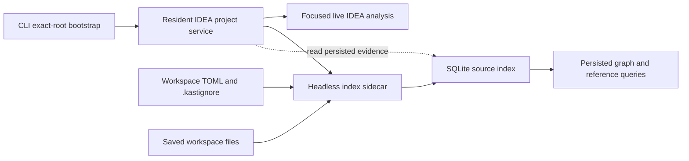

# VFS-Resilient Headless Indexing

**Status:** Proposed for review. The sections from **Proposed ownership** through
**Migration** are normative if this proposal is accepted.

**Audience:** Maintainers of the Kast runtime, index store, CLI, IDEA plugin,
headless backend, and release packages.

This proposal separates durable indexing from the interactive IDEA virtual file
system. It also makes partial graph and reference evidence useful without
claiming complete results.

## Problem

Users observe repeated incomplete graph failures when interactive IDEA virtual
file system activity cancels or invalidates graph and reference work. This is a
reported production symptom. This proposal does not claim a local reproduction.

The current implementation has nine relevant constraints:

1. macOS rejects explicit local headless runtime selection.
2. Semantic graph refresh runs in the requesting coroutine and checks both
   coroutine cancellation and IDEA progress cancellation.
3. Native graph source selection requires complete relationship indexing even
   though graph extraction reads PSI and Kotlin compiler facts directly.
4. Native graph reads reject globally incomplete persisted graph evidence.
5. Release setup bundles contain the headless backend, but the normal macOS
   installer downloads only the native CLI and IDEA plugin. It does not install
   or activate the bundled headless component.
6. The headless backend archive has no Java runtime. Its launchers select
   `JAVA_HOME` or `java` from `PATH`, so it is not a self-contained macOS
   sidecar.
7. Normal macOS setup disables public headless-backend selection, and the CLI
   process that starts headless does not remain as a supervisor.
8. Headless loads one configuration snapshot at startup, while semantic graph
   refresh still routes to the selected IDEA runtime and writes there.
9. The release builds one Linux headless archive with native IDEA libraries and
   reuses that archive in macOS setup bundles.

These constraints couple graph availability to interactive IDEA work and to a
separate reference-index stage. One cancelled or failed file can therefore make
all native graph operations unavailable.

## Goals

- Isolate durable graph and reference indexing from the interactive IDEA
  virtual file system.
- Preserve committed batches across cancellation, restart, and configuration
  changes.
- Let non-critical gaps produce qualified evidence instead of a global failure.
- Let a workspace opt into strict coverage for configured critical paths.
- Exclude generated output before it reaches any source-taking Kast operation.
- Apply indexing scope and batch-size changes without a runtime restart.
- Keep runtime readiness separate from graph and reference coverage.
- Start the managed sidecar without system Java or the interactive IDE runtime.

## Non-goals

- Merge unsaved IDEA document content into the persisted index.
- Add readiness rules for individual graph or reference operations.
- Let IDEA and headless backends write the same index.
- Replace generation-pinned SQLite reads.
- Add graph parallelism controls.
- Change the semantic implementation of focused IDEA analysis for admitted
  source paths.

## Proposed ownership

On macOS, the CLI bootstraps or reuses the exact-root IDEA project and returns.
The resident IDEA project service then manages one exact-root headless index
sidecar. The sidecar runs in a separate JVM with a separate virtual file system.
The macOS setup bundle combines the release-matched headless component with an
architecture-matched Java 21 runtime. The normal macOS install path installs
that self-contained sidecar.



The headless sidecar is the sole persistent writer. It indexes saved disk state
only. The IDEA backend keeps focused live analysis and may read persisted
evidence. It does not perform persistent graph or reference writes.

The managed sidecar starts automatically with the exact-root IDEA runtime even
when public `backends.headless.enabled` is `false`. That setting continues to
control explicit standalone headless-backend selection only; it does not gate
the internal sidecar role. The sidecar remains available until the resident
project service stops.

The resident IDEA project service supervises the sidecar. A sidecar crash does
not stop the IDEA runtime. The service reports unavailable graph and reference
coverage, preserves the last committed generation, and restarts the sidecar
with bounded backoff.

The sidecar exposes an exact-root read-admission endpoint beside the database.
Every persisted graph and reference reader checks this endpoint before and
after a generation-pinned SQLite read. The admission token binds the sidecar
instance, store generation, scope fingerprint, and evidence-family state. A
missing endpoint, a changed token, or failed revalidation makes that evidence
family `UNAVAILABLE`; SQLite coverage alone never admits a persisted read.
This authority is separate from IDEA runtime readiness.

The service establishes an exact-root, lease-bound local control channel when
it starts the sidecar. Persistent graph and reference refresh requests enqueue
an evidence-family refresh through that channel; the IDEA request handler no
longer performs the write. Configuration mutation sends a scope-reload message,
and the sidecar also watches the workspace TOML and `.kastignore` for external
edits. Shutdown sends drain and waits for acknowledgment before the service
closes shared state. Request cancellation can stop waiting for an
acknowledgment, but it cannot cancel work after the sidecar accepts it.

The service is the sole holder of the supervisor end of the control channel.
The sidecar treats control-channel EOF or supervisor-lease expiry as terminal.
It stops accepting work, discards any uncommitted unit, closes the store,
releases the writer lock, and exits. Lease expiry is the fallback when process
death does not deliver EOF. A replacement service waits for that lock release
before it starts a new sidecar.

## Source admission

An eligible file is a canonical exact-root Kotlin source file that the complete
headless IDEA and Gradle model assigns to a source set. A symbolic link must
resolve inside the exact root. An unowned file is not eligible.

If the project model is missing or stale, the worker does not reconcile the
store. It preserves the last committed generation and reports graph and
reference coverage as `UNAVAILABLE` until the model is complete.

The worker computes one effective source set in this order:

1. Normalize the candidate under the exact workspace root.
2. Reject hard-excluded output.
3. Apply repository and workspace ignore rules.
4. Classify the remaining path as critical or non-critical.
5. Attach Gradle module and source-set ownership.

### Hard exclusions

Hard exclusions apply to source inventory, graph, reference, diagnostics,
symbol, and mutation path admission. Commands that do not admit a source path
are unaffected. No configuration can re-include a hard-excluded path.

The hard-exclusion authority combines:

- Gradle and IDEA output or excluded roots;
- any path with a `.gradle`, `build`, or `out` directory component;
- built plugin output below those roots.

This rule prevents generated classes, packaged plugins, sandboxes, and copied
sources from entering semantic operations.

### User ignore rules

The repository root can contain `.kastignore`. Its path separator is `/`. A
leading slash is an anchor token, not a filesystem-root marker. Exactly one
leading slash anchors a pattern at the workspace root. A trailing slash matches
directories. `**` matches across directory boundaries. `#` starts a comment,
`!` re-includes a prior match, and the last matching pattern wins. Hard
exclusions still win over negation. URI schemes, drive or volume prefixes,
network-root prefixes with two leading slashes, and parent traversal are
invalid.

The machine-local workspace TOML can add `indexing.ignoredPaths`. Repository
and workspace ignore rules affect graph and reference indexing only. They do
not change focused diagnostics, mutation, or other interactive analysis.
The effective ignore set is the union of the final `.kastignore` result and
all matching workspace ignore patterns. A `.kastignore` negation cannot
re-include a workspace-ignored path.

Both files are watched. A valid change reconciles the persisted inventory
without a restart. Newly ignored files lose current graph and reference facts.
Newly admitted files become pending.

### Critical paths

The machine-local workspace TOML owns one shared
`indexing.criticalPaths` collection. It applies to graph and reference
coverage. The default collection is empty.

Workspace ignored and critical collections accept positive repository-relative
patterns. They use the same anchoring, directory, and wildcard rules as
`.kastignore`, but do not accept comments or negation.

A resolved eligible file cannot be both ignored and critical. Conflict
validation uses the current resolved source inventory, not abstract pattern
intersection. A future file that creates a conflict makes the new inventory
invalid and leaves the last valid scope active.

Adding a critical pattern that matches no current eligible file is a typed
configuration error. After a pattern is accepted, deleting or renaming its
last match does not invalidate the configuration. It makes graph and reference
coverage `INCOMPLETE` with a typed unmatched-critical-path limitation until a
file matches again or the pattern is removed.

Each accepted pattern is a critical obligation. The obligation is fulfilled
only while it matches at least one eligible file. Every file matched by a
fulfilled obligation is critical. Deletion, hard exclusion, or loss of source
ownership can therefore make an accepted obligation unmatched.

If a live configuration is invalid, the worker keeps the last valid scope and
reports the error. It does not apply a partial configuration and does not stop.

The CLI provides idempotent collection mutations:

```shell
kast config add indexing.criticalPaths 'module/src/main/**' --workspace-root "$PWD"
kast config remove indexing.criticalPaths 'module/src/main/**' --workspace-root "$PWD"
kast config add indexing.ignoredPaths 'samples/**' --workspace-root "$PWD"
kast config remove indexing.ignoredPaths 'samples/**' --workspace-root "$PWD"
```

Adding an existing value and removing an absent value are successful no-ops.
Malformed patterns, URI schemes, drive or volume prefixes, network-root
prefixes, parent traversal, and ignore-critical conflicts fail with typed
configuration errors.

## Work order

Graph and reference indexing are independent pipelines. Graph work does not
wait for relationship outcomes. Reference work does not wait for graph
outcomes.

Semantic graph pending-work selection, source progress, coverage fingerprints,
and coverage classification must not read relationship-stage terminality.
Reference-derived topology remains reference evidence; removing these gates
does not make that topology independent of reference indexing.

Each pipeline uses this stable priority order:

1. critical paths;
2. `main` source sets;
3. `testFixtures` source sets;
4. `test` source sets;
5. the existing module-priority order;
6. normalized path order.

The worker uses bounded batches and short SQLite transactions. Existing
`indexing.relationships.enabled`, `indexing.relationships.batchSize`, and
`indexing.relationships.parallelism` settings remain authoritative for
references. A new positive integer `indexing.graph.batchSize` replaces the
hard-coded semantic graph batch size. The worker reloads these values with the
other watched scope settings.

When `indexing.relationships.enabled` changes to `false`, the worker discards
uncommitted reference work and schedules no new reference work. It retains
committed reference facts but does not serve them. Reference coverage becomes
`UNAVAILABLE` with limitation `REFERENCE_INDEXING_DISABLED`; graph scheduling
and graph coverage do not change. When the setting changes to `true`, the
worker schedules current reference work from the persisted inventory and
normal reference coverage computation resumes.

## Cancellation and retry

Cancellation is a scheduling result, not a file failure. The worker stops the
current uncommitted unit, keeps it pending, and retries it with bounded
backoff. Earlier committed batches remain available.

Three consecutive non-cancellation failures for one content fingerprint make
that stage `LIMITED`. The worker retries limited work at a slower periodic
interval. A file change or explicit refresh makes that work immediately
eligible again.

Only facts or boundary evidence tied to the current content fingerprint and a
current `COMPLETE`, `LIMITED`, or `EXTERNAL_BOUNDARY` outcome are queryable.
Prior facts for changed content are stale and cannot appear in a qualified
result.

A reference `EXTERNAL_BOUNDARY` remains a distinct terminal outcome for its
current fingerprint. It preserves the externalized failure identity and exposes
the existing limited unknown boundary; it does not migrate to `LIMITED`. It is
re-evaluated after a content, scope, or project-model change, or after explicit
refresh. On a critical file it makes reference coverage `INCOMPLETE`. On a
non-critical file it makes reference coverage `QUALIFIED`. It does not affect
semantic graph coverage.

The retry policy has one owner in the workspace worker. Request handlers do not
implement their own retry loops.

## Global coverage

Runtime readiness, graph coverage, and reference coverage are three separate
facts. One cannot imply another.

Graph and reference pipelines each publish one global coverage state:

| State | Meaning | Operation behavior |
| --- | --- | --- |
| `COMPLETE` | Every eligible file has current complete evidence, and every critical obligation is fulfilled. | Run with current evidence. |
| `QUALIFIED` | Every critical obligation is fulfilled and all critical files are complete, but non-critical work is pending, stale, limited, external-boundary, or failed. | Run and return global coverage limitations. |
| `INCOMPLETE` | A critical obligation is unmatched, or at least one critical file lacks current complete evidence. | Reject operations for that evidence family. |
| `UNAVAILABLE` | No admissible persisted generation can be served, including while the project model is unavailable or that evidence family is explicitly disabled. | Reject operations for that evidence family. |

State precedence is `UNAVAILABLE`, `INCOMPLETE`, `COMPLETE`, then `QUALIFIED`.
After availability is established, unmatched critical obligations and
incomplete critical files are evaluated before the empty or fully complete
inventory cases.

All operations that read persisted semantic graph evidence use the global graph
state. All operations that read persisted reference evidence or
reference-derived topology use the global reference state. Reference-derived
topology remains reference evidence even when a result presents it beside
graph facts. It does not gate semantic graph construction or graph coverage.
The design does not compute path-specific or operation-specific readiness.

Focused live IDEA reference search remains a runtime semantic operation. It can
use the existing live PSI fallback when persisted reference evidence is
unavailable or empty, and it retains its per-request relationship coverage. It
does not write persisted evidence and does not derive a new global reference
state. Runtime readiness, not persisted reference coverage, admits that live
operation.

A graph result admits its semantic graph section from the global graph state.
It includes reference-derived topology only when the global reference state is
`COMPLETE` or `QUALIFIED`. If reference coverage is `INCOMPLETE` or
`UNAVAILABLE`, the result omits that topology, attaches the corresponding
reference error and counts, and retains the graph operation exit status.

A qualified positive result is usable. A qualified empty result is not proof
that no matching fact exists. Results must retain the generation, global state,
counts, and limitation codes that explain that boundary.

Availability depends on committed inventory and stage outcomes, not on a
non-empty fact table. A compatible store without a committed current inventory
is `UNAVAILABLE`. After inventory commit, zero eligible files is `COMPLETE` only
when there is no unmatched critical obligation. An accepted obligation that
lost its last match keeps the state `INCOMPLETE`.
With eligible files and no critical obligations, non-critical pending work is
`QUALIFIED`. A complete stage can emit zero facts and still counts as complete.

`COMPLETE` and `QUALIFIED` persisted-evidence operations exit successfully.
`INCOMPLETE` and `UNAVAILABLE` graph operations retain
`GRAPH_EVIDENCE_INCOMPLETE` and `GRAPH_EVIDENCE_UNAVAILABLE`. Persisted
reference operations use the corresponding `REFERENCE_EVIDENCE_INCOMPLETE` and
`REFERENCE_EVIDENCE_UNAVAILABLE` typed errors. These errors exit non-zero.
Errors and qualified results include total, complete, critical-file,
critical-obligation, unmatched-critical-obligation, pending, stale, limited,
external-boundary, and failed counts. No operation computes a different global
readiness state from its requested symbol or path.

Graph and reference states can differ. For example, graph coverage can be
`COMPLETE` while reference coverage is `QUALIFIED`.

## Persistence and consistency

The sidecar preserves the existing exact-root SQLite database and generation
contract. It scans outside transactions and serializes short writes. Readers
pin one generation and reject mixed-generation results.

Admitted source membership and source ownership contribute to the stage input
fingerprint. A change to `.kastignore`, ignored paths, hard exclusions, or
source ownership invalidates only affected stage work. A critical-path change
updates priority and coverage metadata without invalidating current facts.

The single-writer rule removes cross-backend write arbitration. Read-only CLI
and IDEA consumers can continue to use SQLite generation checks while the
sidecar commits later batches.

The resident IDEA project service owns the writer-lock protocol and lock-file
path beside the exact-root database. The sidecar process acquires the
operating-system lock and holds its file descriptor before it opens the store
for writes. IDEA opens persisted evidence read-only in sidecar mode. Startup
fails the sidecar with a typed writer-conflict error if another process holds
the lock.

The release cutover first asks the old IDEA index worker to stop and drain. The
resident service requires confirmation that the worker closed its writable
store; an older writer is not assumed to honor the new lock. Without
confirmation, the sidecar does not start or migrate and the service reports
`INDEX_WRITER_CUTOVER_FAILED`. After confirmation, the sidecar can acquire the
lock and open the store. The operating system releases the lock when the
sidecar exits, so a matching service can recover after a crash without guessing
writer liveness.

One scope-reconciliation transaction removes excluded graph and reference
facts, records the new scope fingerprint and coverage metadata, and advances
the generation. New admissions remain pending after that commit. A reader
therefore cannot observe removed facts with the new coverage claim.

## macOS distribution and lifecycle

The macOS setup bundle includes a release-matched headless component and an
architecture-matched Java 21 runtime. The component uses its own IntelliJ
libraries, plugin files, and Java runtime. It does not reuse the interactive
IDEA application files and does not download a runtime on first use.

The launcher assigns workspace-keyed `idea.config.path`, `idea.system.path`,
log, and temporary directories below machine-local Kast state. The key is a
stable digest of the canonical exact root and sidecar release identity. Two
concurrent roots therefore do not share IntelliJ caches or locks. One exact
root still owns only one sidecar.

The sidecar uses only its bundled Java runtime. Its launcher resolves `java`
inside the installed sidecar and fails with a typed installation error when
that runtime is absent or has the wrong architecture. It does not fall back to
`JAVA_HOME`, `java` from `PATH`, or the interactive IDE Java runtime.

The release pipeline currently places one Linux-built headless backend archive
in every setup bundle. That archive contains platform-native libraries and no
JVM. This design builds separate macOS arm64 and x64 headless archives on
matching macOS runners, combines each with its matching Java runtime, and
changes the public install and runtime routes to use the complete payload.
Setup verification must prove:

- the bundled sidecar matches the installed Kast release;
- the headless archive and native libraries match the setup-bundle platform;
- the bundled Java runtime matches the setup-bundle architecture;
- the sidecar starts with `JAVA_HOME` unset and no system `java` on `PATH`;
- the sidecar starts on macOS for one exact workspace root;
- IDEA and the sidecar have distinct process and virtual file system state;
- only the sidecar opens the index for writes;
- stopping the exact-root runtime drains the sidecar before shared state closes.

The release produces and records separate macOS arm64 and x64 headless backend
artifacts before it assembles the setup bundles. Release checksum and provenance
checks cover each native backend, matching Java runtime, and final setup bundle.
Release review must also confirm the IntelliJ and Java runtime redistribution
terms and report the setup-bundle and resident-memory increase.

General runtime readiness remains independent of sidecar indexing progress.
Status output reports runtime readiness, graph coverage, and reference coverage
as separate fields.

## Migration

The implementation adds an explicit online migration from the current
production schema to the sidecar schema. One transaction adds the required
scope and coverage metadata, preserves admitted inventory, relationship and
graph rows, advances the generation, and commits before the sidecar serves
queries. A failed supported migration rolls back, preserves the old database,
and reports coverage as `UNAVAILABLE`; it does not fall through to destructive
rebuild.

Any other unsupported schema version follows the existing cold rebuild path.
That path makes graph and reference coverage `UNAVAILABLE`, recreates the
schema, commits a new inventory, and then computes coverage normally. It makes
no retained-fact claim. Migration does not infer complete coverage from old
module summaries.

The initial scope reconciliation removes hard-excluded inventory and removes
graph and reference facts for user-ignored files. It retains current admitted
facts, including current external-boundary outcomes and their reason identity,
and queues missing stage work. Existing generation checks remain active during
this transition.

macOS keeps the current IDEA backend as the interactive default. The change
removes the local headless prohibition only for the managed index-sidecar path.
It does not make public mutation commands select an unleased headless backend.

## Verification plan

Implementation is complete only when the following checks exist and pass:

1. Configuration tests cover `.kastignore`, collection mutations, live reload,
   relationship disable and re-enable, hard-exclusion precedence, and
   ignore-critical conflicts.
2. Index-store tests cover independent graph and reference progress, the
   fact-preserving current-schema migration, unsupported-schema cold rebuild,
   scope reconciliation, global coverage states, and retained generations.
3. A RED worker integration test injects request cancellation and proves the
   current request-owned path stops remaining graph work. The same test then
   proves the workspace-owned worker continues. This proves isolation without
   claiming reproduction of the reported production contention.
4. Worker tests prove cancellation remains pending, three repeated failures
   become retryable limited outcomes, current external-boundary evidence keeps
   its reason identity, and stale prior facts stay unqueryable.
5. Runtime tests prove macOS IDEA startup owns one exact-root sidecar and one
   persistent writer even when public headless selection is disabled. Refresh
   forwarding, scope reload, crash, and cutover cases must prove acknowledgment,
   lock release, restart, drain, and generation preservation. Focused live
   reference tests retain PSI fallback without persisted-reference admission.
   Persisted-reader tests reject a missing or changed admission token and a
   sidecar that fails post-read revalidation. Supervisor-crash tests prove
   control-channel EOF or lease expiry stops the orphan, releases its lock, and
   permits replacement.
6. Packaging tests prove native macOS arm64 and x64 headless artifacts contain
   matching native libraries and that the normal install path installs the
   matching Java 21 runtime. A launch test unsets `JAVA_HOME`, removes system
   `java` from `PATH`, and proves the installed sidecar selects its bundled
   runtime.
7. A macOS integration check edits a saved Kotlin file while IDEA is active,
   observes sidecar reconciliation, and reads a generation-pinned graph without
   using the IDEA virtual file system for persistence.
8. A macOS integration check opens two exact-root projects concurrently and
   proves their sidecars use distinct IntelliJ config, system, log, and
   temporary directories.

## Implementation ownership

| Contract | Owning area |
| --- | --- |
| Exact-root bootstrap | `cli-rs/src/execution/runtime/` |
| Resident supervision, refresh forwarding, and writer cutover | `backend-idea/` |
| Sidecar control, runtime status, and typed result contracts | `analysis-api/`, `backend-headless/`, and `cli-rs/src/semantics/` |
| Saved-file project model and background worker | `backend-headless/` |
| Focused live analysis and read-only persisted access | `backend-idea/` |
| Stage state, scope reconciliation, generations, and writer safety | `index-store/` |
| Workspace collections and `.kastignore` projection | `cli-rs/src/configuration/` and `analysis-api/` |
| Native macOS component and Java runtime production, installation, and verification | `install.sh`, `.github/workflows/release.yml`, and `.github/scripts/release/actions/build-setup-bundle/` |

## Consequences

- Interactive IDEA virtual file system pressure cannot directly cancel durable
  index ownership.
- Non-critical failures no longer make all graph or reference evidence
  unavailable.
- Projects can opt into strict global coverage without changing default
  usability.
- The worker consumes memory for a second IntelliJ JVM on macOS.
- Saved disk state, not unsaved editor state, becomes the persistent evidence
  authority.
- Operators must inspect three independent states instead of treating runtime
  readiness as graph readiness.

## Rejected alternatives

- **Run a background job inside IDEA.** It still shares the interactive virtual
  file system and cancellation environment.
- **Let both backends write.** This adds writer election and recovery without a
  second required writer.
- **Keep graph refresh request-owned.** A cancelled client can still stop
  durable progress.
- **Make graph wait for references.** The graph extractor does not consume the
  persisted relationship stage.
- **Compute readiness per operation.** One global state per evidence family is
  sufficient until a measured use case requires finer scope.
- **Persist unsaved document overlays.** This would mix interactive and durable
  source authority.
- **Reuse system Java or the interactive IDE runtime.** This would make sidecar
  startup depend on workstation or host-application state.
- **Download the sidecar on demand.** Startup would depend on network state and
  could install a release-mismatched backend.

## Related current-state references

- [IDEA indexing and generation](flows/indexing-and-generation.md)
- [Native graph refresh and queries](flows/graph-queries.md)
- [IDEA integration architecture decisions](architecture-decisions.md)
- [IDEA shutdown](flows/shutdown.md)
