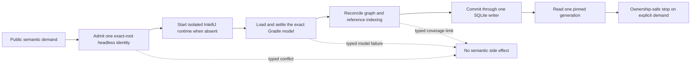

# Headless IntelliJ Integration

This bundle describes Kast's private IntelliJ-based headless runtime. It is an
internal source map, not a user guide. The directory name is retained only to
keep existing internal links stable.

Kast owns one isolated semantic process for each canonical workspace root. A
foreground IntelliJ IDEA or Android Studio process is not part of this flow.
On macOS, a supported installation supplies compatible runtime libraries only.

## Flow pages

- [Load and bootstrap](flows/load-and-bootstrap.md) explains exact-root
  admission, isolated host startup, and descriptor ownership.
- [Gradle sync](flows/gradle-sync.md) explains headless import and model
  settlement.
- [Indexing and generation](flows/indexing-and-generation.md) explains source
  scope, resumable file stages, configuration reconciliation, and generation
  changes.
- [Graph queries](flows/graph-queries.md) explains admitted refresh, read-only
  projections, coverage, and generation pinning.
- [Shutdown](flows/shutdown.md) explains lease, transport, worker, endpoint,
  and store close order.

The [architecture decisions](architecture-decisions.md) record the boundaries
that keep these flows deterministic. The [increment log](log.md) is historical
and does not define current authority.

The implementation design is [Headless-only VFS-resilient semantic
runtime](headless-indexing-resilience.md).

## Stable integration invariants

1. One normalized workspace root identifies the runtime, descriptor, socket,
   writer lease, index, and graph request.
2. One typed Rust boundary admits a healthy headless runtime and rejects legacy
   foreground intent before side effects.
3. The private headless IntelliJ and imported Gradle model decide Kotlin source
   coverage. A recursive repository walk cannot replace them.
4. One headless process holds the persistent writer lease for its lifetime.
5. Runtime readiness, graph coverage, and reference coverage are separate.
6. A query reads one SQLite generation and rejects a generation change.
7. Foreground IDE state cannot change runtime identity, lifecycle, generation,
   or readiness.
