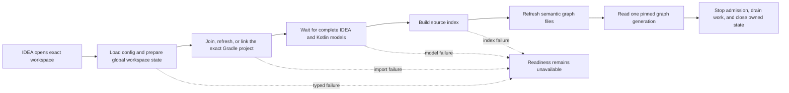

# IDEA Integration

This bundle describes the one IDEA integration that owns an exact Kast
workspace from project open through shutdown. It is an internal source map, not
a user guide. The pages are intentionally absent from the public site
navigation.

The integration keeps generated Kast state outside the project. The normalized
workspace root remains the routing identity. Under the global Kast home, its
workspace-keyed data directory holds compatibility metadata, snapshots, and
the SQLite source index; the global runtime directory holds keyed descriptors
and sockets.

## Flow pages

- [Load and bootstrap](flows/load-and-bootstrap.md) explains exact-root
  admission, install receipt validation, global metadata, and backend startup.
- [Gradle sync](flows/gradle-sync.md) explains the asynchronous link boundary
  and how the imported model becomes indexing evidence.
- [Indexing and generation](flows/indexing-and-generation.md) explains smart
  mode, semantic admission, inventory, SQLite writes, and generation changes.
- [Graph queries](flows/graph-queries.md) explains refresh, nodes, linkages,
  topology, communities, and generation pinning.
- [Shutdown](flows/shutdown.md) explains the close order and why the index store
  outlives the indexing worker.

The [architecture decisions](architecture-decisions.md) record the boundaries
that make those flows deterministic. The [increment log](log.md) records
material changes to this bundle.

## Stable integration invariants

1. A normalized workspace root identifies every runtime, index, and graph
   request.
2. Project-open startup has one owner. It starts the backend without indexing,
   coordinates Gradle, retains admission through restart, and then starts
   indexing once.
3. IDEA and Gradle models decide Kotlin source coverage. A recursive filesystem
   walk cannot substitute for those models.
4. A graph query reads one SQLite generation and rejects a generation change.
5. Shutdown remains `STOPPING` while it stops new transport work and closes the
   dispatcher and backend. The source index closes only after its indexing
   worker terminates.
