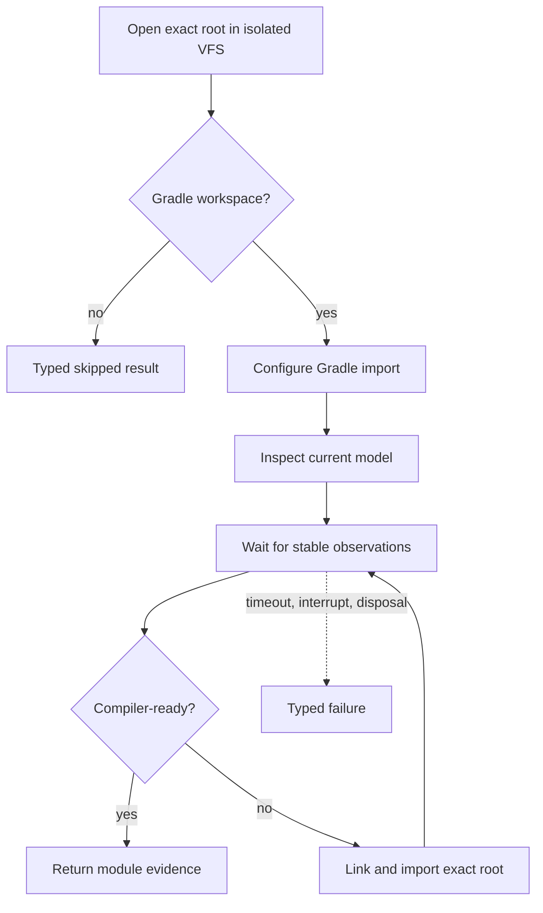

# Indexer Gradle Sync

`ProjectOpener` opens the canonical root in the isolated VFS and passes
the detected workspace kind to `GradleProjectBootstrap`. A non-Gradle
workspace has an explicit skipped result. A Gradle workspace must produce a
compiler-ready imported model.

The awaiter samples lifecycle, active import tasks, Gradle project paths, and
module readiness. `Settled`, `TimedOut`, `Interrupted`, and `ProjectDisposed`
are distinct outcomes and retain the last observation plus a bounded trace.

Submitting an import request is not completion. The indexer does not report
semantic `READY` until Kotlin modules have coherent JDK, SDK, library,
order-entry, PSI, and compiler resolution.

Continue with [Indexing and generation](indexing-and-generation.md).
