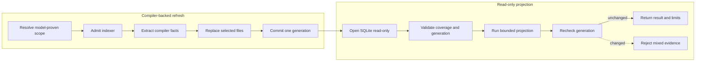

# Graph Refresh and Queries

Graph refresh and graph reads share one exact-root database but retain
different authority. Refresh needs the admitted indexer and exact mutation
authority. Read-only projections need a valid database, scope proof, coverage,
and one pinned generation.

The CLI normalizes and deduplicates selected files. Module and source-set
selectors require persisted Gradle ownership. The indexer requires analyzed
diagnostics, extracts canonical identities and typed occurrences, and passes
provider-neutral facts to `SemanticGraphWriter`.

Nodes use bounded keyset pagination. Neighbors use degree-bounded SQL reads.
Topology and communities materialize only the requested quotient graph. Every
result retains generation, scope, coverage, bounds, and limitations.

Coverage accounts for stale, failed, excluded, and unproven files. A non-empty
result does not prove completeness. Generation movement before return is a
typed consistency failure.

Continue with [Shutdown](shutdown.md).
