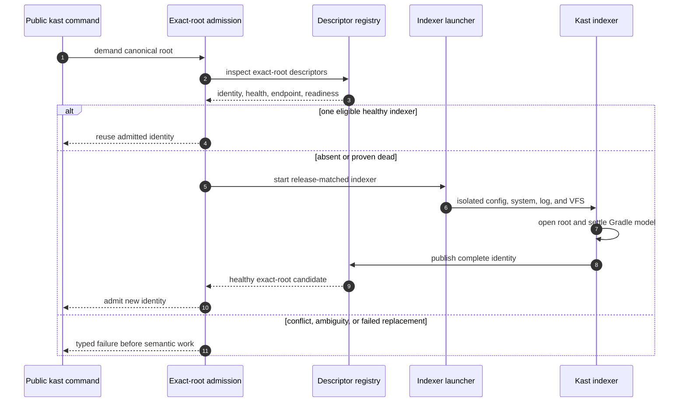

# Indexer Load and Bootstrap

Public demand begins with the semantic command the caller actually needs. The
runtime layer inspects only exact-root candidates and passes them through one
admission boundary; no separate ensure or lifecycle prerequisite exists.

## Isolation boundary

The release contains an internal payload under
`idea-home/plugins/kast-indexer`. It exists only to start the isolated indexer.
It is not installed into IntelliJ IDEA or Android Studio and exposes no user
interface or foreground lifecycle hook.

On macOS, a supported installation supplies a compatible JBR and platform
libraries. Kast does not ask that application to open a project or attach to
its VFS.

## Identity boundary

The descriptor binds canonical root, release version, indexer kind, runtime
instance identifier, process start time, owner UID, socket path, and socket
file identity. Admission rechecks live identity. A stale file, reused PID,
alias path, or replacement socket fails closed.

Continue with [Gradle sync](gradle-sync.md).
