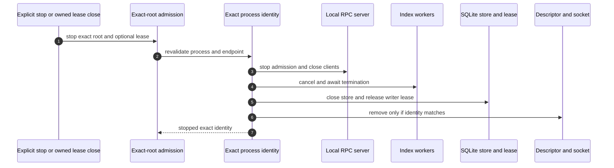

# Indexer Shutdown

Only explicit Kast lifecycle demand stops an indexer. Foreground editor close,
crash, project, VFS, and application events do not enter this flow.

## Ownership rules

- A lease can stop only the matching indexer instance it started.
- A borrowed indexer stays running when the borrower exits.
- PID equality alone is insufficient because a PID can be reused.
- Descriptor replacement does not authorize an old process to delete the new
  descriptor or socket.
- Concurrent close and start reuse a valid identity or return a typed conflict;
  they do not create two writers.

The server closes transport before continuation state and compiler resources.
Workers terminate before the store and writer lease close. Endpoint cleanup
compares live file identity before unlinking.

After a crash, the next explicit demand quarantines stale evidence and admits
or creates one replacement. Kast does not add a foreground watcher or an
unattended supervisor.
