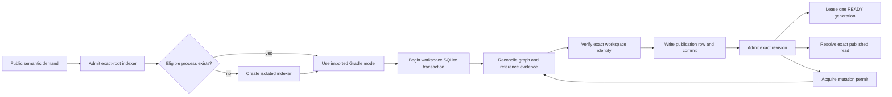

# Kast Indexer

This source map describes Kast's exact-root indexer. It is internal
documentation, not a second user guide.

Kast owns one semantic process for each admitted canonical workspace root. It
reuses an eligible process for that root or creates an isolated one. A
foreground IntelliJ IDEA or Android Studio process is not part of this flow.
On macOS, a supported installation supplies compatible runtime libraries.

## Flow pages

- [Load and bootstrap](flows/load-and-bootstrap.md) explains exact-root
  admission, reuse, isolated startup, and descriptor ownership.
- [Gradle sync](flows/gradle-sync.md) explains import and model settlement.
- [Indexing and generation](flows/indexing-and-generation.md) explains source
  scope, resumable stages, and generation changes.
- [Graph queries](flows/graph-queries.md) explains refresh, read-only
  projections, coverage, and generation pinning.
- [Shutdown](flows/shutdown.md) explains lease, transport, worker, endpoint,
  and store close order.
- [Event-driven semantic atomicity](event-driven-semantic-atomicity.md)
  defines invalidation, workspace identity, single-database atomic publication,
  SQLite visibility, exact read leases, mutation permits, restart behavior,
  cache-only graph reads, and the Rust published-read boundary. Its
  [research ledger](research-ledger.md) maps each decision to source, platform
  contracts, or executable proof.

The [architecture decisions](architecture-decisions.md) record the boundaries
that keep these flows deterministic. The
[semantic evidence pressure-test gaps](semantic-evidence-pressure-test-gaps.md)
remain a separate current assessment.

## Stable invariants

1. One normalized root identifies the process, descriptor, socket, writer
   lease, index, and graph request.
2. Reuse requires matching root, release, process, endpoint, health, and
   capability evidence.
3. The imported Gradle model decides Kotlin source coverage.
4. Only the transition worker can write semantic evidence and publish it.
5. The committed `workspace_publication` row and its workspace facts share one
   SQLite transaction and one `source-index.db` visibility boundary.
6. READY carries one exact published manifest. Each read lease rejects revision
   or manifest movement.
7. A mutation permit withdraws READY and waits for active readers. The mutation
   returns only after a different manifest becomes READY.
8. A public graph request reads cached facts only. Missing facts request a
   worker transition; the public operation does not write them.
9. Restart opens the same workspace database. SQLite recovers interrupted
   transactions; a schema mismatch regenerates current state without migration.
10. Default Rust-local reads validate the database publication row and exact
    runtime manifest before and after each operation.
11. Process readiness, graph coverage, and reference coverage are separate.
    Foreground editor state cannot change indexer identity or evidence.
