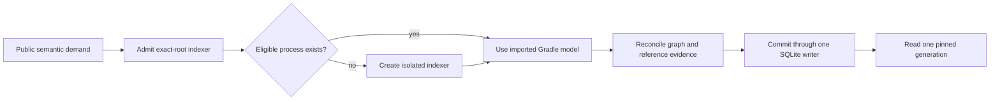

# Kast Indexer

This source map describes Kast's exact-root indexer. It is internal
documentation, not a second user guide.

Kast owns one semantic process for each admitted canonical workspace root. It
reuses an eligible process for that root or creates an isolated one. A
foreground IntelliJ IDEA or Android Studio process is not part of this flow.
On macOS, a supported installation supplies compatible runtime libraries.

## Flow pages

- [Load and bootstrap](flows/load-and-bootstrap.md) explains exact-root
  admission, reuse, isolated startup, and descriptor ownership.
- [Gradle sync](flows/gradle-sync.md) explains import and model settlement.
- [Indexing and generation](flows/indexing-and-generation.md) explains source
  scope, resumable stages, and generation changes.
- [Graph queries](flows/graph-queries.md) explains refresh, read-only
  projections, coverage, and generation pinning.
- [Shutdown](flows/shutdown.md) explains lease, transport, worker, endpoint,
  and store close order.
- [Event-driven semantic atomicity](event-driven-semantic-atomicity.md)
  defines invalidation, workspace identity, verified publication, and read
  admission. Its [research ledger](research-ledger.md) maps each decision to
  source, platform contracts, or executable proof.

The [architecture decisions](architecture-decisions.md) record the boundaries
that keep these flows deterministic. The
[semantic evidence pressure-test gaps](semantic-evidence-pressure-test-gaps.md)
remain a separate current assessment.

## Stable invariants

1. One normalized root identifies the process, descriptor, socket, writer
   lease, index, and graph request.
2. Reuse requires matching root, release, process, endpoint, health, and
   capability evidence.
3. The imported Gradle model decides Kotlin source coverage.
4. One indexer holds the persistent writer lease for its lifetime.
5. Process readiness, graph coverage, and reference coverage are separate.
6. A query reads one SQLite generation and rejects generation movement.
7. Foreground editor state cannot change indexer identity or evidence.
