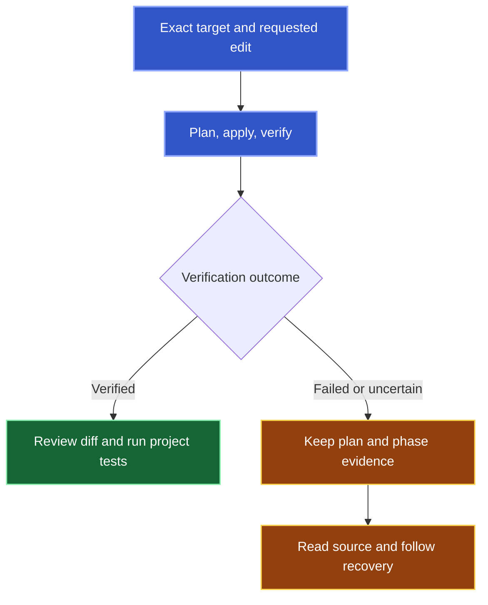

Kast adds one declaration to an existing Kotlin file or replaces one supported function body. [Find and inspect the target](/search) first. Pass its issued exact reference unchanged.

## Check the target and scope

Substitute your function and directory:

```text wrap
Use Kast to find retryLimit under checkout. Show matching signatures and locations. If several functions match, stop so I can choose. Read the selected function's source and check whether it has a supported block body before changing it.
```

Then request the chosen change:

```text wrap
Use Kast to replace the chosen function's body with { return 3 }. Keep its signature and the source outside the body unchanged. Report verification and the change receipt; if the outcome is uncertain, preserve recovery evidence and stop before retrying the write.
```

Body replacement requires a non-inline named function with a block body and no contract. Change tools do not create files, edit arbitrary ranges, rename symbols, or perform multi-file refactors.

## Read the receipt

Each call plans, applies, and verifies the edit. Inspect its receipt alongside the diff.



<Warning>
  A rejection, timeout, or lost response does not prove that no write occurred. Inspect the source and recovery evidence before retrying.
</Warning>

IDEA diagnostics and edit verification cover their reported scope. Run your project's build and tests after a verified change.

## Exact inputs for tool authors

Replace placeholders with current issued references.

<AccordionGroup>
  <Accordion title="Add a declaration">
    ```json
    {
      "exactTarget": "<exact-ref-returned-by-Kast>",
      "declaration": "fun retryLimit(): Int = 3"
    }
    ```

    Select the existing file and review the insertion location. See the [Add declaration schema](/api-reference/add-declaration).
  </Accordion>

  <Accordion title="Replace a function body">
    ```json
    {
      "exactTarget": "<exact-function-ref-returned-by-Kast>",
      "body": "{ return 3 }"
    }
    ```

    Supply the complete block, including braces. See the [Replace body schema](/api-reference/replace-body).
  </Accordion>

  <Accordion title="Carry exact identity across a change">
    `exact:v5:…` and `exact:v3:…` are opaque. Never rewrite their prefixes or substitute another handle.

    After verified replacement, pass the returned `freshRef` to a subsequent `add_declaration`. Pre-write references still require authority checks.
  </Accordion>
</AccordionGroup>
