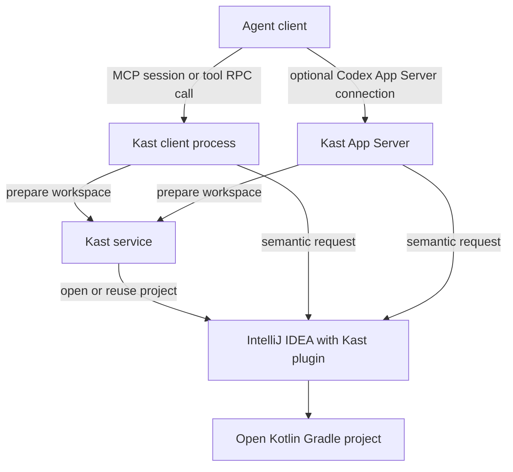

Kast lets an agent ask questions about the Kotlin project in IntelliJ IDEA.
The agent connection carries the request; IDEA's Kast plugin uses the open
project and its compiler state to answer it.

The installer sets up a per user Kast service. It can remain available between
agent sessions. The direct MCP process belongs to one client session; an RPC
process handles one `catalog` or `call`. The optional Codex App Server
connection manages its own conversations and asks the same service to prepare
workspaces. Semantic requests then use the IDEA plugin's project state. The
selected IDEA application owns project opening and evaluation.

## What happens on the first request

Kast finds the exact Gradle root from the client's working directory. For MCP,
preparation starts with the first valid protocol request. An RPC tool call starts
preparation for its request. The service attaches to the selected IDEA when it
is running or launches it in the background, then opens the requested project.
Kast waits for the Gradle model and indexing before a compiler backed answer.
Later calls reuse the prepared project when it is still valid.

The IDE is launched without deliberately taking focus. You may still need to
respond in IDEA if it asks whether to trust a project or reports an import or
save problem. Kast returns a specific failure when it cannot establish the
required state.

[Background startup](/concepts/background-startup) follows those stages in
more detail. [Connect an agent client](/agent-harnesses) compares the public
connections.
