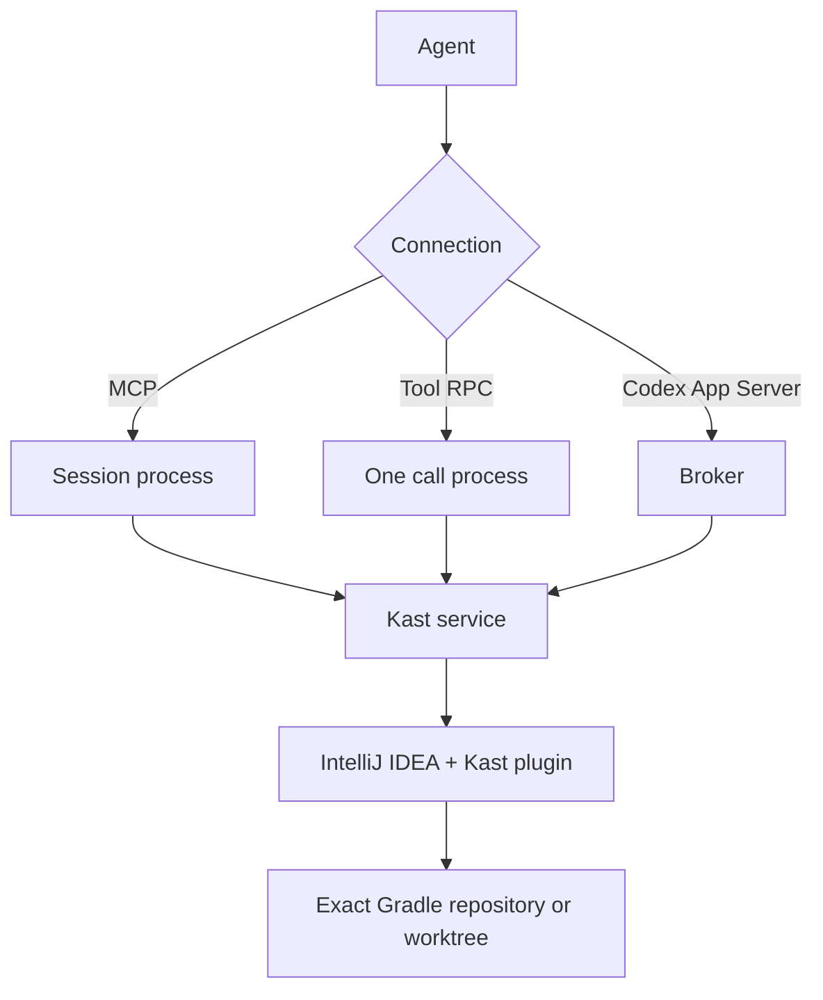
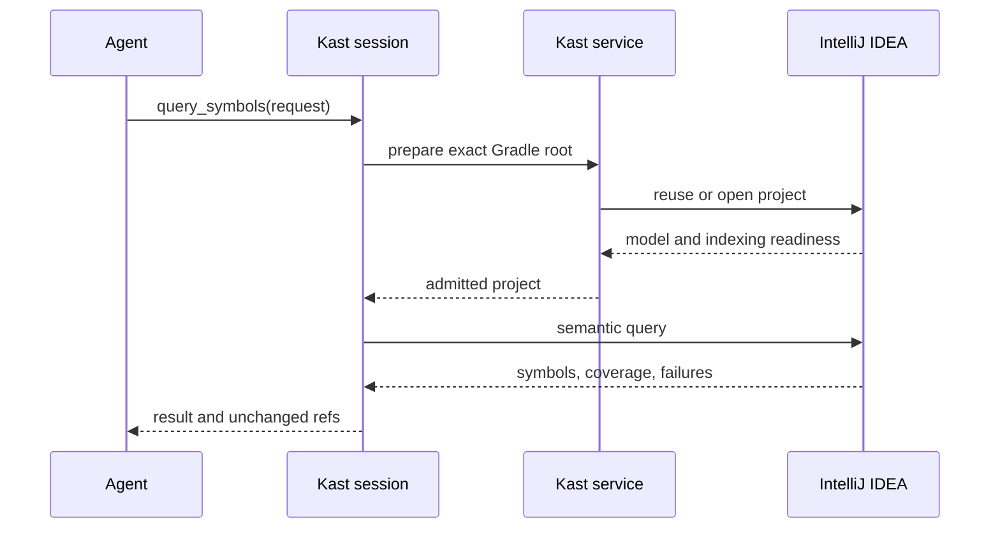
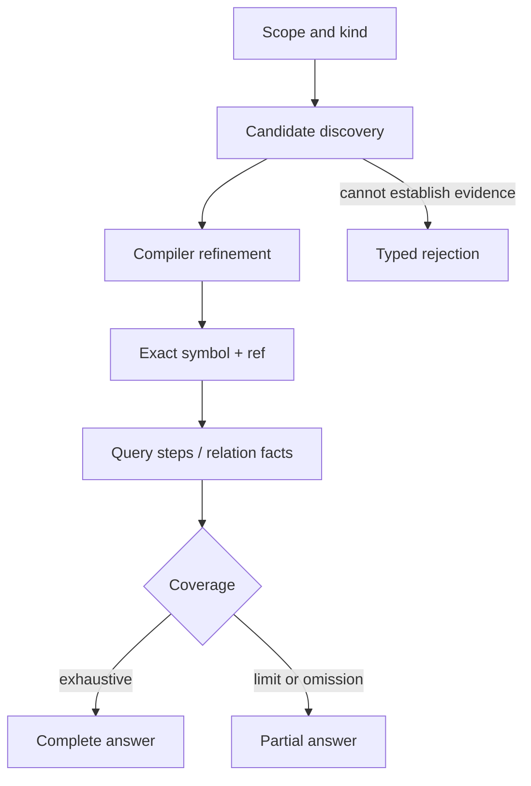

Kast answers from the exact Kotlin Gradle project admitted in IntelliJ IDEA.
The installed service prepares that project; the IDEA plugin performs the
semantic read.

## From request to ready project

The client starts in a repository. Kast finds its Gradle root, reuses or starts
the selected IDEA, opens that project, and waits for the required model and
indexing state. A trust, save, or import blocker returns as a failure.

## From declaration to claim

Kast first restricts discovery by the requested name, kind, and scope. It
refines candidates through the compiler before issuing exact `ref` values.
The result keeps evidence and limits together.

An exact `ref` can be reused while its owning workspace and evidence remain
valid. A partial result preserves known facts but cannot prove that missing
facts do not exist. See [query examples](/search) and the
[transport contracts](/reference/mcp-catalog).
