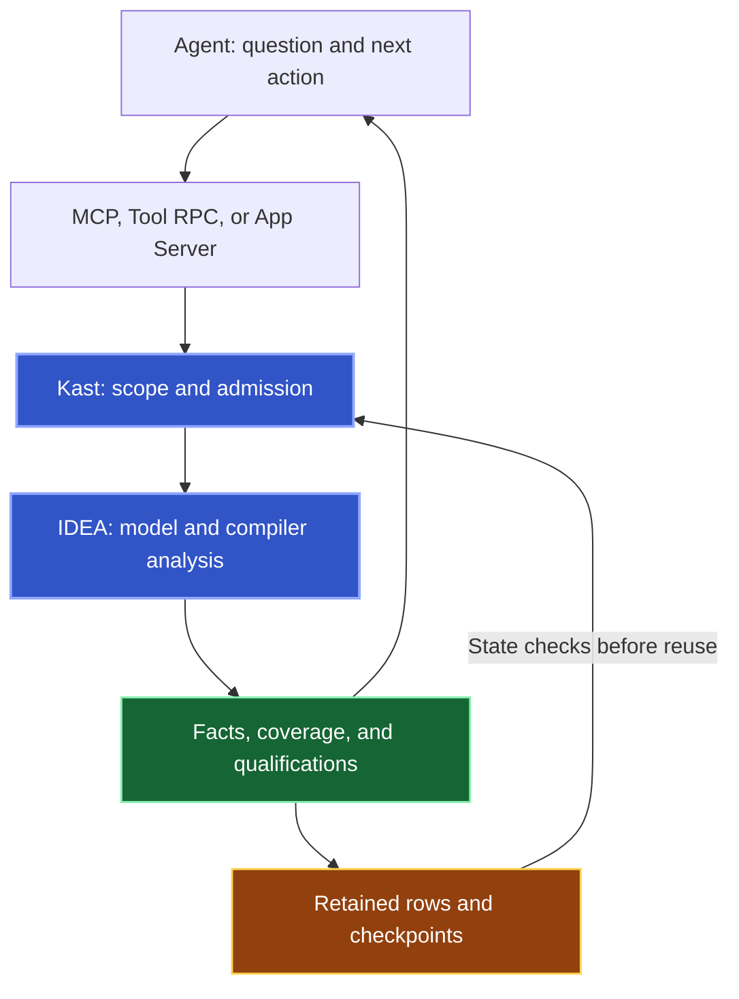

Your agent chooses the question. Kast queries the exact repository's IDEA project and returns facts with their scope, source state, and limitations.

## Authority stays with the program

IDEA's imported Gradle model, Kotlin plugin, and indexes establish declarations and relationships. Discovery finds candidates. Compiler analysis establishes semantic identity.

```mermaid
flowchart TB
  accTitle: Inference, semantic authority, and retained evidence have separate owners
  accDescr: The agent chooses a question. Transport adapters carry it to Kast, which obtains semantic facts from the selected IDEA project. Retained rows preserve those facts but require state checks before reuse.
  A["Agent: question and next action"] --> T["MCP, Tool RPC, or App Server"]
  T --> K["Kast: scope and admission"]
  K --> I["IDEA: model and compiler analysis"]
  I --> E["Facts, coverage, and qualifications"]
  E --> A
  E --> S["Retained rows and checkpoints"]
  S -->|State checks before reuse| K
  class K,I authority;
  class E evidence;
  class S limited;
  classDef authority fill:#3154C7,color:#FFFFFF,stroke:#8FA7FF,stroke-width:2px;
  classDef evidence fill:#166534,color:#FFFFFF,stroke:#86EFAC,stroke-width:1.5px;
  classDef limited fill:#92400E,color:#FFFFFF,stroke:#FCD34D,stroke-width:1.5px;
  classDef rejected fill:#991B1B,color:#FFFFFF,stroke:#FCA5A5,stroke-width:1.5px;
```

Adapters preserve the operation document through their transport wrappers. Saved rows and checkpoints preserve evidence. They do not replace compiler authority.

## Bounded execution preserves progress

Queries run within configured work, byte, result, and time limits. Resumable results issue a continuation. Terminal results report why work cannot continue.

`ALL_DECLARATIONS` retains unvisited files and its position within the active file. Filters can remove every row from a page without stopping progress. [Results](/reference/responses#follow-progress-not-row-count) distinguishes execution from saved-row paging.

## Read state constrains reuse

Kast checks workspace root, owning IDEA instance, read epoch, committed source state, and lifetime before restoring saved work. It retains references rather than live compiler objects.

An exact symbol can undergo fresh compiler revalidation. Results and continuations require their original read state. See [Saved state and identity](/reference/responses#saved-state-and-identity).

Queries [prepare IDEA automatically](/concepts/background-startup). Trust, save, import, and indexing blockers remain explicit failures. Listing tools does not establish readiness.
