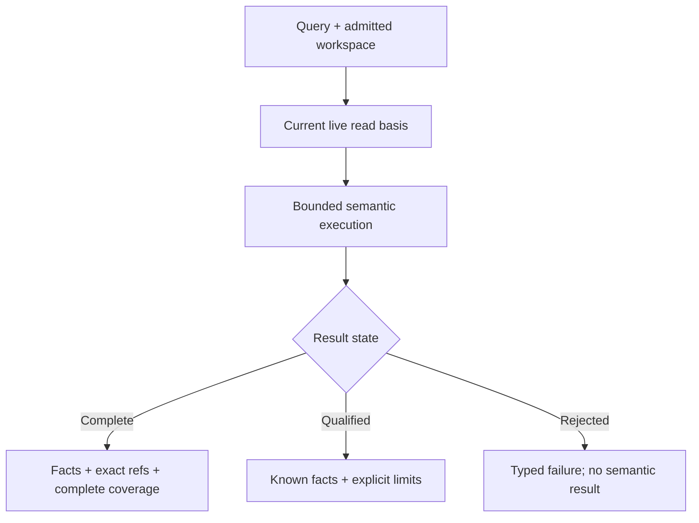

Kast binds a request to the exact Gradle repository or worktree, prepares that project in IntelliJ IDEA, and asks the matching plugin for semantic evidence.

## Why use the project open in IDEA?

IntelliJ IDEA owns the imported Gradle model, Kotlin plugin state, and semantic indexes developers use while editing. Kast exposes bounded reads from that authority to agents instead of treating a separate text index as proof of compiler identity.

## From an admitted search to an answer

```mermaid
flowchart TB
  A["Query + admitted workspace"] --> B["Current live read basis"]
  B --> C["Bounded semantic execution"]
  C --> D{"Result state"}
  D -->|Complete| E["Facts + exact refs + complete coverage"]
  D -->|Qualified| F["Known facts + explicit limits"]
  D -->|Rejected| G["Typed failure; no semantic result"]
```

The request's source, scope, and ordered steps specify the search; the live read basis identifies the semantic state against which it ran. The invariant is that successful facts stay attached to both. Kast can report exact positive facts and, with complete coverage, a scoped empty answer. A qualified result cannot prove absence; a rejected request establishes no semantic result. The basis identifies the live IDE read, not a permanent snapshot of every repository byte.

## Readiness is part of the result

A semantic request may need the project import or indexing to finish. A trust prompt, failed save, import error, or unavailable IDE state is reported as a blocker. Kast does not turn that failure into a successful empty answer.

Ordinary queries prepare the workspace themselves. The hosted App Server's workspace lifecycle tool exists for explicit project control.

## What “same state” means here

For the production IDE plugin, a live read basis identifies the canonical workspace root, the owning IDE lifetime, its read epoch, and a saved, committed PSI content view. Kast re-admits that authority when it restores retained execution or result state. This is a live semantic identity, not a permanent cryptographic fingerprint or an archive of every repository byte.

When the IDE's read epoch changes, retained query state is cleared. A fresh exact-symbol read can use bounded reacquisition and revalidation; a retained query result or continuation is restored only while its owner, lifetime, and basis remain admissible.

[See how query references continue work](/query-pipelines) and [what an answer proves later](/concepts/evidence-boundaries). The [transport contracts](/reference/mcp-catalog) define the public result wrappers.
