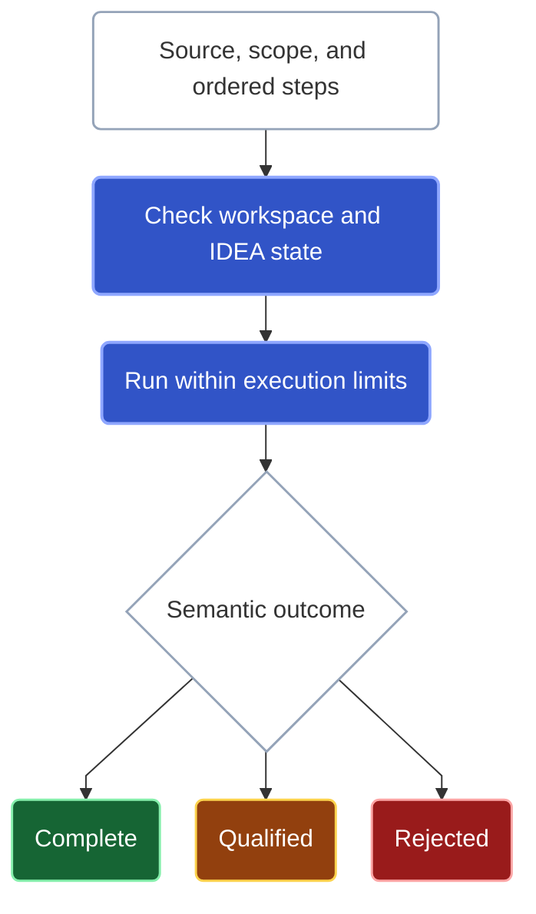

Your agent chooses a question. Kast checks the selected Gradle repository or worktree, runs the query through its IntelliJ IDEA project, and returns facts with coverage and any limitations. The agent uses that result to decide what to do next.

## Query the selected IDEA project

Kast uses the selected IDEA project’s imported Gradle model, Kotlin plugin, and indexes to identify declarations and relationships. A name or text match can help find a declaration; the compiler establishes its identity and semantic relationships.

The MCP, Tool RPC, and App Server adapters carry requests between the agent and Kast. Each preserves the operation’s result and limitations through its own response format.

## From a question to a bounded answer

```mermaid
%%{init: {"flowchart": {"curve": "linear", "nodeSpacing": 24, "rankSpacing": 32}}}%%
flowchart TB
  accTitle: A query reports completion, limitations, or rejection
  accDescr: Kast checks the selected workspace and IDEA state, then runs the requested source and steps within the execution limits. The result reports complete, qualified, or rejected.
  A("Source, scope, and ordered steps") --> B("Check workspace and IDEA state")
  B --> C("Run within execution limits")
  C --> D{"Semantic outcome"}
  D --> E("Complete")
  D --> F("Qualified")
  D --> G("Rejected")
  classDef default fill:transparent,stroke:#94A3B8,stroke-width:1.5px;
  classDef authority fill:#3154C7,color:#FFFFFF,stroke:#8FA7FF,stroke-width:2px;
  classDef evidence fill:#166534,color:#FFFFFF,stroke:#86EFAC,stroke-width:1.5px;
  classDef limited fill:#92400E,color:#FFFFFF,stroke:#FCD34D,stroke-width:1.5px;
  classDef rejected fill:#991B1B,color:#FFFFFF,stroke:#FCA5A5,stroke-width:1.5px;
  class B,C authority;
  class E evidence;
  class F limited;
  class G rejected;
```

**Complete** means Kast covered the declared scope. **Qualified** reports limitations or unfinished work alongside the returned facts. **Rejected** means the request could not complete under its input or state requirements. Check this outcome even when the tool call itself succeeds.

The request defines what to investigate. The result also identifies the IDEA read state used for that investigation. It is not a permanent snapshot of every repository file.

## Preserve facts and unfinished work

Some queries can save unfinished work and continue in another call. For example, `ALL_DECLARATIONS` records unvisited Kotlin files and its position within the active file. It can continue from that position while preserving the facts and limitations already returned.

Only results with resumable progress provide an execution continuation. Unsupported source scopes, source partitions that cannot fit within a limit, or unavailable saved state can stop the query with a reported reason. An empty page may still reflect progress through input that a filter removed. Read the reported progress to decide whether to continue.

Use `RESUME` to continue unfinished work. Use `READ_RESULT` to read saved rows without running more of the query. [Results](/reference/responses#follow-progress-not-row-count) explains their references and cursors; [Combine query results](/query-pipelines) shows how to reuse saved rows.

Kast stores references and checkpoints rather than retaining live compiler objects between requests. It checks their workspace, lifetime, and IDEA read state before reuse.

## Prepare the project before querying

Ordinary queries [prepare the workspace themselves](/concepts/background-startup). Import or indexing may need to finish. A trust prompt, failed save, import error, or unavailable IDE state is reported as a blocker, not disguised as successful empty output.

The hosted App Server's workspace lifecycle tool is separate explicit project control. Listing tools does not establish semantic readiness.

## Check whether saved state is still valid

The plugin records the workspace root, owning IDEA instance, read epoch, and saved source state committed to IDEA’s program model. Kast restores saved work and results only while that state remains valid and available.

A changed read epoch invalidates retained queries and results. A fresh read of an exact symbol may reacquire the declaration and validate its identity through the compiler. Reusing a result or continuation requires the original read state; a matching name or path is not enough.

See [what an answer proves](/concepts/evidence-boundaries) for reuse and coverage, and [the transport contracts](/reference/mcp-catalog) for the public wrappers. The current implementation is mapped in the [source-bound semantic query guide](https://github.com/amichne/kast/blob/ce91aad64974f69de076412891e31c543ac9be95/knowledge/flows/semantic-query.md).
