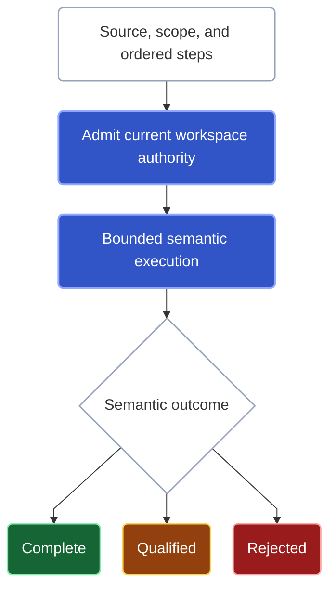

Kast separates the agent's judgment from facts that the program can establish. A request is admitted for one exact Gradle repository or worktree, evaluated through the matching IntelliJ IDEA project, and returned with its semantic outcome and evidence boundaries intact.

## IDEA owns program meaning

IntelliJ IDEA owns the imported Gradle model, Kotlin plugin state, and semantic indexes used by the developer. Kast asks that authority for exact declarations and relationships. A separate text index, remembered name, or reconstructed reference does not become compiler proof.

Kast's adapters connect the agent to that authority; they do not replace it. The agent chooses the question and interprets the answer. Kast constrains which program facts can be claimed and which evidence can be reused.

## From a question to a bounded answer

```mermaid
%%{init: {"flowchart": {"curve": "linear", "nodeSpacing": 24, "rankSpacing": 32}}}%%
flowchart TB
  accTitle: An admitted query keeps its semantic outcome explicit
  accDescr: A query binds its source, scope, and steps to the current workspace authority. Bounded semantic execution returns complete, qualified, or rejected, without converting limits into success.
  A("Source, scope, and ordered steps") --> B("Admit current workspace authority")
  B --> C("Bounded semantic execution")
  C --> D{"Semantic outcome"}
  D --> E("Complete")
  D --> F("Qualified")
  D --> G("Rejected")
  classDef default fill:transparent,stroke:#94A3B8,stroke-width:1.5px;
  classDef authority fill:#3154C7,color:#FFFFFF,stroke:#8FA7FF,stroke-width:2px;
  classDef evidence fill:#166534,color:#FFFFFF,stroke:#86EFAC,stroke-width:1.5px;
  classDef limited fill:#92400E,color:#FFFFFF,stroke:#FCD34D,stroke-width:1.5px;
  classDef rejected fill:#991B1B,color:#FFFFFF,stroke:#FCA5A5,stroke-width:1.5px;
  class B,C authority;
  class E evidence;
  class F limited;
  class G rejected;
```

**Complete** means the declared universe was covered. **Qualified** preserves returned facts together with incomplete obligations, omissions, and progress. **Rejected** means this request did not establish a successful semantic result. A working transport does not collapse those distinctions.

The source, scope, and ordered steps identify the requested investigation. The live read basis identifies the semantic authority against which it ran. Neither is a permanent snapshot of every repository byte.

## Preserve facts and unfinished work

A bounded call need not restart the investigation. Supported progressive reads retain detached positions for work they have not consumed, while keeping established facts and limitations attached to the result. The current Kotlin-source `ALL_DECLARATIONS` path advances through admitted files and declaration offsets rather than reconstructing the consumed prefix.

This does not make every provider or every limit resumable. A usable continuation advances the saved execution. An unsupported universe, indivisible oversized partition, or unavailable retained state must instead preserve a finite failure or terminal limitation. Even an empty page can represent input progress; inspect the reported progress rather than treating zero rows as exhaustion.

`RESUME` continues unfinished execution. `READ_RESULT` presents immutable retained rows without invoking semantic providers again. These have different handles and owners. Read [Results](/reference/responses#follow-progress-not-row-count) and [Combine query results](/query-pipelines) for the operational distinction.

Native compiler objects do not survive the request. Detached references and checkpoints are re-admitted under their owning workspace, lifetime, and basis before use.

## Readiness is part of the boundary

Ordinary queries [prepare the workspace themselves](/concepts/background-startup). Import or indexing may need to finish. A trust prompt, failed save, import error, or unavailable IDE state is reported as a blocker, not disguised as successful empty output.

The hosted App Server's workspace lifecycle tool is separate explicit project control. Listing tools does not establish semantic readiness.

## Validity is checked, not assumed

The production plugin's live read basis identifies the canonical workspace root, owning IDE lifetime, read epoch, and a saved, committed source view. Retained execution and result state are restored only while that authority remains admissible and the bounded state is available.

A changed read epoch invalidates retained query state. A fresh exact-symbol read may attempt bounded reacquisition and compiler revalidation, but a retained result or continuation does not silently replay against a different basis. A matching name or path is not continuity of proof.

See [what an answer proves](/concepts/evidence-boundaries) for reuse and coverage, and [the transport contracts](/reference/mcp-catalog) for the public wrappers. The current implementation is mapped in the [source-bound semantic query guide](https://github.com/amichne/kast/blob/ce91aad64974f69de076412891e31c543ac9be95/knowledge/flows/semantic-query.md).
