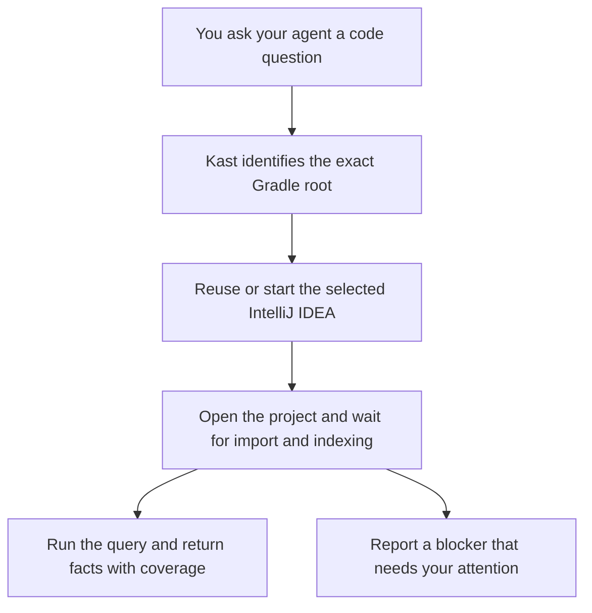

Start your agent in the Kotlin Gradle repository you want to inspect and ask a Kast question. Kast prepares that repository in IntelliJ IDEA when the request needs semantic analysis. You do not need to open or synchronize a workspace through another tool first.

## What happens on the first question

Preparation can take longer than a later query against an already-ready project. Kast does not deliberately bring IDEA to the foreground, but background presentation is best effort. A trust prompt, unsaved-document blocker, or failed import can still require your attention in IDEA.

A readiness failure is not an empty answer. Ask the agent to report the blocker and resolve it before repeating the query.

## What Kast uses

Kast asks the selected IDEA project for declarations and semantic relationships. The result belongs to that exact Gradle repository or worktree and to the evidence available for the request. Starting your agent in a different worktree does not make the previous worktree's references valid there.

Listing a tool catalog is not a semantic readiness check. Use the [first-query prompt](/agent-harnesses#check-that-the-tools-work) to check that the full connection works.

## Control when an agent uses Kast

Ask for a Kast-backed answer when symbol identity, callers, implementations, or reusable query results matter. For a text-only task, tell the agent not to call Kast.

To remove an installed harness registration, use `kast disconnect <harness>` and restart that harness. This is not an automatic-preparation toggle: it does not terminate existing sessions, close IDEA, or stop other connected clients.

There is no documented `kast` management command that disables project preparation while keeping semantic queries enabled. The hosted App Server has separate explicit workspace lifecycle controls; [Manage Kast](/workspaces) explains that boundary.

For the internal request flow and evidence checks, read [How Kast works](/concepts/architecture). For installation or readiness failures, use [Troubleshooting](/troubleshooting).
