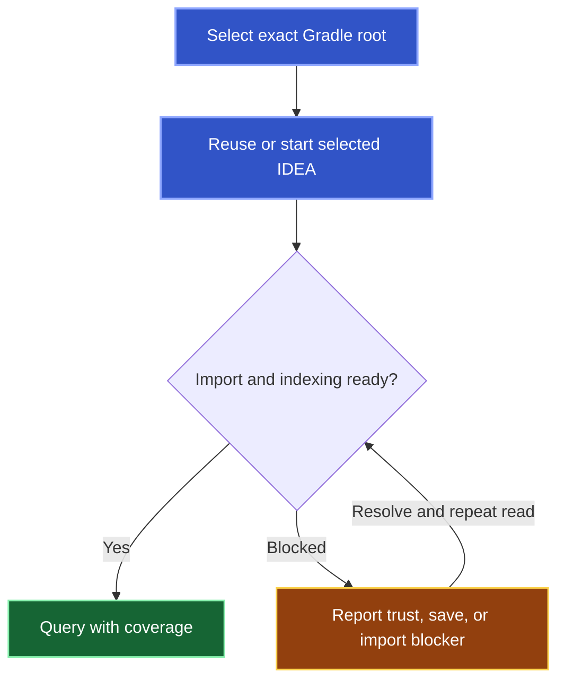

Start your agent in the intended Kotlin Gradle repository or worktree. A semantic request prepares its IDEA project automatically.

## What happens on the first question

The first request can take longer than later queries. Background presentation is best effort; a trust prompt, unsaved document, or failed import can require attention in IDEA.

Results belong to that exact worktree. References from another worktree require their own admission. Use the [first query](/agent-harnesses#check-that-the-tools-work) to verify readiness and tool use.

## Control when an agent uses Kast

Request Kast for identity, relationships, or retained queries. For text-only work, tell the agent not to call it.

`kast disconnect <harness>` removes an installed registration. Restart that agent to unload it. Disconnect does not close IDEA or stop existing sessions and other clients.

There is no management command that disables preparation while keeping semantic queries enabled. Hosted App Server [workspace lifecycle controls](/workspaces#explicit-workspace-control-in-the-hosted-app-server) provide separate explicit project actions.
