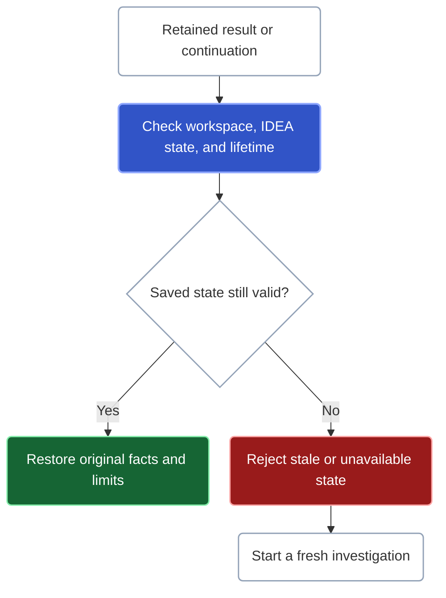

A result describes the workspace, source state, and scope that Kast checked. Read those limits before using it to answer a broader question or making a source change.

## Exact facts are not the same as exhaustive coverage

| Result | What it supports |
| --- | --- |
| Exact symbol with complete coverage | Kast confirmed the declaration and covered the requested search scope. |
| Exact symbol with qualified coverage | Kast confirmed the declaration, but more matches or unfinished checks may remain. |
| Empty with complete coverage | No matching result exists within the declared, supported search scope. |
| Empty with qualified coverage | Absence remains unproven, even when this page has no rows. |
| Rejected or unavailable | No successful semantic result was established by this request. Resolve the reported failure. |

A complete Kotlin-source search covers the stated source scope. It does not establish facts about other languages, libraries, or runtime behavior. Read any restrictions, omissions, and item failures alongside the result.

## Decide whether to continue

A qualified result keeps confirmed facts and explains what remains unfinished. If progress is resumable, use its issued continuation. If progress is terminal, read the reason it stopped. A result limit alone does not mean a continuation exists, and a missing continuation does not mean coverage is complete.

An empty page may mean Kast examined input that did not pass a filter. Follow the reported progress to check for more work. Reading every page of saved rows only retrieves existing results; it cannot complete unfinished query work. See [how to follow progress](/reference/responses#follow-progress-not-row-count).

Combining results preserves their limitations. `DIFFERENCE` and an `ANTI` join remove symbols found in the right-hand input. That input must have complete coverage before Kast can conclude that a symbol is absent from it.

## Can I reuse this result later?

When you reuse a retained result or continuation, Kast checks its workspace, owning IDEA instance, read state, and lifetime.

Saved rows and unfinished work can be reused only while that state remains valid and available. A changed IDEA read epoch, expired or evicted entry, or different owner causes a rejection or unavailable result. A matching name or path cannot make the old result valid again.

A fresh read of an exact symbol may reacquire it and check its identity through the compiler. This is a new validation. Retained results and continuations cannot move to a different read state this way.

## Keep the right evidence intact

An exact symbol `ref`, a retained-result reference, an execution continuation, a result cursor, and a row ID have different meanings. Pass each unchanged to the operation that accepts it. Do not rebuild tokens, compare their spelling as semantic identity, or substitute a remembered source location.

Selecting saved rows preserves their evidence, but says nothing about rows you excluded. Reference occurrences such as imports and aliases can belong to a file without an enclosing declaration. Kast keeps those use sites in the result without treating them as declarations that a call graph can expand.

## Check the scope of verification

Kast identifies the exact target of a source change and reports whether verification succeeded. If verification fails or remains incomplete, follow the reported recovery guidance. The [change guide](/change) describes supported targets and recovery states.

Run the build and tests your project requires. IDEA diagnostics and verification of one edit cover their reported scope; they do not establish whole-project behavior.

Canonical semantic reads distinguish complete, qualified, and rejected. Direct MCP returns the operation document itself in `result.structuredContent`, without a generic `partial` wrapper or an additional semantic `data` layer. Invocation failures use the MCP wrapper and may have no admitted structured document. Tool RPC has separate reply variants. Use [Results](/reference/responses) to locate and interpret the operation document inside its transport.
