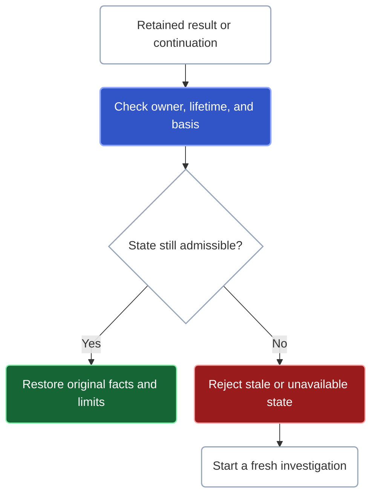

A result is useful only within the workspace authority, source state, and request scope that produced it. Kast carries those boundaries with the facts so that the next step can preserve them rather than guess.

## Exact facts are not the same as exhaustive coverage

| Result | What it supports |
| --- | --- |
| Exact symbol with complete coverage | The declaration was established and the requested search universe was covered. |
| Exact symbol with qualified coverage | The returned declaration is established; additional matches or obligations may remain. |
| Empty with complete coverage | No matching result exists within the declared, supported search universe. |
| Empty with qualified coverage | Absence remains unproven, even when this page has no rows. |
| Rejected or unavailable | No successful semantic result was established by this request. Resolve the reported failure. |

A complete Kotlin-source search is not a claim about every language, library, or possible runtime behavior. Scope, provider support, omissions, and item failures matter to the claim you can make.

## Incomplete does not always mean the same next step

A qualified result keeps useful facts and explains what is unfinished. Its progress says whether an issued continuation can resume execution or whether the operation has stopped with a terminal reason. Do not invent a continuation from the presence of a result limit, and do not infer completion from its absence.

An advancing empty page may have consumed input that did not satisfy a later filter. Follow its reported progress. Conversely, reading every retained presentation page does not discharge missing semantic evidence. See [how to follow progress](/reference/responses#follow-progress-not-row-count).

Composition preserves these limitations. `DIFFERENCE` and an `ANTI` join require complete right-hand membership before they can establish nonmembership; incomplete right-hand input is not evidence of absence.

## Can I reuse this result later?

A later read is another admission against the current workspace authority and retained-state owner.

Retained rows or unfinished execution are restored only under the same admitted basis while their bounded state remains available. A changed IDE read epoch, expired or evicted entry, or different owner produces an explicit rejection or unavailable state. An unchanged name or path cannot establish continuity.

A fresh exact-symbol read is different: it may perform bounded reacquisition and compiler revalidation. That is a new check, not permission to treat an old reference as permanently valid. Retained results and continuations do not transparently migrate to a new basis.

## Keep the right evidence intact

An exact symbol `ref`, a retained-result reference, an execution continuation, a result cursor, and a row ID have different meanings. Pass each unchanged to the operation that accepts it. Do not rebuild tokens, compare their spelling as semantic identity, or substitute a remembered source location.

Selecting retained rows preserves their evidence, but a subset does not prove coverage of excluded rows. File-scoped reference occurrences, such as imports and aliases, remain use-site facts; they do not acquire a fabricated enclosing declaration or become call-graph endpoints.

## A bounded verification is not a universal guarantee

Kast's source changes retain an exact target and report their verification outcome. A failed or incomplete verification must not become a verified success. The [change guide](/change) describes the supported targets and recovery states.

Retrieved IDEA diagnostics and a verified bounded edit do not assert that the entire Gradle project builds or that the change satisfies business requirements.

Canonical semantic reads distinguish complete, qualified, and rejected. Direct MCP returns the operation document itself in `result.structuredContent`, without a generic `partial` wrapper or an additional semantic `data` layer. Invocation failures use the MCP wrapper and may have no admitted structured document. Tool RPC has separate reply variants. Use [Results](/reference/responses) to locate and interpret the operation document inside its transport.
