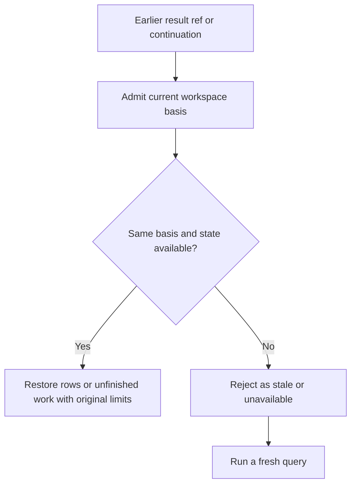

A result is useful only within the workspace, source state, and request scope that produced it. Status and coverage determine what the agent can claim.

| Result | What it supports |
| --- | --- |
| Exact symbol + complete | The declaration was established in the reported scope. |
| Exact symbol + partial | The returned declaration is useful; additional matches may be missing. |
| Empty + complete | No match was established in the requested scope. |
| Empty + partial | Absence remains unproven. |
| Rejected or unavailable | No successful semantic result was established. Resolve the reported failure first. |

## Can I trust this result later?

A later read is a new check against the current workspace authority and retained-state owner.

The invariant is that retained rows or unfinished execution are restored only under the same admitted basis while their bounded state remains available. Kast can preserve the original coverage and qualifications across a valid continuation. A changed IDE read epoch, an expired or evicted entry, or a different owner leads to explicit rejection or unavailability; an unchanged name or path alone cannot establish continuity.

## Keep opaque references intact

A `ref` is issued by Kast and belongs to its workspace and evidence lifetime. Copy it unchanged into the next query. A matching name, reconstructed token, or remembered file path is not an exact reference. Fresh exact-symbol reads may perform bounded reacquisition and revalidation; retained query results and continuations do not transparently replay under a changed basis. If Kast reports a stale ref, query again.

## Coverage is specific

Coverage describes the requested scope and any observed omissions or limits. Result limits and semantic provider interruptions can qualify known facts; an unavailable project or hard deadline can reject the read before a result is published. Selecting a subset of retained rows does not prove anything about excluded rows.

The canonical operation document distinguishes complete, qualified, and rejected. Direct MCP wraps semantic reads as complete, partial, rejected, or unavailable. Tool RPC uses its own top-level reply variants. Inspect both the transport wrapper and the canonical document in [Read a Kast result](/reference/responses).

IDEA diagnostics report the analysis facts Kast retrieved; they do not assert that the entire Gradle project builds successfully.
