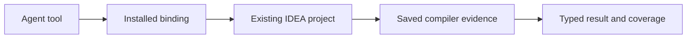

Ordinary semantic tools read the repository already open in IDEA. The installed
broker owns agent connections and routing; the IDEA project owns live compiler
evidence. Use this distinction when a request fails or when validating a harness.

## Follow a read

A missing or unready host rejects. This path does not open a workspace, import
Gradle, synchronize an index, or start an isolated worker as a hidden prerequisite.
Save source and finish indexing before requesting evidence.

Each live result retains its canonical root, original host incarnation, and
content/model epoch. Those coordinates distinguish the evidence from an answer
for another repository or a retired owner. See [Live evidence](/reference/models/live-evidence).

## Understand broker ownership

The installation-owned coordinator retains service identity, connection
admission, workspace registration, invocation lanes and controller approvals.
Thread bindings retain workspace and installation owners. Ambiguous roots,
contradictory thread reuse, stale epochs, and stale service generations reject.

The shipped runtime contains only the existing-IDE plugin. Coordinator status
admits zero worker reservations and rejects retired worker-demand messages.
Workspace enrollment remains routing information and grants no project-opening
or Gradle-import authority.

<Accordion title="Version-owned state and endpoint cleanup">
  The version root owns configuration, workspace registration, mutable runtime
  state, payloads, caches, and socket endpoints. Reset and removal use exact
  manifests and ownership receipts. Socket aliases retain inode and owner
  evidence; bind, probe, publication, and cleanup revalidate it. Replaced or
  otherwise unproven objects remain in place with a recovery-required result.
</Accordion>

## Choose evidence for a validation claim

| Check | What it can establish |
| --- | --- |
| Generated contract and schema tests | Request shapes, response variants, invocation bindings, and rejection of invalid values |
| Focused coordinator and transport tests | Routing, ownership, deadlines, and bounded failure handling |
| Existing-IDE semantic acceptance | Compiler results in the admitted project, source state, host, and workload tested |
| Broker workspace-lane tests | Routing separation, settlement and cleanup for the exercised identities |
| Product build gates | Agreement of the required checks at the tested source revision |

A source implementation is not a passed acceptance run. A small fixture is not a
capacity guarantee. Consult the repository's
[existing-IDE acceptance record](https://github.com/amichne/kast/blob/main/docs/reviews/live-semantic-read-acceptance.md)
and [semantic reproduction record](https://github.com/amichne/kast/blob/main/docs/reviews/hosted-semantic-reproduction.md)
for the observed boundary.

<Accordion title="How isolated acceptance avoids changing live installations">
  The acceptance harness creates a private writable root and staged product,
  with separate homes, configuration, caches, runtime payloads, and temporary
  files. Children receive explicit executable and environment inputs. It tracks
  and retires only its own processes and checks endpoint ownership before cleanup.

  This isolates writable state and process ownership; it is not an OS sandbox.
  Dependency downloads are an explicit exception in the Gradle fixture. Failed
  runs retain bounded outcome evidence for diagnosis. Run one Gradle invocation
  at a time per checkout.
</Accordion>

For operational failures, use [Troubleshooting](/troubleshooting); for field-level
handling, use [Read a response](/reference/responses).
