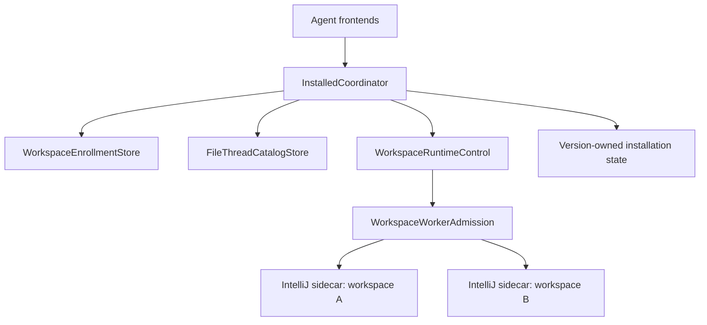

> This page describes the pre-release `feature/plan-0.36.1-runtime-integration` work. It separates source that exists, focused proof that has been observed, and gates that still need to run. It is not a release receipt.

## Runtime model

One installed coordinator owns service identity, connection admission, workspace registration, resource reservations, and worker retirement. Each resident workspace still runs in its own IntelliJ sidecar.

The coordinator is installation-owned. Its readiness proof carries the installation identity, state epoch, service generation, configuration identity, and registry revision. A worker route must match those coordinates before a caller can reuse it.

The workspace registry records canonical roots and a monotonically increasing revision. Thread bindings retain their workspace and installation owner. Ambiguous roots, reused thread identifiers with different owners, stale epochs, and stale service generations reject instead of selecting a likely workspace.

Worker admission is partitioned by workspace. Startup requests for the same workspace and lifecycle intent can share one in-flight launch. A conflicting reuse, rebuild, or seed intent rejects. The default policy admits one resident worker and one heavy startup; the installed two-workspace fixture opts into two resident workers while retaining one startup lane.

## Version-owned state

The version root owns configuration, the workspace registry, mutable runtime state, runtime payloads, caches, and socket endpoints. Installation reset and removal use the manifest and exact ownership receipts. They do not scan for vaguely related processes or remove unrelated caches.

Unix socket aliases retain an inode and owner receipt for the physical `state/run` directory. The broker, CLI, and indexer revalidate that receipt around bind, probe, publication, and cleanup. If another actor replaces an alias or socket, cleanup retains the unproven object and reports recovery required.

## Self-contained validation environment

The acceptance harness gives each run one private `0700` root and a private copy of the staged product. Writable HOME, JVM user home, CODEX_HOME, Gradle home, XDG directories, temporary files, configuration, runtime state, caches, and runtime payloads stay inside that root.

Children receive an explicit executable and environment allowlist. Ambient credentials and controls are absent. The default network policy points cooperative clients at a closed localhost proxy; the Gradle acceptance case deliberately permits dependency downloads into its empty private Gradle home.

The harness tracks the process handles it starts and retires only those handles. It also validates any endpoint-alias receipt before unlinking the alias. A successful run removes the private root. A failed run retains the fixture and writes a bounded outcome document so the failure can be inspected without recording tool or source payloads.

This is self-contained writable state and process ownership, not an operating-system sandbox. The staged product, semantic runtime archive, compatible IDEA installation, and admitted tool binaries are explicit read-only inputs. Dependency downloads are an explicit exception for the two Gradle workspaces.

## Validation layers

| Layer | Executable proof | Claim |
| --- | --- | --- |
| Offline environment | `python3 packaging/test-acceptance-environment.py` | Ambient credentials are excluded; products, homes, state, aliases, and owned processes stay isolated. |
| Lifecycle | `python3 packaging/test-installation-lifecycle.py` | Reset and remove use exact manifests and receipts; unresolved work blocks deletion. |
| Focused transport | `./gradlew :cli:nativeTest --tests '*WireDeadlineTest' :indexer:test --tests '*IndexerRequestLifetimeTest' --tests '*InstalledIndexerLaunchTest'` | Silent or partial peers terminate within the admitted budget, and uncertain retirement stays local. |
| Coordinator | `./gradlew :app-server:test` | Workspace registration, immutable routing, startup coalescing, resource admission, status, and retirement remain typed and bounded. |
| Installed two-workspace | `python3 packaging/test-model-input-startup.py --product /absolute/staged-product --runtime /absolute/semantic-runtime.zip --idea-home '/absolute/IntelliJ IDEA.app/Contents' --report /absolute/report.json` | Two independent Gradle workspaces return their own semantic symbols, reconnect to the same workers, stop independently, and reset owned state while preserving configuration. |
| Product | `./gradlew productBuildGate` | Module checks, architecture, generated configuration, packaging, fixture isolation, installer behavior, and installed host integration agree at one source head. |

Run one Gradle invocation at a time in a checkout. The two-workspace script prints `model-input-startup: two workspaces passed; <report>` only after every assertion and cleanup command succeeds.

## Feature-branch status

As of 2026-09-08, the source branch contains the typed configuration catalogue, version-owned coordinator and worker receipts, workspace registry and thread bindings, per-workspace admission, elapsed wire budgets, indexer retirement handling, lifecycle tooling, and the isolated acceptance harness.

Focused indexer alias and request-lifetime checks, plus the offline lifecycle regression suite, have been observed passing during implementation. Passive App Server status still has an observed failing test while its coordinator projection is being completed. The installed two-workspace script and final `productBuildGate` have not yet been observed at the final implementation head.

Completion requires all R1-R7 acceptance evidence from the plan at one final source revision, including a clean-checkout build and required CI. Representative heavy-monolith qualification remains a separate, explicitly authorized gate; the small fixtures establish routing and lifecycle behavior, not universal capacity.
