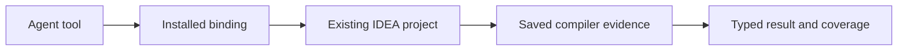

The installed broker routes requests to compiler evidence owned by the open IDEA project.

## Follow a read

A missing or unready host rejects.

The read path never hides these prerequisites:

- opening a workspace
- importing Gradle
- synchronizing an index
- starting an isolated worker

Save source and finish indexing before requesting evidence.

Each live result retains its root, host incarnation, and content/model epoch.

Those coordinates distinguish another repository or a retired owner.

See [Live evidence](/reference/models/live-evidence) for the complete coordinates.

## Understand broker ownership

| Owner | Responsibility |
| --- | --- |
| Installed coordinator | Service identity, connection admission, workspace registration, invocation lanes, and approvals |
| Thread binding | Workspace and installation owner identity |
| IDEA project | Live compiler evidence and project lifecycle |

Ambiguous roots, contradictory thread reuse, stale epochs, and stale service generations reject.

The shipped runtime contains only the existing-IDE plugin.

Workspace enrollment provides routing information, not project-opening authority.

<Accordion title="Version-owned state and endpoint cleanup">
  The version root owns configuration, registration, runtime state, payloads,
  caches, and socket endpoints.

  - Reset and removal use exact manifests and ownership receipts.
  - Socket aliases retain inode and owner evidence.
  - Bind, probe, publication, and cleanup revalidate ownership.
  - Unproven objects remain in place with a recovery-required result.
</Accordion>

## Choose evidence for a validation claim

Kast's default testing approach starts with one named behavior, its minimum facts
and the real production rule. Focused tests supply explicit inputs and script only
the external observations that the rule consumes. Filesystem, compiler, platform
and native fixtures are used when the assertion requires that authority.

Each fixture has a dependency budget. A scripted timeout can establish failure
handling without waiting or starting a child; it cannot establish how a native
process reaches that timeout. Ownership checks and protected-state assertions
remain with the production implementation. See the
[development testing guide](https://github.com/amichne/kast/blob/main/docs/development.md#test-one-behavior-at-a-time)
for the general rule, boundary choices and executable examples.

| Check | What it can establish |
| --- | --- |
| Pure policy and scripted observation tests | Resolution, provenance, finite failures and effect order for the declared inputs |
| Private filesystem and process-adapter checks | Path, lock and identity admission or invocation wiring at the exercised boundary |
| Generated contract and schema tests | Request shapes, response variants, invocation bindings, and rejection of invalid values |
| Focused coordinator and transport tests | Routing, ownership, deadlines, and bounded failure handling |
| Existing-IDE semantic acceptance | Compiler results in the admitted project, source state, host, and workload tested |
| Broker workspace-lane tests | Routing separation, settlement and cleanup for the exercised identities |
| Product build gates | Agreement of the required checks at the tested source revision |

A source implementation is not a passed acceptance run.

A small fixture is not a capacity guarantee.

Use the [existing-IDE acceptance record](https://github.com/amichne/kast/blob/main/docs/reviews/live-semantic-read-acceptance.md)
and [semantic reproduction record](https://github.com/amichne/kast/blob/main/docs/reviews/hosted-semantic-reproduction.md)
for observed results.

<Accordion title="How isolated acceptance avoids changing live installations">
  The acceptance harness creates a private writable root and staged product.

  It separates homes, configuration, caches, payloads, and temporary files.

  - Child processes receive explicit executable and environment inputs.
  - Cleanup retires only owned processes and endpoints.
  - The boundary isolates state but is not an OS sandbox.
  - The Gradle fixture may download dependencies.
  - Failed runs retain bounded diagnostic evidence.
  - Each checkout supports one Gradle invocation at a time.
</Accordion>

Use [Troubleshooting](/troubleshooting) for operational failures.

Use [Read a response](/reference/responses) for field-level handling.
