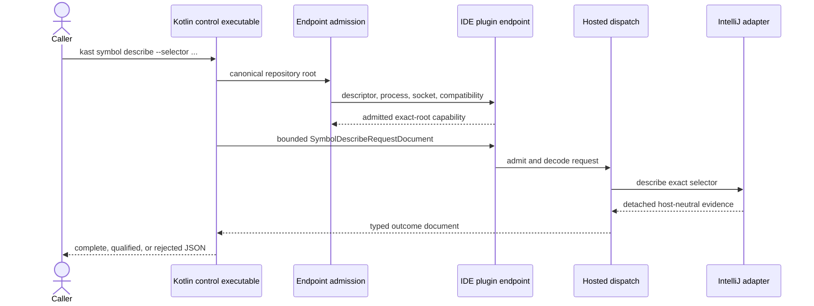

Kast places a narrow command boundary in front of an already-running supported
IDE. It reuses the exact open Project without opening, focusing, importing, or
refreshing it.

## One request, end to end

<Frame caption="The exact-root endpoint is admitted before one bounded request reaches request-local PSI and K2 state.">



</Frame>

The request and response cross the local Unix-domain socket as generated JSON
documents. PSI and K2 objects never cross the wire.

## What `kast start` means

`kast start` does not launch a runtime. `IdeOnlyRuntimeDemander` admits one
compatible endpoint already published by the IntelliJ Project for the exact
repository root, then the CLI sends `workspace.inspect` and returns that
readiness result.

Missing, stale, wrong-root, wrong-version, or unreachable endpoint evidence
fails closed. There is no private IDE installation, runtime acquisition, VFS
refresh, Gradle import, or isolated indexing fallback.

Before the plugin publishes readiness, its hosted composition constructs the
exact ten-operation public capability set: workspace inspection, topology
build, three symbol operations, traversal, and the four AddDeclaration
lifecycle operations. Direct relation and diagnostic routes remain internal
services used by those workflows.

<Columns cols={3}>
  <Card title="Exact root" icon="folder-key">
    The canonical checkout determines the descriptor and socket identity. A
    focused window cannot substitute another Project.
  </Card>
  <Card title="Exact product" icon="badge-check">
    CLI version, plugin version, IDE build, Kotlin plugin build, registry
    digest, wire digest, protocol identity, and capabilities must agree.
  </Card>
  <Card title="Existing IDE" icon="monitor-check">
    The descriptor must name a live IDE process and a reachable endpoint. The
    CLI has no authority to manufacture either one.
  </Card>
</Columns>

## Follow one symbol request

Assume discovery and resolution already returned an exact selector:

```console
kast symbol describe --selector '<exact-selector>'
```

The Kotlin control executable parses `symbol.describe` and constructs a
`SymbolDescribeRequestDocument`. `UnixDomainWireClient` sends that document as
one bounded frame to the admitted socket.

`IdeEndpointTransport` reads the frame and passes it to `HostedIdeRuntime`.
The runtime delegates the four read routes to `IdeReadRuntimeDispatch` and the
six topology, traversal, and change routes to its exact hosted-effects table.
This request reaches `HostedSymbolDescription`. The
`IntellijSymbolExactCompilerAdapter` resolves the selector using request-local
Project, PSI, index, and K2 authority, then detaches a host-neutral symbol
description.

The same RPC returns one closed outcome. The control executable writes one JSON
document to standard output for complete or qualified evidence, or one JSON
diagnostic to standard error for a boundary rejection.

<AccordionGroup>
  <Accordion title="Trace the implementation owners" icon="code-xml">
    - [`KastCli`](https://github.com/amichne/kast/blob/main/cli/src/main/kotlin/io/github/amichne/kast/cli/KastCli.kt)
      parses the public command and holds the orchestration boundary.
    - [`IdeOnlyRuntimeDemander`](https://github.com/amichne/kast/blob/main/cli/src/main/kotlin/io/github/amichne/kast/cli/runtime/IdeOnlyRuntimeDemand.kt)
      requires an already-running compatible endpoint for the exact root.
    - [`UnixDomainWireClient`](https://github.com/amichne/kast/blob/main/cli/src/main/kotlin/io/github/amichne/kast/cli/UnixDomainWireClient.kt)
      owns client-side framing and transport.
    - [`IdeEndpointTransport`](https://github.com/amichne/kast/blob/main/ide-plugin/src/main/kotlin/io/github/amichne/kast/ide/endpoint/IdeEndpointTransport.kt)
      owns the plugin-side socket and request frames.
    - [`IdeReadRuntimeDispatch`](https://github.com/amichne/kast/blob/main/runtime/ide-read/src/main/kotlin/io/github/amichne/kast/runtime/ide/read/dispatch/IdeReadRuntimeDispatch.kt)
      admits and routes the exact four read operations.
    - [`HostedIdeReadProductionComposition`](https://github.com/amichne/kast/blob/main/runtime/ide-read/src/main/kotlin/io/github/amichne/kast/runtime/ide/read/preparation/composition/HostedIdeReadProductionComposition.kt)
      binds the four routes to the retained Project and native adapters.
    - [`HostedIdeRuntime`](https://github.com/amichne/kast/blob/main/runtime/ide-host/src/main/kotlin/io/github/amichne/kast/runtime/ide/host/HostedIdeRuntime.kt)
      composes those reads with the six exact topology, traversal, and change
      routes.
    - [`IntellijSymbolExactCompilerAdapter`](https://github.com/amichne/kast/blob/main/symbol/intellij/src/main/kotlin/io/github/amichne/kast/symbol/intellij/exact/IntellijSymbolExactCompilerAdapter.kt)
      confines exact request-local K2 work.
  </Accordion>

  <Accordion title="Inspect module ownership" icon="boxes">
    The dependency direction stays pointed toward detached evidence:

    ```mermaid placement="top-right" actions={true}
    flowchart LR
        CLI[Kotlin control executable] --> ADMIT[Exact endpoint admission]
        CLI --> WIRE[Typed wire documents]
        WIRE --> TRANSPORT[IDE plugin transport]
        TRANSPORT --> DISPATCH[Exact ten-route hosted dispatch]
        DISPATCH --> ROUTES[Hosted read and effect routes]
        ROUTES --> K2[Request-local IntelliJ adapters]
        K2 --> EVIDENCE[Host-neutral evidence]
        EVIDENCE --> WIRE
    ```

    The checked-in [LikeC4 sources](https://github.com/amichne/kast/tree/main/docs/public/architecture)
    remain the deeper repository proof. They are excluded from publication by
    `.mintignore` because Mintlify renders this native Mermaid projection.
  </Accordion>
</AccordionGroup>

## How the live generation moves

Endpoint startup hashes only the admitted workspace root, source-root model,
source provenance, and one project-service cold-start identity into a bounded
lineage basis. It does not walk the repository or read every source file. Full
source reads occur only for an explicit topology build or a targeted mutation
boundary.

A newly opened Project conservatively advances the durable semantic generation.
IntelliJ does not expose a persistent, source-root-bounded subtree epoch that
could prove files were unchanged while the Project was closed, so Kast does
not reuse the old generation on layout evidence alone. Deferred startup
attempts in the same project service reuse one listener and event counter.
After a cold start, an explicit `topology.build` enumerates the current
canonical candidates; if their paths, source roots, and content hashes exactly
match the durable snapshot, Kast rebinds that snapshot to the new lease as
`reused` instead of repeating K2 extraction.

The endpoint retains a source-root-filtered IntelliJ VFS transition counter.
A matching descendant or source-root-ancestor structural event advances the
source lineage; a targeted mutation proof also advances it when the physical
transition is known before a VFS event is available. Source invalidation and
lease-guarded effects share one serialization boundary. Unrelated VFS traffic
cannot move the workspace. The workspace owner durably issues the newer
generation, reconciles the same admitted model, stages an exact-generation
read runtime, and publishes only a proven same-root successor. A complete
`change.apply` therefore makes prior selectors stale in the same endpoint
before `change.verify` observes and proves the resulting state.

If a physical write cannot be followed by durable application authority, the
workspace still publishes its source transition and the mutation state becomes
recovery-required immediately. A successful rollback publishes another
successor generation before it re-audits durable state and installs fresh
writer capabilities without reconstructing the endpoint; unresolved recovery
never regains them.

## Compiler objects stay inside the adapter

IntelliJ Projects, VFS entries, PSI, K2 symbols, compiler sessions, and native
search scopes remain inside request-local IDE boundaries. Kast projects results
into host-neutral identities and evidence documents before they travel over the
wire.

This gives the caller stable facts without pretending compiler objects can be
serialized or reused after their workspace generation changes.

## The current boundary is intentionally narrow

<Columns cols={3}>
  <Card title="Hosted now" icon="circle-check">
    Workspace inspection, topology, symbol reads, traversal, and the
    AddDeclaration lifecycle are the ten public installed capabilities.
  </Card>
  <Card title="Internal services" icon="circle-dashed">
    Relation and diagnostic operations remain canonical internal services and
    have no direct endpoint routes.
  </Card>
  <Card title="IDE-owned lifecycle" icon="power">
    `stop`, `clean`, and `reindex` reject for the active hosted endpoint. Close,
    restart, or reindex the Project through IntelliJ.
  </Card>
</Columns>

## Exact endpoint identity is part of the result

One exact-root hosted endpoint means another checkout, Project, IDE process, or
stale descriptor cannot silently become the authority for this request. When
root, generation, capability, scope, or endpoint identity cannot be proven,
the operation fails closed.

[Set up and start Kast](/start) follows this path from a clean host.
[Trust the evidence](/concepts/evidence-boundaries) explains how to read the
result at the other end.
