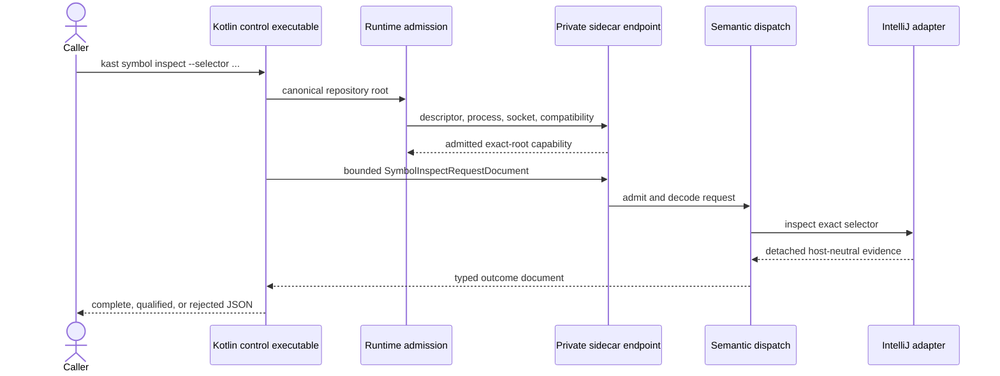

Kast places a narrow command boundary in front of an isolated headless Project.
The sidecar uses one release-line-compatible local IDEA installation and its
JBR, Kotlin plugin, Gradle integration, PSI, and indexes. Kast preserves the
exact observed host identities, while all mutable IDE state stays under
Kast-owned paths.

## One request, end to end

<Frame caption="The exact-root endpoint is admitted before one bounded request reaches request-local PSI and K2 state.">



</Frame>

The request and response cross the local Unix-domain socket as generated JSON
documents. PSI and K2 objects never cross the wire.

## What `kast start` means

`kast start` discovers or admits one compatible IDEA home. It verifies that the
observed IDEA and Kotlin plugin builds remain on the platform release lines
declared by the installed Kast release, then preserves their exact patch
identities alongside the JBR and private payload. It also verifies bootstrap
classes and Gradle integration before launching a headless process with private
config, system, plugin, and log directories. The Project is imported from disk,
its VFS is refreshed, and the endpoint is published only after smart mode and
semantic canaries succeed.

Missing, ambiguous, wrong-build, wrong-root, stale-cache, or unreachable
evidence fails closed. A missing cache causes a fresh private import; it does not
authorize reading the user's IDEA cache. Kast ships no IDEA distribution and
has no user-IDE plugin fallback.

Before the sidecar publishes readiness, its composition constructs the
exact eleven-operation public capability set: index synchronization, topology
build, symbol discovery and inspection, source and relation reads, traversal,
diagnostics, and planning, verified application, or recovery for changes.

Source-root identity comes from IntelliJ's canonical local source-folder URL,
not from an existence-dependent `VirtualFile`. A declared source directory may
therefore be absent, including an empty resources or generated-source root,
without preventing endpoint publication. Its absence contributes no source
candidates until the directory appears. Malformed, non-local,
outside-workspace, conflicting, or otherwise unproven roots still fail closed.

| Boundary | Required proof |
| --- | --- |
| **Exact root** | The canonical checkout determines the descriptor and socket identity. A focused window cannot substitute another Project. |
| **Compatible host, exact observation** | IDEA and Kotlin plugin release lines must be compatible; their observed patch builds, JBR identity, payload digest, protocol identity, and capabilities remain exact. |
| **Private state** | The sidecar's config, system, plugins, logs, socket, and persistent cache are physically distinct from the user's IDEA state. |

## Optional index seeding is a validated copy

`kast start --cache seed` is the only lifecycle intent authorized to read an IDEA
system directory. The source must belong to the exact runtime and target
project, and IDEA must be fully stopped with no live lock or matching process.
Interactive startup discloses the version-specific allowlist, estimated bytes,
and the unavoidable presence of other-project entries in required global
VFS/index files. Non-interactive startup must carry
`--accept-global-index-copy` as explicit consent.

On APFS, Kast copy-on-write clones the allowlisted global identity data and only
the target project's dedicated model/index cache into an unpublished staging
directory. Local History, logs, AI data, VCS logs, editor state, temporary
data, and other projects' dedicated caches are excluded. Source and clone
manifests plus source quiescence are checked again before an atomic publish.
The seed is only an acceleration hint: corrupt, changed, or incompatible state
becomes a typed failure or `rebuild-required`, never semantic success.

The foreground seed coordinator emits payload-free JSON-line activity for its
bounded validation, discovery, quiescence, copy, clone-validation, receipt, and
publication stages. Each line records only the component, event, stage, outcome,
and a finite rejection reason when applicable; it never records paths or cache
payloads.

The broker service log uses the same bounded shape for startup. It records each
qualification, catalog, upstream, server, and readiness-publication stage plus
the payload-free start and finish of every admitted tool call. Failures retain a
finite reason without recording tool arguments, results, or repository content.

## Follow one symbol request

Assume inspection already returned an exact selector:

```console
kast symbol inspect --selector '<exact-selector>'
```

The Kotlin control executable parses `symbol.inspect` and constructs a
`SymbolInspectRequestDocument`. `UnixDomainWireClient` sends that document as
one bounded frame to the admitted socket.

The private `InstalledIndexerTransport` reads the frame and passes it through
`KastIndexerHost` to `InstalledKastRuntime`. `CanonicalKastOperationHandlerFactory`
binds the complete eleven-operation protocol to the exact workspace graph.
This request reaches the symbol service created by `InstalledIntellijSymbolPorts`.
Its request-local IntelliJ adapters resolve the selector with Project, PSI,
index, and K2 authority, then detach a host-neutral symbol description.

The same RPC returns one closed outcome. The control executable writes one JSON
document to standard output for complete or qualified evidence, or one JSON
diagnostic to standard error for a boundary rejection.

<AccordionGroup>
  <Accordion title="Trace the implementation owners" icon="code-xml">
    - [`KastCli`](https://github.com/amichne/kast/blob/main/cli/src/main/kotlin/io/github/amichne/kast/cli/KastCli.kt)
      parses the public command and holds the orchestration boundary.
    - [`InstalledSidecarRootRuntimeDemander`](https://github.com/amichne/kast/blob/main/cli/src/main/kotlin/io/github/amichne/kast/cli/runtime/InstalledSidecarRuntimeDemand.kt)
      discovers the exact installed runtime, prepares the private cache, and
      starts or reuses the exact-root endpoint.
    - [`IndexSeedFilesystemService`](https://github.com/amichne/kast/blob/main/cli/src/main/kotlin/io/github/amichne/kast/cli/runtime/IndexSeedFilesystemService.kt)
      admits and validates an explicitly requested APFS cache clone.
    - [`UnixDomainWireClient`](https://github.com/amichne/kast/blob/main/cli/src/main/kotlin/io/github/amichne/kast/cli/UnixDomainWireClient.kt)
      owns client-side framing and transport.
    - [`KastIndexerApplicationStarter`](https://github.com/amichne/kast/blob/main/indexer/src/main/kotlin/io/github/amichne/kast/indexer/KastIndexerApplicationStarter.kt)
      admits the exact launch, publishes bootstrap progress, and owns the
      sidecar process until exit.
    - [`InstalledIndexerTransport`](https://github.com/amichne/kast/blob/main/indexer/src/main/kotlin/io/github/amichne/kast/indexer/InstalledIndexerTransport.kt)
      owns the bounded Unix-domain socket and request frames.
    - [`InstalledKastRuntime`](https://github.com/amichne/kast/blob/main/runtime/composition/src/main/kotlin/io/github/amichne/kast/runtime/composition/bootstrap/InstalledKastRuntime.kt)
      admits the exact workspace and state directory before composition.
    - [`InstalledRuntimeAssembly`](https://github.com/amichne/kast/blob/main/runtime/composition/src/main/kotlin/io/github/amichne/kast/runtime/composition/bootstrap/InstalledRuntimeAssembly.kt)
      constructs the workspace graph, persistence, and all eleven canonical
      operation handlers.
    - [`InstalledIntellijWorkspace`](https://github.com/amichne/kast/blob/main/workspace/intellij/src/main/kotlin/io/github/amichne/kast/workspace/intellij/InstalledIntellijWorkspace.kt)
      owns project open, Gradle import, indexing, and detached model capture.
    - [`InstalledIntellijSymbolPorts`](https://github.com/amichne/kast/blob/main/symbol/intellij/src/main/kotlin/io/github/amichne/kast/symbol/intellij/InstalledIntellijSymbolPorts.kt)
      confines exact request-local PSI and K2 work.
  </Accordion>

  <Accordion title="Inspect module ownership" icon="boxes">
    The dependency direction stays pointed toward detached evidence:

    ```mermaid placement="top-right" actions={true}
    flowchart LR
        CLI[Kotlin control executable] --> ADMIT[Exact runtime discovery and admission]
        CLI --> WIRE[Typed wire documents]
        ADMIT --> SIDECAR[Private installed-IDE sidecar]
        WIRE --> TRANSPORT[Private sidecar transport]
        TRANSPORT --> DISPATCH[Exact eleven-route semantic dispatch]
        DISPATCH --> ROUTES[Read and change routes]
        ROUTES --> K2[Request-local IntelliJ adapters]
        K2 --> EVIDENCE[Host-neutral evidence]
        EVIDENCE --> WIRE
    ```

    The checked-in [LikeC4 sources](https://github.com/amichne/kast/tree/main/docs/public/architecture)
    remain the deeper repository proof. Their generated, provenance-checked
    views are published in the [technical specification](/technical-specification).
  </Accordion>
</AccordionGroup>

## How the live generation moves

Sidecar startup imports the exact Gradle project, waits for smart mode and
indexing quiescence, captures the admitted source-root model and current source
identity, and publishes that evidence as one durable semantic generation. It
does not perform a full repository topology build during startup. An explicit
`topology.build` enumerates admitted candidates; when paths, roots, and content
hashes exactly match a durable snapshot, Kast can rebind that snapshot to the
current generation instead of repeating K2 extraction.

`index.sync` is the explicit stale-file repair boundary. It refreshes the
admitted local source roots, waits for the same strengthened indexing
quiescence proof used at startup, captures current source identity, and
reconciles the workspace publication. Missing, outside-root, refresh-failed,
or indexing-failed state returns a typed rejection.

`change.apply` owns the full write, successor publication, and verification
sequence. It returns success only with a verified receipt for a resulting
same-root generation derived from the exact prior lease. Rejected and
recovery-required outcomes cannot be presented as successful application, and
unresolved recovery never regains write authority.

## Compiler objects stay inside the adapter

IntelliJ Projects, VFS entries, PSI, K2 symbols, compiler sessions, and native
search scopes remain inside request-local IDE boundaries. Kast projects results
into host-neutral identities and evidence documents before they travel over the
wire.

This gives the caller stable facts without pretending compiler objects can be
serialized or reused after their workspace generation changes.

## The current boundary is intentionally narrow

| Boundary | Current contract |
| --- | --- |
| **Sidecar routes** | Index synchronization, topology, symbol discovery and inspection, source and relation reads, traversal, diagnostics, planning, verified application, and recovery are the eleven public installed capabilities. |
| **Compiler-grounded reads** | Relation and diagnostic routes use the same typed compiler services as planning and verification while remaining independently callable. |
| **Kast-owned lifecycle** | `start` owns admission and typed cache policy, `status` is passive, and `stop` targets only the proven sidecar process and its endpoint artifacts. |

## Performance traces stay local by default

Before runtime construction, the sidecar proves a private trace destination
inside the exact socket's durable state directory. Completed topology and
traversal spans are forwarded asynchronously as OTLP JSON Lines. `kast product inspect`
exposes the enabled directory, trace file, and format without starting the
runtime.

The span tree separates workspace admission, snapshot eligibility and reads,
candidate enumeration, extraction, revalidation, publication, snapshot open,
and traversal expansion. Its custom attributes are limited to closed outcome
and failure variants plus non-negative file or record counts. Paths, selectors,
source text, exception messages, and stack traces never enter this telemetry
contract.

## Exact endpoint identity is part of the result

One exact-root sidecar endpoint means another checkout, Project, IDE process, or
stale descriptor cannot silently become the authority for this request. When
root, generation, capability, scope, or endpoint identity cannot be proven,
the operation fails closed.

[Set up and start Kast](/start) follows this path from a clean host.
[Trust the evidence](/concepts/evidence-boundaries) explains how to read the
result at the other end. The [technical specification](/technical-specification)
continues from this overview into the runtime, protocol, domain services,
change lifecycle, module policy, and verification system.
