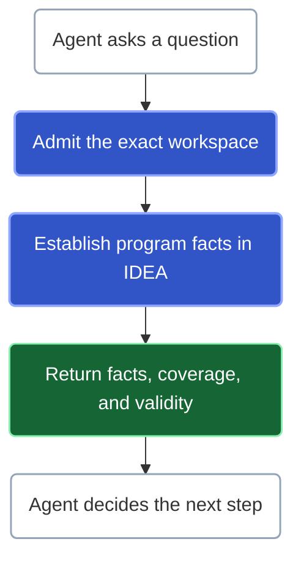

**Kast is the deterministic structure around a probabilistic system.**

It gives coding agents compiler-grounded understanding of Kotlin code, so questions the program can answer do not have to remain guesses. The agent decides what to investigate. Kast establishes program facts through IntelliJ IDEA and carries their identity, scope, coverage, and validity into the next operation.

## Fewer questions left to guess

More context can help an agent choose a plausible answer. But a plausible declaration is not an exact declaration, a likely caller is not a confirmed caller, and an empty search is not necessarily evidence of absence.

Kast asks a different question: **how much of this task should remain probabilistic at all?**

When the compiler can establish which declaration is referenced, the agent should not infer it from a name. When a read is incomplete, the agent should not decide that the missing results probably do not exist. When retained evidence is no longer valid, the next operation should not silently treat it as current.

The model still supplies judgment. Kast supplies established facts and explicit limits, not a guarantee that every conclusion the model draws is correct.

## What that makes possible

<CardGroup cols={2}>
  <Card title="Find the exact code" icon="fingerprint" href="/search">
    Distinguish overloads and same-named declarations. Carry an issued symbol reference forward instead of resolving a name again.
  </Card>

  <Card title="Follow real relationships" icon="git-branch" href="/reference/api">
    Trace callers, implementations, and individual uses. Keep confirmed relationships separate from uncovered work.
  </Card>

  <Card title="Build on established evidence" icon="workflow" href="/query-pipelines">
    Combine retained investigations by semantic identity, resume unfinished execution, or inspect stored rows without restarting the query.
  </Card>

  <Card title="Change a known target" icon="file-pen-line" href="/change">
    Add a declaration or replace a supported function body through an exact-target operation with an explicit verification outcome.
  </Card>
</CardGroup>

These are parts of one ambition: carry dependable evidence from a question toward a justified action. Knowing something should narrow the next step, not disappear when a tool call ends.

## Know what the answer proves

An exact positive result can remain useful even when the wider investigation is incomplete. A complete empty result supports absence only within the declared search universe. An empty page with unfinished work does not.

Kast reports complete, qualified, or rejected semantic outcomes. Qualified results preserve their limits and distinguish usable continuation from a terminal stop. References and retained results remain bound to the authority that admits them. Read [what an answer proves](/concepts/evidence-boundaries) before treating a result as exhaustive or reusing it later.

## What Kast does not promise

Kast is not another language model, a substitute for your agent's judgment, or a claim of arbitrary refactoring support. Its current source changes are declaration insertion and supported block-body replacement. Retrieved diagnostics and a verified bounded edit do not certify a whole-project build or business correctness.

The current installation targets Kotlin Gradle projects on Apple silicon macOS with IntelliJ IDEA `262.*`. Kast prepares the selected project in the background and reports readiness blockers rather than returning a misleading empty answer. See [compatibility](/reference/compatibility) and [background preparation](/concepts/background-startup).

## Start using Kast

[Install Kast](/start), then [connect your agent](/agent-harnesses). Start the agent in the repository or worktree you want to inspect and ask:

> Use Kast to find the declaration relevant to this question. Show its exact identity and source location, trace the relationships that matter, and separate what is established from what remains incomplete.

Use [Find and trace code](/search) for concrete prompts and [Query forms](/reference/api) for the current request shapes.
