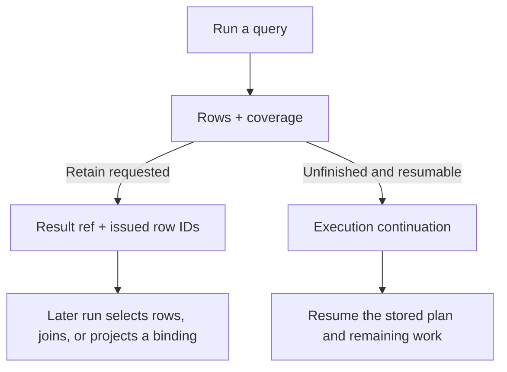

`query_symbols` is Kast's composable semantic query operation. It starts from a typed source and applies ordered steps, so discovery, relation reads, traversal, and composition share one evaluator.

## Choose a source

A query can start from declaration discovery, a named declaration containing a workspace-relative file offset, exact refs returned by Kast, or a retained result. At a file offset, Kast finds the nearest containing named declaration. This is declaration containment, not go-to-definition. Use [the first query](/search) to obtain an exact `ref`.

## Apply ordered steps

Steps run from left to right. A pipeline can filter by typed predicates, remove duplicate semantic identities, expand one-hop relations into declarations or occurrences, walk a relation to a bounded depth, combine result sets, or join typed symbol bindings.

Difference and anti-join cannot infer absence from an incomplete right-hand result. Kast rejects that request before execution.

## Example: find references to an exact symbol

First obtain a `ref` from a query. Then pass it unchanged as the source for the next query:

```json
{
  "request": {
    "type": "RUN",
    "source": {"type": "SYMBOL_REFS", "symbolRefs": ["<exact-ref-returned-by-Kast>"]},
    "steps": [{"type": "EXPAND_RELATION", "relation": "REFERENCES"}],
    "output": {"type": "OCCURRENCES"}
  }
}
```

Occurrence output preserves individual relation facts and repeated use sites. An empty result supports an absence claim only when coverage is complete for the requested scope.

## Retain, inspect, and continue

A query can retain its immutable result. A later query can select issued row IDs, join against a retained result, or project one named binding. When unfinished work is resumable, the issued execution continuation resumes it without replaying a completed prefix.



The invariant is that each issued handle retains the facts its next operation needs: a result ref keeps rows and qualifications, while an execution continuation keeps the admitted plan and pending work. An agent can compose from retained rows or resume unfinished execution without reconstructing those facts from prose. Retention is optional and bounded; either handle can be unavailable or rejected when its basis no longer matches.

| Handle | Job |
| --- | --- |
| Exact symbol `ref` | Identifies one semantic symbol; pass it to a fresh query or source read for revalidation. |
| Result ref | Names immutable retained rows from one query result, with their original coverage and qualification. |
| Execution continuation | Resumes unfinished work from its checkpoint on the same admitted basis. |
| Result cursor | Pages through one retained result; it does not continue semantic execution. |

Result refs, row IDs, execution continuations, and presentation cursors have different owners. Reuse each token only for the operation that issued it. Rows selected from a retained result can seed another query. Their original qualifications travel with them, and excluded rows remain unchecked.

See [what an answer proves later](/concepts/evidence-boundaries). The generated **Query symbols** entry in the API / RPC tab lists every supported source, step, output, continuation, and finite rejection. Use the installed catalog for the exact schema; do not construct `ref` values.
