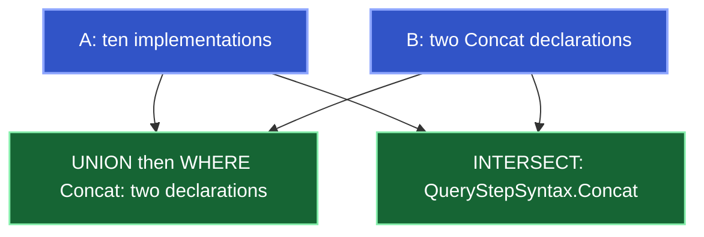

Retain results with `retention: "RETAIN"`, then combine their rows by exact symbol identity. Pass issued result references unchanged.

This example uses the [historical recording](/reference/schemas#recorded-walkthrough) against [Kast at `56df091`](https://github.com/amichne/kast/tree/56df0912e46b182bb4ad8beabd1512823100fd72). Counts describe that run. **A**, **B**, and **C** are teaching labels; use fresh references in your session.

## Retain a second query result

The [walkthrough](/reference/walkthrough) retains **A**: ten implementations of `QueryStepSyntax`. Retain **B**: two class-like declarations named `Concat` under `query/contract` in `main`.

`QueryStepSyntax.Concat` implements the interface; `ExactQueryStage.Concat` does not. A shared name does not establish shared identity.

<Accordion title="Request: discover and retain input B">
  ```json
  {
    "request": {
      "type": "RUN",
      "executionBudget": {"maxElapsedMs": 15000},
      "source": {
        "type": "SEARCH_DECLARATIONS",
        "declarationName": "Concat",
        "declarationKinds": ["CLASS"],
        "scope": {
          "type": "DIRECTORY",
          "relativeDirectoryPath": "query/contract",
          "sourceSetNames": ["main"]
        }
      },
      "output": {"type": "SYMBOLS", "fields": ["NAME", "LOCATION", "SIGNATURE"]},
      "retention": "RETAIN"
    }
  }
  ```
</Accordion>

## Combine both inputs, then filter the combined stream



The recorded union/filter (`04-union-filter`) returns both declarations with exhaustive coverage. The filter applies after union.

<Accordion title="Request: union by identity, then filter by name">
  ```json
  {
    "request": {
      "type": "RUN",
      "executionBudget": {"maxElapsedMs": 15000},
      "source": {"type": "RESULT", "result": "<result A>"},
      "steps": [
        {"type": "UNION", "right": {"type": "RESULT", "result": "<result B>"}},
        {
          "type": "WHERE",
          "predicate": {
            "type": "PRIMITIVE",
            "field": "NAME",
            "operator": "EQUALS",
            "value": "Concat"
          }
        }
      ],
      "output": {"type": "SYMBOLS", "fields": ["NAME", "LOCATION", "SIGNATURE"]}
    }
  }
  ```

  `CONCAT` with `input` preserves order and duplicates. Add further union steps before the filter for more retained inputs.
</Accordion>

## Keep only symbols present in both

The recorded intersection (`05-intersection`) returns only `QueryStepSyntax.Concat`. Incomplete inputs retain their qualifications.

<Accordion title="Request: intersect retained inputs">
  ```json
  {
    "request": {
      "type": "RUN",
      "executionBudget": {"maxElapsedMs": 15000},
      "source": {"type": "RESULT", "result": "<result A>"},
      "steps": [
        {"type": "INTERSECT", "right": {"type": "RESULT", "result": "<result B>"}}
      ]
    }
  }
  ```
</Accordion>

## Keep the matched pair, then select a side and continue

`INNER` joins preserve both rows' evidence. Name the cells, then select one with `PROJECT_BINDING` before another relationship step.

The recorded join (`06-join-c`) retains one pair as **C**. Both cells identify `QueryStepSyntax.Concat`; `step` preserves implementation evidence and `candidate` discovery evidence. Different reference strings can identify the same declaration.

<Accordion title="Requests: retain pairs as C, then follow one side">
  ```json
  {
    "request": {
      "type": "RUN",
      "executionBudget": {"maxElapsedMs": 15000},
      "source": {"type": "RESULT", "result": "<result A>"},
      "steps": [
        {
          "type": "JOIN",
          "mode": {"type": "INNER", "leftName": "step", "rightName": "candidate"},
          "right": {"type": "RESULT", "result": "<result B>"}
        }
      ],
      "output": {"type": "BINDING_ROWS"},
      "retention": "RETAIN"
    }
  }
  ```

  Then project `step` and follow references:

  ```json
  {
    "request": {
      "type": "RUN",
      "executionBudget": {"maxElapsedMs": 15000},
      "source": {"type": "RESULT", "result": "<result C>"},
      "steps": [
        {"type": "PROJECT_BINDING", "name": "step"},
        {"type": "EXPAND_RELATION", "relation": "REFERENCES"}
      ],
      "output": {"type": "OCCURRENCES"}
    }
  }
  ```

  The recorded query (`07-project-references`) found this compiler-confirmed use:

  ```kotlin
  is QueryStepSyntax.Concat -> ExactQueryStage.Concat(step.input, stage)
  ```
</Accordion>

There is no arbitrary-field join or general-purpose `MAP`.

## Choose the relationship search domain

`EXPAND_RELATION` defaults to `WORKSPACE`; `WALK` defaults to `RETAINED_SEED`. `expansionScope` controls the search domain before enumeration. A later `WHERE` filters returned rows.

For explicit source restrictions:

```json
{
  "type": "EXPAND_RELATION",
  "relation": "REFERENCES",
  "expansionScope": {
    "type": "SOURCE_DOMAIN",
    "sourceSets": ["main"],
    "directory": "query/contract",
    "includeSubdirectories": true,
    "sourcePolicy": "PRODUCTION_ONLY",
    "generatedSources": "EXCLUDE"
  }
}
```

Coverage applies to that domain. This current step does not change the recording's counts.

## Resume work or inspect retained rows

`RESUME` advances unfinished execution. `READ_RESULT` presents stored rows without semantic work; a result cursor pages those rows. Neither paging nor composition erases original limitations.

<Accordion title="Requests: resume execution or read retained rows">
  ```json
  {"request":{"type":"RESUME","continuation":"<issued execution continuation>"}}
  ```

  ```json
  {"request":{"type":"READ_RESULT","result":"<issued symbol-result reference>"}}
  ```

  ```json
  {"request":{"type":"READ_RESULT","result":"<result C>","output":{"type":"BINDING_ROWS"}}}
  ```

  Recorded reads `08-read-a` and `09-read-c` returned ten symbols and one pair with their original result identities.
</Accordion>

### Observe a resumable result

The recording's `12-bounded-symbols` returns one qualified row with `result-limit-reached` and resumable progress. `13-resume` returns the remaining row with complete coverage. Follow your own result's progress; row count does not establish resumability.

### Reject an incomplete absence check

`DIFFERENCE` and `ANTI` require complete right coverage. The recorded incomplete search (`10-incomplete-right`) makes both reject:

```json
{
  "status": "rejected",
  "rejection": {
    "type": "execution-rejected",
    "reason": "right-input-incomplete"
  },
  "next_action": "correct_request"
}
```

That historical search had terminal `upstream-incomplete` progress. Current exact-name search can retain candidates beyond output limits; `ALL_DECLARATIONS` can retain its discovery position. Native work or byte limits can still leave coverage incomplete.

Edits, builds, and IDEA state changes can invalidate retained results. Use [Results](/reference/responses) for recovery and handle rules.
