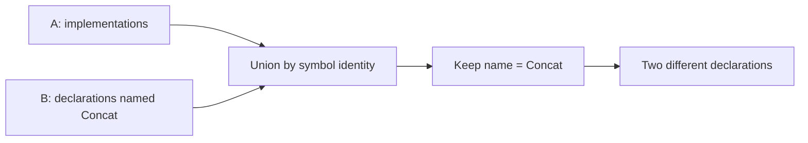

Use retained results when a question builds on earlier investigations. The next query can consume those results directly instead of asking the agent to reconstruct a list of symbols from prose.

This walkthrough continues [Find and trace code](/search) against [Kast at `56df091`](https://github.com/amichne/kast/tree/56df0912e46b182bb4ad8beabd1512823100fd72).

<Note>
  [Recorded requests and responses](/examples/query-walkthrough.json) accompany this walkthrough. Replace every angle-bracket placeholder with a token issued in your session. **A**, **B**, and **C** are guide labels, not accepted reference values. Keep the workspace stable between calls: builds or edits can advance its semantic basis and make retained inputs unavailable. See the [capture details](/reference/schemas#recorded-walkthrough).
</Note>

## Keep two independently useful results

The previous walkthrough retained **A**, the implementations of `QueryStepSyntax`. Now produce **B**, declarations named `Concat` in the same production module.

**Ask your agent:**

> Keep the retained implementations result. Separately find the class-like declarations named `Concat` under `query/contract` in `main`, and retain that second result. Show their enclosing declarations so we can distinguish same-named symbols.

```json
{
  "request": {
    "type": "RUN",
    "executionBudget": {"maxElapsedMs": 15000},
    "source": {
      "type": "SEARCH_DECLARATIONS",
      "declarationName": "Concat",
      "declarationKinds": ["CLASS"],
      "scope": {
        "type": "DIRECTORY",
        "relativeDirectoryPath": "query/contract",
        "sourceSetNames": ["main"]
      }
    },
    "output": {
      "type": "SYMBOLS",
      "fields": ["NAME", "LOCATION", "SIGNATURE"]
    },
    "retention": "RETAIN"
  }
}
```

The recorded response (`03-concat-b`) contains two distinct declarations with exhaustive coverage:

| Declaration | Source |
| --- | --- |
| `QueryStepSyntax.Concat` | [QuerySteps.kt](https://github.com/amichne/kast/blob/56df0912e46b182bb4ad8beabd1512823100fd72/query/contract/src/main/kotlin/io/github/amichne/kast/query/contract/QuerySteps.kt) |
| `ExactQueryStage.Concat` | [QueryPlan.kt](https://github.com/amichne/kast/blob/56df0912e46b182bb4ad8beabd1512823100fd72/query/contract/src/main/kotlin/io/github/amichne/kast/query/contract/QueryPlan.kt) |

Both are named `Concat`. Only the first implements `QueryStepSyntax`. Their issued references, locations, signatures, retained-result handle, and coverage are preserved in the recording.

## Combine both inputs, then filter the combined stream

**Ask your agent:**

> Combine A and B by exact symbol identity. From that combined set, keep declarations named `Concat` and show their signatures. Do not merge different declarations just because they share a name.

```json
{
  "request": {
    "type": "RUN",
    "executionBudget": {"maxElapsedMs": 15000},
    "source": {"type": "RESULT", "result": "<result A>"},
    "steps": [
      {"type": "UNION", "right": {"type": "RESULT", "result": "<result B>"}},
      {
        "type": "WHERE",
        "predicate": {
          "type": "PRIMITIVE",
          "field": "NAME",
          "operator": "EQUALS",
          "value": "Concat"
        }
      }
    ],
    "output": {"type": "SYMBOLS", "fields": ["NAME", "LOCATION", "SIGNATURE"]}
  }
}
```

**Recorded result (`04-union-filter`):** two rows with exhaustive coverage; both `QueryStepSyntax.Concat` and `ExactQueryStage.Concat` survive. The filter runs after the union, so it applies to symbols from either input. Their distinct identities remain distinct.



The diagram describes the recorded result; a new run must establish its own coverage. To preserve duplicates and stream order instead, use `CONCAT` with an `input` field. For a third retained input, add another union step before the filter.

## Keep only symbols present in both

**Ask your agent:**

> Which declarations named `Concat` are also in the retained implementations result? Compare symbol identity, not name or file text.

```json
{
  "request": {
    "type": "RUN",
    "executionBudget": {"maxElapsedMs": 15000},
    "source": {"type": "RESULT", "result": "<result A>"},
    "steps": [
      {"type": "INTERSECT", "right": {"type": "RESULT", "result": "<result B>"}}
    ]
  }
}
```

**Recorded result (`05-intersection`):** one row with exhaustive coverage, `QueryStepSyntax.Concat`. `ExactQueryStage.Concat` is not the same symbol and does not match merely because it has the same simple name.

An incomplete input still carries its qualifications. A returned match is useful evidence; it does not prove that every possible match was found.

## Keep the matched pair, then select a side and continue

An inner join preserves named left and right cells for each identity-matched pair. This is useful when the agent needs to inspect both inputs' established rows before choosing what to investigate next.

**Ask your agent:**

> Join A to B by symbol identity. Name the left cell `step` and the right cell `candidate`, and retain the paired rows. Then select `step` from those rows and find its reference occurrences.

First, retain the pairs as **C**:

```json
{
  "request": {
    "type": "RUN",
    "executionBudget": {"maxElapsedMs": 15000},
    "source": {"type": "RESULT", "result": "<result A>"},
    "steps": [
      {
        "type": "JOIN",
        "mode": {"type": "INNER", "leftName": "step", "rightName": "candidate"},
        "right": {"type": "RESULT", "result": "<result B>"}
      }
    ],
    "output": {"type": "BINDING_ROWS"},
    "retention": "RETAIN"
  }
}
```

**Recorded pair (`06-join-c`), shown as teaching notation:**

```text
step:      QueryStepSyntax.Concat from A
candidate: the same exact symbol from B
```

The response contains one `binding_row` with exhaustive coverage. Its `step` cell retains the implementation occurrence; `candidate` retains the discovered symbol. The two issued reference strings differ, but the join establishes the same canonical symbol identity. Do not compare opaque token strings to implement a join.

Then project a symbol cell from every paired row before applying a symbol relation:

```json
{
  "request": {
    "type": "RUN",
    "executionBudget": {"maxElapsedMs": 15000},
    "source": {"type": "RESULT", "result": "<result C>"},
    "steps": [
      {"type": "PROJECT_BINDING", "name": "step"},
      {"type": "EXPAND_RELATION", "relation": "REFERENCES"}
    ],
    "output": {"type": "OCCURRENCES"}
  }
}
```

The [plan compiler](https://github.com/amichne/kast/blob/56df0912e46b182bb4ad8beabd1512823100fd72/query/contract/src/main/kotlin/io/github/amichne/kast/query/contract/QueryPlan.kt) contains this reference:

```kotlin
is QueryStepSyntax.Concat -> ExactQueryStage.Concat(step.input, stage)
```

The recorded query (`07-project-references`) returned that use in `QueryPlanCompiler.exactStage`, at offsets 6088–6094, with `exact-compiler-confirmed` relation evidence and exhaustive coverage.

Kast does not expose a general-purpose `MAP` operator or arbitrary-field join. Here, `PROJECT_BINDING` selects a named symbol from each row, and later steps operate on those symbols. An inner join matches canonical symbol identity, not a custom equality expression.

## Resume work or inspect retained rows

**Ask your agent:**

> If this query returns a continuation, resume that saved query. Do not rerun its completed steps. If it is finished and retained, inspect the stored rows instead.

<Tabs>
  <Tab title="Resume unfinished execution">
    ```json
    {"request":{"type":"RESUME","continuation":"<issued execution continuation>"}}
    ```
  </Tab>
  <Tab title="Read retained symbols">
    ```json
    {"request":{"type":"READ_RESULT","result":"<issued symbol-result reference>"}}
    ```
  </Tab>
  <Tab title="Read retained pairs">
    ```json
    {"request":{"type":"READ_RESULT","result":"<result C>","output":{"type":"BINDING_ROWS"}}}
    ```
  </Tab>
</Tabs>

The retained reads (`08-read-a` and `09-read-c`) returned ten symbols and one paired row respectively, with exhaustive coverage and the original retained-result identities.

A result reference identifies retained rows; an execution continuation resumes unfinished work. A result cursor pages through stored rows and does not resume semantic execution. If a handle is stale or unavailable, report that failure and start a fresh investigation explicitly.

### Observe a resumable result

The capture runs `SYMBOL_REFS` with both references from B and `executionBudget: {"maxElapsedMs": 15000, "maxResults": 1}` (`12-bounded-symbols`). The first response returns one row. Selected fields from that response:

```json
{
  "status": "qualified",
  "coverage": {
    "exhaustive": false
  },
  "qualification": {
    "knownMinimum": 1,
    "limitations": [
      "result-limit-reached"
    ],
    "progress": {
      "type": "resumable",
      "checkpoint": {
        "type": "upstream",
        "token": "query:v1:0b89fbb4-f1ca-4603-93a4-4f6fbe8cd0b6"
      },
      "next_action": "resume"
    }
  },
  "continuation": "query:v1:0b89fbb4-f1ca-4603-93a4-4f6fbe8cd0b6"
}
```

Call `RESUME` with that exact continuation and `maxElapsedMs: 15000`, omitting the one-result allowance. In the capture (`13-resume`), this returns the remaining row with `status: "complete"` and exhaustive coverage. It does not repeat the first row.

### Reject an incomplete absence check

Searching for `Concat` with `maxResults: 1` and `retention: "RETAIN"` instead limits discovery (`10-incomplete-right`). That response has `coverage.exhaustive: false`, limitation `discovery-incomplete`, and terminal reason `upstream-incomplete`; it has no continuation. A bounded result is not always resumable.

Using that incomplete retained result as the right side of `DIFFERENCE` (`11-reject-difference`) or an `ANTI` join (`16-reject-anti`) produces this recorded rejection excerpt:

```json
{
  "status": "rejected",
  "rejection": {
    "type": "execution-rejected",
    "reason": "right-input-incomplete"
  },
  "next_action": "correct_request"
}
```

For absence questions, `DIFFERENCE` and an `ANTI` join require a complete right-hand result. An unfinished search cannot prove that a symbol is missing. See [Results](/reference/responses) before interpreting a zero-row answer.
