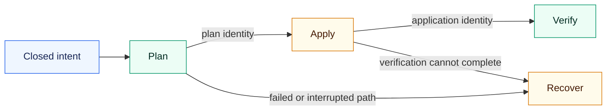

# How can I change it safely?

Kast does not collapse a desired edit, a physical write, and a verified result
into one optimistic action. Each phase produces the authority required by the
next phase.



## Plan without writing

Start from one closed intent. The supported intents add a file, add a
declaration, replace a declaration, or rename a symbol.

```console
kast change plan \
  --intent add-declaration \
  --target '<exact-selector>' \
  --declaration 'fun subtotal(): Money = items.sumOf(Item::price)'
```

`kast change plan` performs no source write. A successful plan binds the intent
to the admitted target and current workspace evidence, then returns a plan
identity. Invalid option combinations never become loosely interpreted
requests.

## Apply the admitted plan

```console
kast change apply --plan '<plan-identity>'
```

Apply is the explicit physical-effect boundary. It consumes an admitted plan
and returns an application identity tied to the resulting workspace state.
Calling apply again cannot substitute a different target or intent under that
identity.

## Verify the result

```console
kast change verify --application '<application-identity>'
```

Verification asks whether the applied result satisfies its semantic contract
in the resulting generation. Only this terminal operation turns a completed
write into verified change evidence.

## Recover a non-terminal plan

If application or verification cannot reach a valid terminal result, recover
the plan instead of guessing which edits took effect:

```console
kast change recover --plan '<plan-identity>'
```

Recovery is also an explicit write boundary. Its job is to return the plan to a
known workspace state. A rejected recovery remains a failure; Kast does not
label uncertain source state as restored.

The four identities preserve the transition from intent to proven result.
[Trust the evidence](../concepts/evidence-boundaries.md) explains how generation
and outcome states constrain reuse.
