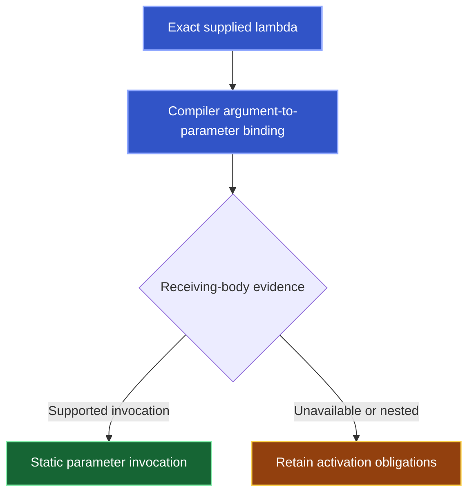

Kast preserves anonymous callable identity instead of treating every nested invocation as a call by the enclosing named function. Static paths do not prove execution.

## Named callers and lexical ownership

`REFERENCES` records lexical containment. `CALLERS` and `CALLEES` retain `callback_observations` with exact occurrence, lexical owner, anonymous body, and named-call policy.

| Policy | Named-edge meaning |
| --- | --- |
| `EXCLUDED` | Invocation is absent from named callers, with its reason. |
| `ADMITTED_DIRECT` | A compiler-confirmed immediate invocation admits a named edge while preserving its anonymous body. |
| `ADMITTED_INLINE` | Inline policy admits a named edge while preserving the anonymous owner. |
| `UNAVAILABLE` | Ownership remains incomplete. |

## Static bindings and unfinished proof



The flow's `binding.type` distinguishes an explicit argument (`BOUND`), a declared default (`DEFAULT`), a directly invoked literal or anonymous function (`DIRECT`), and unavailable mapping (`UNAVAILABLE`). Direct admission requires the compiler's builtin function invocation. Labels and parentheses retain the compiler's argument mapping. A default records its defining formal and default expression. It does not create a caller edge from every call to that definition: a supplied argument replaces the default.

Each parameter invocation retains `forwardings`: the source formal, exact supplied expression, and destination argument binding at every hop. Immutable local aliases retain their existing value-transfer proof. Forwarding through an alias, mutable storage, returns, and cycles can still leave obligations.

`scan` describes static formal-invocation enumeration:

| Scan | Meaning |
| --- | --- |
| `EXHAUSTIVE` | The admitted scan finished. Empty invocations establish no supported invocation sites in that scanned flow. |
| `INCOMPLETE` | A limit or unsupported flow prevents an absence claim. |
| `NOT_APPLICABLE` | A directly invoked body has no receiving formal to scan. |

An exhaustive scan can retain `NESTED_CALLBACK_EXECUTION`: enumeration of sites does not establish activation of a nested callable owner, including a local named function. `owner_bindings` retains an anonymous owner's supply and mapping when available. Obligations explain the remaining limits:

| Evidence | Limit |
| --- | --- |
| Nested callable owner | `NESTED_CALLBACK_EXECUTION` |
| Library mapping | `EXTERNAL_CALLABLE` and `OUTSIDE_DOMAIN` |
| Local initializer | `STORED_CALLBACK` |
| Returned literal | `RETURNED_CALLBACK` |
| Unsupported supply | `UNSUPPORTED_CALLBACK_SUPPLY` |
| Recursive forwarding | `CALLBACK_CYCLE` |

Unresolved mappings, external callback bodies, escaped parameters, and exhausted work, time, result, or byte allowances retain qualifications. Inline policy still excludes `noinline` and `crossinline` bodies from named edges with known reasons.

## Symbolic callees and known boundaries

`CALLEES` also retains `callable_observations`. A `PARAMETER_INVOCATION` target preserves the exact named defining callable, formal position, parameter occurrence, and actual invocation owner for `block()` or `block.invoke()`. It records the symbolic callee without guessing which runtime function value is passed. Formals owned by anonymous functions currently remain unsupported.

A `SOURCE_LESS` target preserves a resolved compiler callable identity and its compiler module even when no source PSI exists. Builtins and libraries excluded by the requested policy are known boundaries and permit complete enumeration. If the request includes library sources and those sources are unavailable, the observation retains `LIBRARY_SOURCE_UNAVAILABLE` and coverage remains qualified. Missing PSI alone never proves an external boundary.

## Read the exact anonymous source

Pass the issued `candidateSelector` unchanged:

```json
{
  "request": {
    "type": "READ_SOURCE",
    "candidateRef": "<issued candidateSelector>"
  }
}
```

Reacquire it after an epoch change. Do not substitute the enclosing named function.

## Continue output delivery

`page_progress` counts page rows and evidence. Zero-row pages can advance callback or callable output. Follow issued tokens and `next_action`. Complete traversal coverage can precede complete delivery. See [Results](/reference/responses#follow-progress-not-row-count).

Updated relation and walk schemas require `callable_observations`, including empty arrays. Observed callback flows require `scan`; parameter invocation entries require `forwardings`, including empty arrays. Consumers must use the current advertised schema. Payloads missing these fields are rejected.
