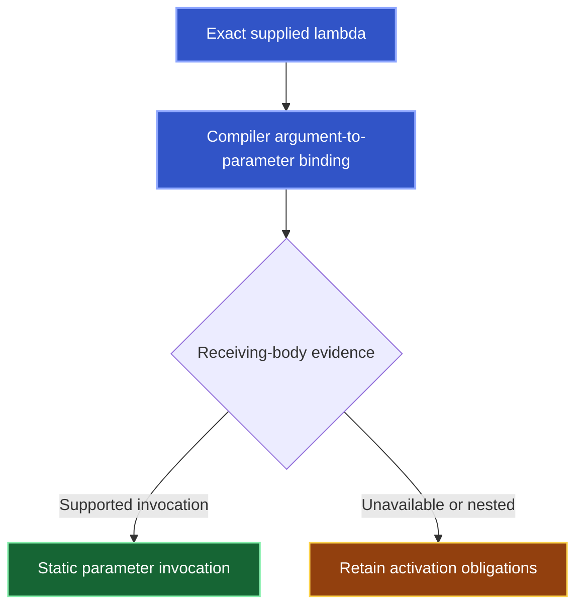

Kast preserves anonymous callable identity instead of treating every nested invocation as a call by the enclosing named function. Static paths do not prove execution.

## Named callers and lexical ownership

`REFERENCES` records lexical containment. `CALLERS` and `CALLEES` retain `callback_observations` with exact occurrence, lexical owner, anonymous body, and named-call policy.

| Policy | Named-edge meaning |
| --- | --- |
| `EXCLUDED` | Invocation is absent from named callers, with its reason. |
| `ADMITTED_INLINE` | Inline policy admits a named edge while preserving the anonymous owner. |
| `UNAVAILABLE` | Ownership remains incomplete. |

## Static bindings and unfinished proof



`owner_bindings` retains a nested body's supplying call and formal mapping when available. Obligations explain the remaining limits:

| Evidence | Limit |
| --- | --- |
| Nested supply | `NESTED_CALLBACK_EXECUTION` |
| Library mapping | `EXTERNAL_CALLABLE` and `OUTSIDE_DOMAIN` |
| Local initializer | `STORED_CALLBACK` |
| Returned literal | `RETURNED_CALLBACK` |
| Unsupported supply or direct literal activation | `UNSUPPORTED_CALLBACK_SUPPLY` |

Unresolved mappings, external bodies, and escaped parameters also retain obligations.

## Read the exact anonymous source

Pass the issued `candidateSelector` unchanged:

```json
{
  "request": {
    "type": "READ_SOURCE",
    "candidateRef": "<issued candidateSelector>"
  }
}
```

Reacquire it after an epoch change. Do not substitute the enclosing named function.

## Continue output delivery

`page_progress` counts page rows and evidence. Zero-row pages can advance callback output. Follow issued tokens and `next_action`; complete traversal coverage can precede complete delivery. See [Results](/reference/responses#follow-progress-not-row-count).
