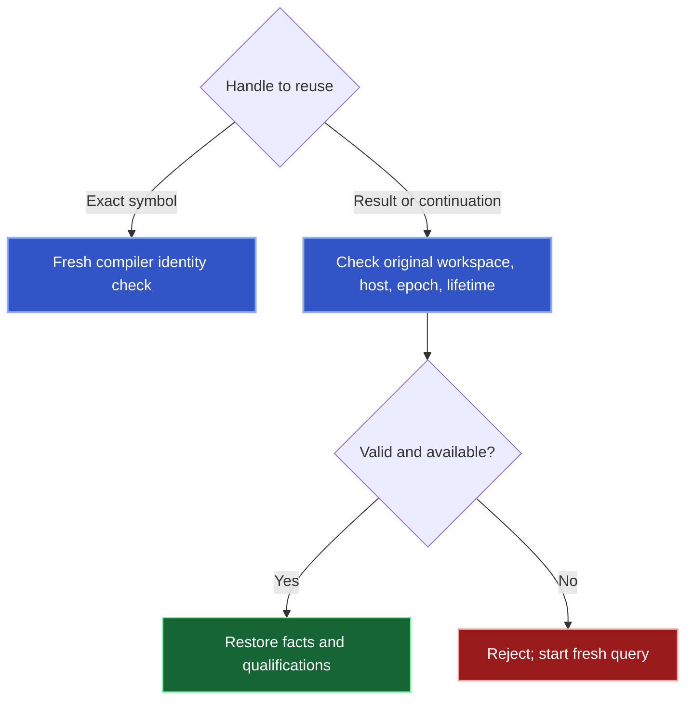

Read facts with coverage and progress. Transport completion does not establish semantic completion.

## Interpret coverage before making a claim

| Status | Meaning |
| --- | --- |
| `complete` | Declared scope covered. |
| `qualified` | Stated limitations or unfinished work remain. |
| `rejected` | Input or state requirements prevented completion. |

Confirmed rows remain useful with qualifications. Empty qualified results do not prove absence. [Query forms](/reference/api#choose-the-result-you-need) defines symbol, occurrence, traversal, binding, and impact outputs.

Diagnostics cover the reported IDEA scope. Source changes require their own [verification and recovery evidence](/change#read-the-receipt).

## Follow progress, not row count


An empty page can advance filtered input. Follow issued `next_action`. A result limit does not guarantee a continuation.

| Operation | Advances | Handle |
| --- | --- | --- |
| `RESUME` | Saved execution | Execution continuation |
| `READ_RESULT` | Presentation of stored rows | Result reference and optional cursor |

Reading every retained page leaves original coverage unchanged. `ALL_DECLARATIONS` saves unvisited files and its position within the active file.

Exact-name discovery collects candidates within work and byte allowances, independently of output row limits. Five admitted candidates can appear as pages of two, two, and one. Native discovery limits can still leave coverage incomplete.

Replaying a published continuation returns the same page and successor without repeating the scan. Concurrent unfinished execution can report `continuation-in-use`.

## Carry the correct handle forward

| Handle | Use |
| --- | --- |
| Exact symbol `ref` | Fresh `SYMBOL_REFS` query with current identity checks. |
| Retained-result reference | `RESULT`, composition, or `READ_RESULT`. |
| Row ID | Select a row from its owning result. |
| Execution continuation | `RESUME`. |
| Result cursor | Page stored rows. |

Pass handles unchanged. Token spelling, names, and locations do not establish semantic identity. Row selection preserves evidence without proving coverage of excluded rows. Retention failure can prevent reuse without erasing returned facts.

## Compact and detailed output

Omit `verbose` for compact output. For execution details:

```json
{
  "request": {
    "type": "RUN",
    "source": {"type": "SEARCH_DECLARATIONS", "declarationName": "QueryStepSyntax"}
  },
  "verbose": true
}
```

Compact output preserves facts, coverage, limitations, references, continuation, and recovery evidence. `verbose` accepts only a boolean.

`knownMinimum` counts logical final output, including delivered rows. It does not count remaining pages or unfiltered provider candidates.

## Saved state and identity



An exact symbol can undergo fresh revalidation. Retained results and continuations cannot migrate to another read state. Changed epochs, different owners, expiry, or eviction prevent reuse.

Composition preserves input qualifications. `DIFFERENCE` and `ANTI` joins require complete right-hand coverage before establishing absence.

<Accordion title="Where the operation document sits in each transport">
Direct MCP places the canonical semantic document in `result.structuredContent`. `health_check` has a separate readiness shape. Tool RPC document variants carry `document`. Hosted App Server completed invocations also carry `document`.

Decode with the [MCP](/reference/mcp-catalog), [Tool RPC](/reference/rpc-catalog), and [generated contracts](/reference/schemas).


</Accordion>
