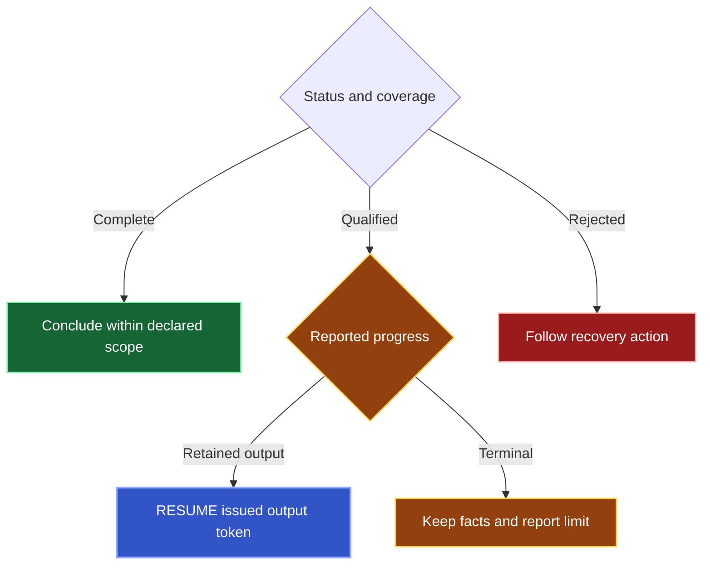
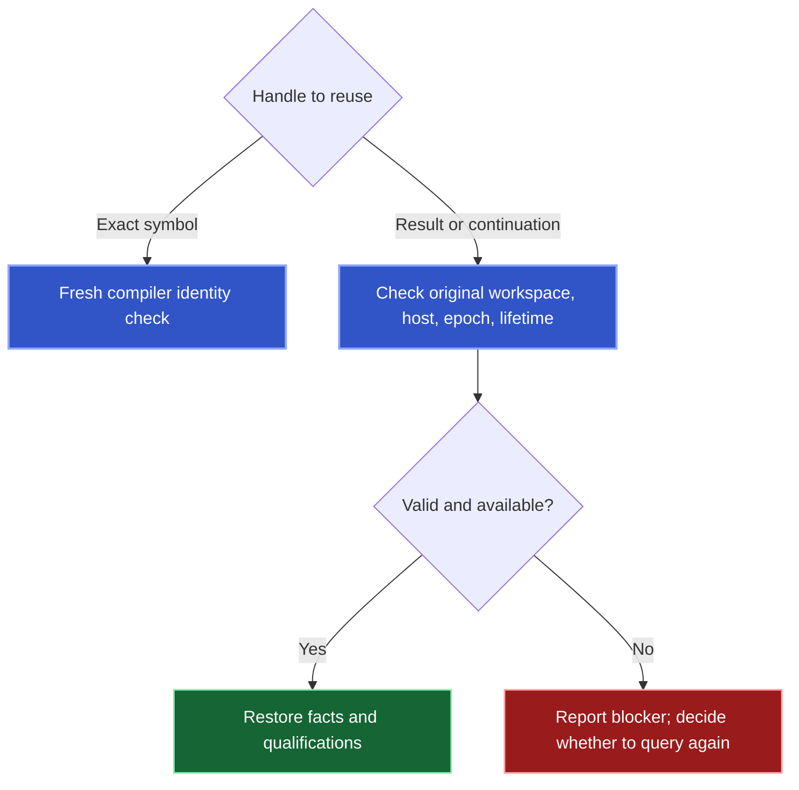

Read facts with coverage and progress. Transport completion does not establish semantic completion.

## Interpret coverage before making a claim

| Status | Meaning |
| --- | --- |
| `complete` | Declared scope covered. |
| `qualified` | Stated limitations or unfinished work remain. |
| `rejected` | Input or state requirements prevented completion. |

Confirmed rows remain useful with qualifications. Empty qualified results do not prove absence. [Query forms](/reference/api#choose-the-result-you-need) defines symbol, occurrence, traversal, binding, and impact outputs.

Diagnostics cover the reported IDEA scope. Source changes require their own [verification and recovery evidence](/change#read-the-receipt).

## Read an automatic query

The response shape uses `kast.query.run.v8`; Host and Control must provide the same contract.

A `query_symbols` `RUN` returning symbols, occurrences, traversal records, or bindings follows issued resumable execution internally. One call returns the accumulated rows in page order, with their exact references and multiplicity. Empty advancing pages can continue. The original query, scope, output, and semantic basis stay fixed.

Every RUN requires `COMPLETE_ONLY` within `COMPILER_RESOLVED_STATIC_V1`. A successful answer requires exhausted execution, no item failures or omitted evidence, proven callback graphs, and conserved original investigation ledgers where applicable. Unsupported questions and missing proof return typed rejections. Retained rejection evidence remains rejected evidence when read; it cannot become a successful answer.

When strict completion rejects, retained completion evidence includes a bounded
`preview`, the original `question`, and a copyable `nextQuery` for `READ_RESULT`.
Use that query to inspect proven partial facts. Its `originalCoverage` preserves
the proven minimum, limitations and original progress. `policyProgress` is
`{"type":"EVIDENCE_ONLY"}`, granting presentation of evidence. A historical
checkpoint does not authorize more strict execution. If retention was unavailable,
the response names its finite cause rather than inventing a result handle.
`RETENTION_UNAVAILABLE` preserves complete enumeration when required storage
fails. Its evidence names the actual storage cause.

Use the emitted public `nextQuery` arguments. The retained `question` describes
the canonical query; its source grammar is not a replacement public request.
When `seedQuery` is supplied, it starts a new investigation from proven preview
symbol references. That selection preserves identity but does not prove coverage
of omitted rows or unfinished scope.

Keep the retained question's scope and the relationship observations' effective
domains with those facts. To continue semantic investigation, issue a narrower
new query based on observed candidates and scope evidence. Do not interpret zero proven rows as absence. For
`BYTE_LIMIT_REACHED`, distinguish encoded response bytes from conservative
detached callback-proof storage. The final response has an encoded-byte guard;
the callback graph builder separately accounts proof storage against its admitted
byte allowance. Few returned rows do not imply either allowance remains available.
Inspect the finite callback failure cause, scan state and obligations alongside
the returned-byte execution grant. Callback evidence does not expose numeric
storage accounting in the public result. The IDE diagnostic `kast_semantic_read`
receipt records the actual retention allowance, admitted accounting and attempted
required accounting, plus a coherent latest byte-rejection snapshot and finite
decision counters. These values describe conservative proof storage, not measured
heap use or encoded output size. Independent ledgers are not summed; later
successful attempts do not erase the latest byte-rejection snapshot.

The fixed compiler-static model does not prove runtime activation or path feasibility. RUN rejects supplied `completion` fields.

The invocation shares one elapsed-time, work, and retention allowance. It stops when work finishes or needs a new decision, including a budget increase, invalid state, or a terminal limit. It does not restart discovery after a stale state or hard timeout. Strict `VALUE_PATHS` follows issued continuations against one original investigation ledger. Strict `IMPACT_WITNESS` from `IMPACT` completes that investigation and presents a retained section. `RESUME` presents already-produced output; `READ_RESULT` presents retained evidence without semantic replay. A rejection's historical checkpoint grants no new execution allowance.

| Response field | Meaning |
| --- | --- |
| `invocation.accumulated_row_count` | Rows accumulated across admitted execution pages. |
| `invocation.preview.type` | `INLINE` includes every accumulated row; `PREFIX` includes an ordered preview. |
| `invocation.preview.row_count` and `encoded_bytes` | Actual preview rows and UTF-8 bytes of the encoded `items` array. |
| `invocation.stop.type` | Typed reason the invocation stopped, with failure evidence when applicable. |
| `retention` and `next_cursor` | Issued retained-result reference and position for reading more rows. |
| `evidence_window` | Independent emitted evidence positions: `start`, `end`, and `total`. `type: MORE` means evidence remains; `FINAL` reaches its retained end. |

Small results appear inline. Larger results have a preview bounded by row count and encoded bytes, plus a retained-result reference when retention succeeds. Use `READ_RESULT` with that reference and cursor to retrieve additional rows without running semantic providers again.

Accumulated failures, omissions, and observations also use bounded pages. Use `READ_RESULT.evidence_cursor` with `evidence_window.end` when its type is `MORE`. Evidence follows a fixed sequence: failures, omissions, walk observations, reference observations, discovery observations, then relation observations. Track row and evidence positions independently. Once the rows are drained, keep the row `cursor` at `invocation.accumulated_row_count` while advancing the evidence cursor. An evidence-only page does not advance the row cursor.

For impact, completion requires original ledger conservation and discharged obligations. Selected preview paths and witness sections retain that original proof through accounting and a retained presentation window. `INVESTIGATION_UNPROVEN` distinguishes missing original evidence, incomplete path selection, and unresolved required obligations. Retained reads preserve the original question even when reading another witness section or expanding value paths.

Coverage describes semantic execution. Preview truncation describes presentation. A complete retained result remains complete when its preview omits rows. Reading every retained page preserves terminal upstream limitations. Required query retention failure returns typed completion rejection with original coverage and the actual storage cause. Hosted output fitting can qualify presentation while preserving the retained result and its original coverage.

## Follow progress, not row count



An empty retained page can advance evidence. Follow issued `next_action`; a requested budget increase needs a new decision. A result limit does not guarantee a usable output token. `retention_unavailable` preserves a useful prefix but means its remaining output could not be retained.

| Operation | Advances | Handle |
| --- | --- | --- |
| `RESUME` | Presentation of already-produced output | Issued `query-output:v1` token |
| `READ_RESULT` | Presentation of stored rows and evidence | Result reference with independent row/evidence cursors |

Reading every retained page leaves original coverage unchanged. Public RUN requires complete execution; public RESUME does not visit unexamined files or continue a semantic scan.

Exact-name discovery collects candidates within work and byte allowances, independently of output row limits. Five admitted candidates can appear as pages of two, two, and one. Native discovery limits can still leave coverage incomplete.

Replaying an issued output token returns stored output without semantic execution or renewed expiry. Stale or unavailable saved state remains a blocker.

## Carry the correct handle forward

| Handle | Use |
| --- | --- |
| Exact symbol `ref` | Fresh `SYMBOL_REFS` query with current identity checks. |
| Retained-result reference | `RESULT`, composition, or `READ_RESULT`. |
| Row ID | Select a row from its owning result. |
| Issued output continuation | Output-only `RESUME`. |
| Result cursor | Page stored rows. |

Pass handles unchanged. Token spelling, names, and locations do not establish semantic identity. Row selection preserves evidence without proving coverage of excluded rows. Retention failure can prevent reuse without erasing returned facts.

## Compact and detailed output

Omit `verbose` for compact output. For execution details:

```json
{
  "request": {
    "type": "RUN",
    "source": {"type": "SEARCH_DECLARATIONS", "declarationName": "QueryStepSyntax"}
  },
  "verbose": true
}
```

Compact output preserves facts, coverage, limitations, references, continuation, and recovery evidence. `verbose` accepts only a boolean.

`knownMinimum` counts logical final output, including delivered rows. It does not count remaining pages or unfiltered provider candidates.

## Saved state and identity



An exact symbol can undergo fresh revalidation. Retained results and continuations cannot migrate to another read state. Changed epochs, different owners, expiry, or eviction prevent reuse.

Composition preserves input qualifications. `DIFFERENCE` and `ANTI` joins require complete right-hand coverage before establishing absence.

<Accordion title="Where the operation document sits in each transport">
Direct MCP places the canonical semantic document in `result.structuredContent`. `health_check` has a separate readiness shape. Tool RPC document variants carry `document`. Hosted App Server completed invocations also carry `document`.

Decode with the [MCP](/reference/mcp-catalog), [Tool RPC](/reference/rpc-catalog), and [generated contracts](/reference/schemas).


</Accordion>
