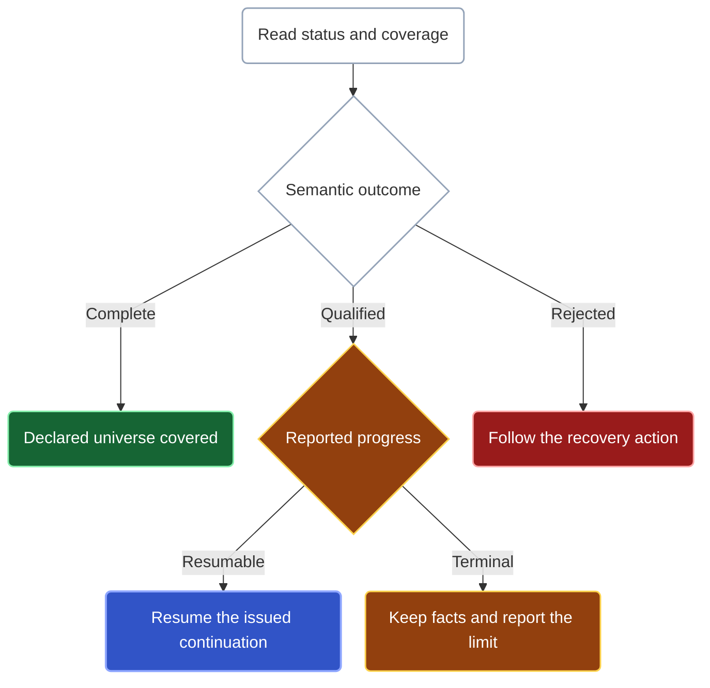

Read two things in every Kast answer: **the facts returned** and **what the query covered**. A successful tool invocation does not, by itself, establish a complete semantic result.

## What can come back

| Result | Use it for |
| --- | --- |
| Symbols | Exact declarations, their issued references, and selected name, location, signature, or source fields. |
| Occurrences | Individual use sites and relationship facts, including repeated uses. |
| Traversal records | Relationship evidence with hop depth from a bounded walk. |
| Binding rows | Named symbol cells produced by an inner join. Project a cell before another symbol step. |

See [Query forms](/reference/api) to select an output, or [the composition walkthrough](/query-pipelines) to follow a result into the next query.

## Interpret coverage before making a claim

| Canonical status | What the agent may say |
| --- | --- |
| `complete` | The operation covered its declared scope. |
| `qualified` | These returned facts are usable with the stated limitations; some obligation remains incomplete. |
| `rejected` | This request did not establish a successful semantic result. |

For example, “Kast found these callers, but the walk stopped with unfinished work” preserves a qualified result. “These are all callers” does not.

A zero-row qualified answer is not proof that a declaration or relationship is absent. Before making an absence claim, check complete coverage of the requested scope, item failures, and omissions. Diagnostics cover the reported IDEA analysis scope; they do not certify a whole-project build.

## Follow progress, not row count

A bounded answer can preserve work that has not yet produced a row. Read the semantic status and required qualification progress together; do not decide that an investigation is finished because this page is empty.



When qualification reports resumable execution, use its issued continuation with `RESUME`. This restores saved work; it is not a new `RUN` with reconstructed steps. A terminal qualification keeps its precise reason and any established facts but does not promise a usable successor. Follow the reported recovery guidance instead of fabricating a token or retrying indefinitely.

`READ_RESULT` is different. It pages immutable stored rows with a presentation cursor and does not advance semantic providers. It supports retained symbols, occurrences, traversal records, and binding rows with the matching output type. Draining those pages cannot remove the producer's omissions or turn qualified evidence into complete coverage.

Current progressive Kotlin-source declaration discovery retains unopened partitions and the active source position. Reference output can retain file-scoped imports and aliases without inventing an enclosing declaration. Discovery work counts, emitted rows, and provider coverage are different quantities; a small row count says nothing by itself about how much input was examined.

Replaying an already-published continuation returns the same semantic page and successor without repeating its scan. Concurrent use of unfinished execution can report `continuation-in-use`. Expired, evicted, or stale state requires explicit recovery; a token is not a permanent snapshot.

## Carry the correct handle forward

| Handle | Next use |
| --- | --- |
| Exact symbol `ref` | Start a fresh query from `SYMBOL_REFS`; Kast revalidates its identity and basis. |
| Retained-result reference | Start from `RESULT`, combine with another retained input, or use `READ_RESULT`. |
| Issued row ID | Select a row from its owning retained result. A subset does not prove coverage of omitted rows. |
| Execution continuation | Use `RESUME` to continue stored unfinished work. |
| Result cursor | Page through stored result rows, not semantic execution. |

Pass tokens unchanged. A stale or unavailable handle requires an explicit recovery decision, not a guessed replacement token. Retention is bounded and can fail without erasing the query's returned facts.

## Compact and detailed output

Omit `verbose` for compact output. Use a strict boolean beside the tool's arguments when execution detail is needed:

```json
{
  "request": {
    "type": "RUN",
    "source": {"type": "SEARCH_DECLARATIONS", "declarationName": "QueryStepSyntax"}
  },
  "verbose": true
}
```

Compact output preserves semantic results, coverage, limitations, exact references, retained-result identities, continuation, and recovery evidence. It omits redundant fields and bookkeeping, not the limitations needed to interpret the answer. `"true"`, null, and numeric values are not accepted substitutes for a boolean.

<Accordion title="Counts and bounded presentation">
  `knownMinimum` refers to the logical query's final output, including rows already delivered. It is not a count of remaining presentation rows or unfiltered provider candidates.

  Draining output pages does not remove semantic omissions or turn qualified coverage into complete coverage. Presentation and semantic execution have different continuation owners.
</Accordion>

<Accordion title="Where the operation document sits in each transport">
  Direct MCP puts the canonical semantic operation document itself in `result.structuredContent`; queries do not add a generic `partial` wrapper or nest that document under `data`. The support tool `health_check` has its own readiness schema. Tool RPC returns a top-level `type` and a `document` for completed, qualified, or rejected documents. Hosted App Server invocations have a `status` and, when completed, a `document`.

  Integrators should use the [MCP](/reference/mcp-catalog) or [Tool RPC](/reference/rpc-catalog) contract rather than infer wrappers from a tutorial excerpt. The full contracts are collected on [Schemas and samples](/reference/schemas).
</Accordion>
