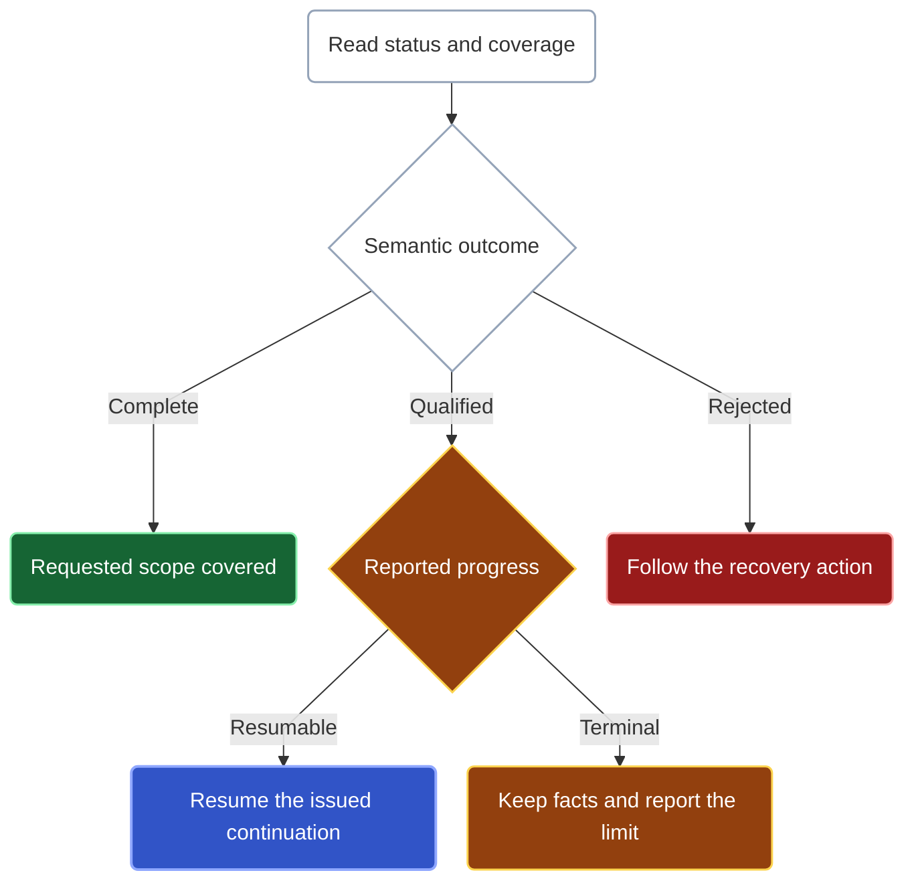

Read the returned facts together with coverage and progress. A tool call can finish successfully while the query still has work to do.

## Interpret coverage before making a claim

| Semantic outcome | What it establishes |
| --- | --- |
| `complete` | The operation covered its declared scope. |
| `qualified` | The result contains stated limitations or unfinished work. |
| `rejected` | Kast could not complete the request under its input or state requirements. |

Read the facts together with limitations, item failures, omissions, and progress. A qualified answer can establish specific callers without establishing that every caller was found. An empty qualified answer does not prove absence.

Diagnostics cover the reported IDEA analysis scope; they do not certify a whole-project build. For a source change, inspect its [receipt and recovery evidence](/change#read-the-receipt) separately: a rejected request or lost response does not prove that no write occurred.

## What can come back

| Result | Use it for |
| --- | --- |
| Symbols | Exact declarations, issued references, and selected name, location, signature, or source fields |
| Occurrences | Individual use sites and relationship facts, including repeated uses |
| Traversal records | Established relationship evidence with hop depth |
| Binding rows | Named symbol cells produced by an inner join |

See [Query forms](/reference/api) to choose an output or [Combine query results](/query-pipelines) to carry retained rows into another investigation.

## Follow progress, not row count

An empty page can still represent progress: Kast may have examined input that did not pass a filter. Use the reported outcome and progress to decide what to do next.



When progress is resumable, pass the issued continuation to `RESUME` to continue the saved query. If progress is terminal, keep the returned facts and read the reason it stopped. Follow its recovery guidance; a result limit alone does not mean a continuation exists.

`READ_RESULT` reads saved rows without continuing the query. Choose the output type that matches the retained symbols, occurrences, traversal records, or binding rows, then use a result cursor to read another page. Reading every page leaves the query’s original coverage limits unchanged.

`ALL_DECLARATIONS` saves unvisited files and its position in the active file. Rows returned, input examined, and scope covered measure different things. A small row count alone does not tell you how much work the query performed.

Exact-name searches collect candidates within the work and byte allowances,
independently of the output row limit. If five candidates fit those allowances,
a two-row limit can return them across pages of two, two, and one without repeating
discovery. A native discovery limit can still leave the final page incomplete;
check its coverage after draining the continuation.

Replaying an already-published continuation returns the same semantic page and successor without repeating its scan. Concurrent use of unfinished execution can report `continuation-in-use`. If saved state expires, is evicted, or becomes stale, follow the reported recovery guidance.

## Carry the correct handle forward

| Handle | Next use |
| --- | --- |
| Exact symbol `ref` | Start a fresh query from `SYMBOL_REFS`; Kast checks its identity against the current workspace state. |
| Retained-result reference | Start from `RESULT`, combine with another retained input, or use `READ_RESULT`. |
| Issued row ID | Select a row from its owning retained result. A subset does not prove coverage of omitted rows. |
| Execution continuation | Use `RESUME` to continue stored unfinished work. |
| Result cursor | Page through stored result rows, not semantic execution. |

Pass each reference, continuation, or cursor unchanged. If Kast reports it as stale or unavailable, follow the recovery guidance. A query can return useful facts even when Kast cannot retain them for later use.

## Compact and detailed output

Omit `verbose` for compact output. Set `verbose: true` beside the tool’s arguments when you need execution details:

```json
{
  "request": {
    "type": "RUN",
    "source": {"type": "SEARCH_DECLARATIONS", "declarationName": "QueryStepSyntax"}
  },
  "verbose": true
}
```

Compact output preserves semantic results, coverage, limitations, exact references, retained-result identities, continuation, and recovery evidence. It omits redundant fields and bookkeeping, not the limitations needed to interpret the answer. `"true"`, null, and numeric values are not accepted substitutes for a boolean.

<Accordion title="Counts and bounded presentation">
  `knownMinimum` refers to the logical query's final output, including rows already delivered. It is not a count of remaining presentation rows or unfiltered provider candidates.

  Draining output pages does not remove semantic omissions or turn qualified coverage into complete coverage. Use a result cursor to read saved rows and an execution continuation to resume work.
</Accordion>

<Accordion title="Where the operation document sits in each transport">
  Direct MCP puts the canonical semantic operation document itself in `result.structuredContent`; queries do not add a generic `partial` wrapper or nest that document under `data`. The support tool `health_check` has its own readiness schema. Tool RPC returns a top-level `type` and a `document` for completed, qualified, or rejected documents. Hosted App Server invocations have a `status` and, when completed, a `document`.

  Integrators should use the [MCP](/reference/mcp-catalog) or [Tool RPC](/reference/rpc-catalog) contract rather than infer wrappers from a tutorial excerpt. The full contracts are collected on [Schemas and samples](/reference/schemas).
</Accordion>
