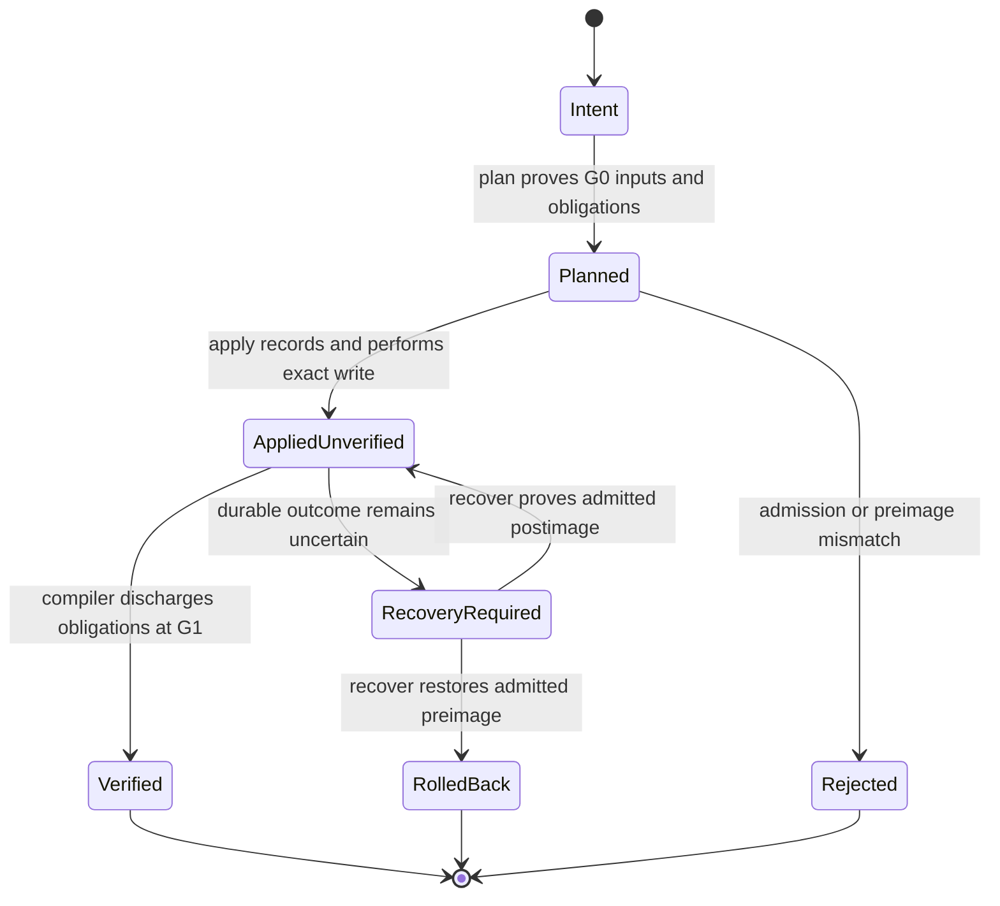

Kast does not model a source change as a single success boolean. The public
AddDeclaration workflow separates intent, proof planning, physical mutation,
semantic verification, and recovery so that no phase can claim authority held
only by another.

## Plan: compile intent into proof obligations

Raw plan input is refined into an `AddDeclarationIntent` only after it proves a
canonical absolute workspace root, one contained `.kt` target, an exact
lowercase SHA-256 preimage, and normalized non-blank declaration text.

The IntelliJ planning boundary gathers generation-bound target, file, compiler,
and expected semantic evidence. The pure planning service admits that aggregate
and issues a deterministic `PlannedAddDeclaration`. Its plan identity is
derived from the complete G0 material, not assigned independently.

Planning owns no write capability. A valid plan proves what may be attempted
and what later verification must establish; it does not reserve the filesystem
or predict that the preimage will remain current.

## Apply: cross the physical effect boundary

Application reacquires mutation authority and rechecks the plan, current lease,
target, declared singleton write set, and exact preimage immediately before the
write. The write adapter is constrained to the admitted target.

A physically successful write produces `AppliedUnverified`. That type retains
the plan identity, postimage, publication, recovery binding, and prior lease,
while deliberately carrying no semantic-success proof. This distinction is the
critical handoff between filesystem truth and compiler truth.

The recovery journal is part of write admission. If the operation cannot leave
a durable account of how to distinguish and repair preimage, postimage, or
uncertain state, write authority is withdrawn. A failed write can become
rolled-back or recovery-required, but never an invented success.

## Verify: discharge obligations against a resulting generation

Verification consumes `AppliedUnverified`, not an arbitrary plan ID. It
requires a current same-root generation derived from the prior lease and
reobserves the target through the compiler. Expected declarations, diagnostics,
relations, and other plan-specific obligations must be discharged against the
resulting generation.

Only this phase can produce verified mutation evidence. A stale or unrelated
generation, unexpected semantic delta, contract mismatch, or incomplete
compiler observation remains finite rejection. The successful successor
publication also becomes the generation used by later read operations.

## Recover: resolve durable uncertainty

Recovery is not a retry shortcut. It reads a durable recovery record, observes
the current source state, and chooses only a transition justified by exact
preimage or postimage identity. It may establish that the write was applied,
restore the preimage, or retain recovery-required state. Unknown content fails
closed.

While unresolved recovery exists, the target cannot regain ordinary planning,
application, or verification authority. This keeps a process crash from
turning uncertainty into permission.

## SQLite is an adapter, not a domain model

Workspace publication, topology snapshots, durable change authority, and
mutation recovery records are defined as host-neutral contracts. The
`evidence:sqlite` module realizes those contracts with transactions, schemas,
rows, and state files.

Domain services do not depend on JDBC or SQL vocabulary. SQLite failures remain
adapter failures, and data read from durable storage must be parsed and admitted
back into domain identities before it can authorize a transition.

## Primary authorities

- [`AddDeclarationIntent`](https://github.com/amichne/kast/blob/main/change/contract/src/main/kotlin/io/github/amichne/kast/change/contract/AddDeclarationIntent.kt)
  refines raw plan input into typed canonical intent.
- [`PureAddDeclarationPlanningService`](https://github.com/amichne/kast/blob/main/change/plan/src/main/kotlin/io/github/amichne/kast/change/plan/PureAddDeclarationPlanningService.kt)
  issues a deterministic plan without physical capabilities.
- [`AddDeclarationApplyService`](https://github.com/amichne/kast/blob/main/change/apply/src/main/kotlin/io/github/amichne/kast/change/apply/AddDeclarationApplyService.kt)
  owns admission around the physical source write and its truthful terminal states.
- [`VerifiedMutationService`](https://github.com/amichne/kast/blob/main/change/verify/src/main/kotlin/io/github/amichne/kast/change/verify/VerifiedMutationService.kt)
  discharges plan obligations against the resulting semantic generation.
- [`SqliteMutationRecoveryJournal`](https://github.com/amichne/kast/blob/main/evidence/sqlite/src/main/kotlin/io/github/amichne/kast/evidence/sqlite/SqliteMutationRecoveryJournal.kt)
  persists and transitions durable recovery evidence.
