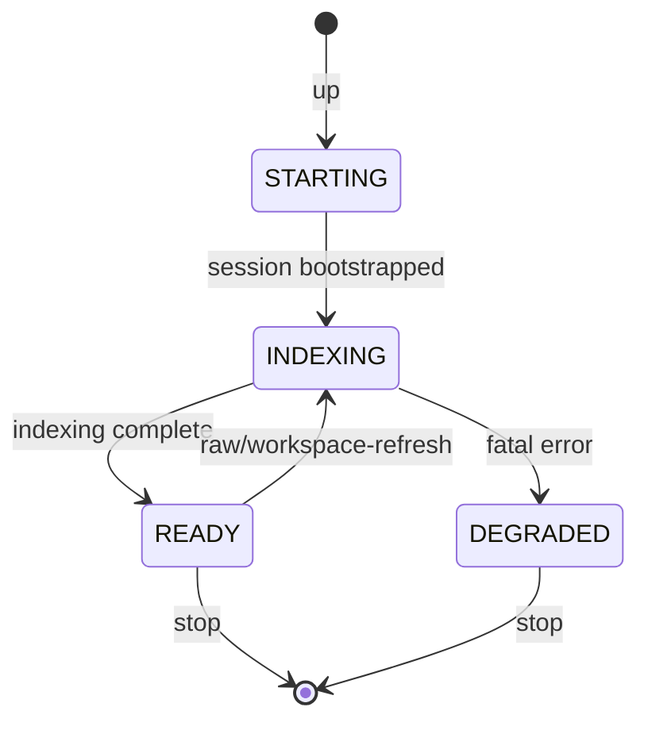
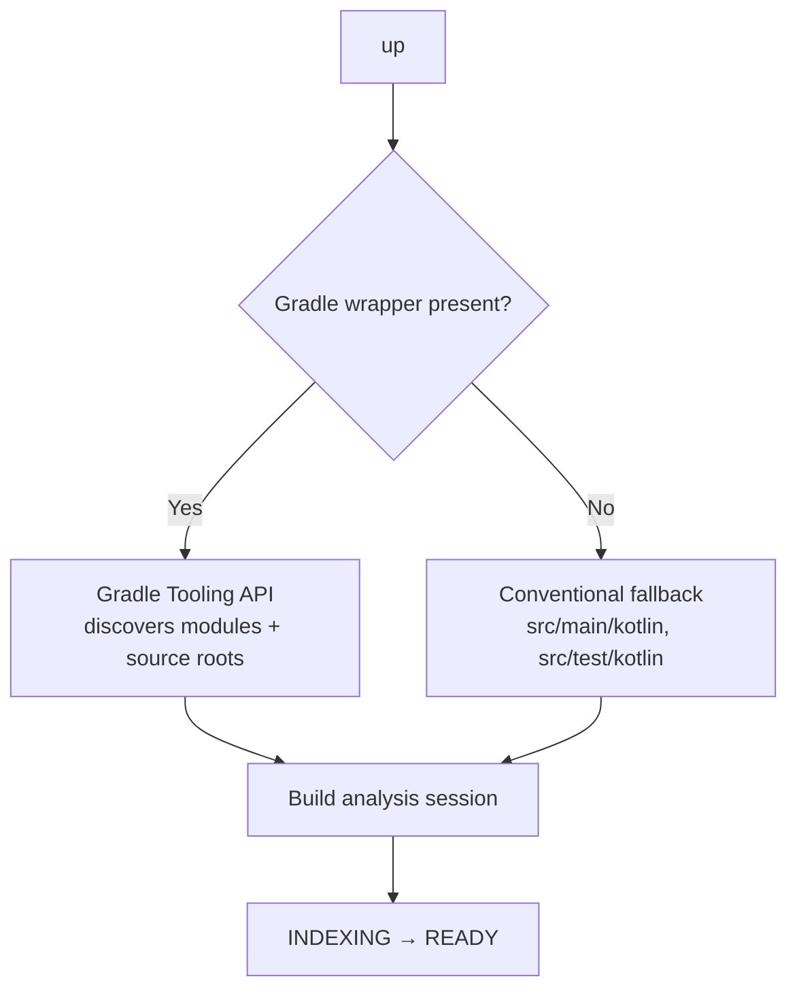

# Manage workspaces

`kast` runs a long-lived daemon per workspace. These operations
start it, check its state, inspect what it discovered, and stop it
cleanly. Knowing the lifecycle is the difference between automation
that runs reliably and automation that leaks zombie processes.

## Daemon lifecycle

The daemon moves through a predictable set of states. Knowing them
tells you when to send queries and when to wait.



- **STARTING** — process launched, analysis session not yet up
- **INDEXING** — K2 session is active, scanning sources. Semantic
  queries may return partial results
- **READY** — indexing done. Every query returns full results
- **DEGRADED** — fatal error during indexing. Stop and investigate

### Start the daemon

`up` starts the daemon and blocks until it is servable.

```console title="Start the daemon and wait for READY"
kast up \
  --workspace-root="$PWD"
```

Pass `--accept-indexing=true` when partial results during indexing
are acceptable.

### Check daemon state

```console title="Check daemon state"
kast status \
  --workspace-root="$PWD"
```

### Stop the daemon

Stop explicitly when you're done. Don't leave orphans behind.

```console title="Stop the daemon cleanly"
kast stop \
  --workspace-root="$PWD"
```

## Workspace discovery

When the daemon starts, it discovers the project automatically. The
strategy depends on what's in your workspace root.



For Gradle projects, `kast` uses the Tooling API to discover
modules, source roots, and classpath. For non-Gradle projects, it
falls back to the conventional Kotlin layout (`src/main/kotlin`,
`src/test/kotlin`).

## Refresh the workspace

`kast` watches source roots for `.kt` changes and refreshes
automatically. `apply-edits` triggers an immediate refresh for the
files it touched. Use `raw/workspace-refresh` via `kast rpc` only as
a manual recovery when an external change slipped past the watcher.

```console title="Full workspace refresh"
kast rpc '{"jsonrpc":"2.0","id":1,"method":"raw/workspace-refresh","params":{}}' \
  --workspace-root="$PWD"
```

Targeted refresh:

```console title="Targeted refresh"
kast rpc '{"jsonrpc":"2.0","id":1,"method":"raw/workspace-refresh","params":{"filePaths":["/absolute/path/to/src/main/kotlin/App.kt"]}}' \
  --workspace-root="$PWD"
```

## Inspect workspace files (RPC)

`raw/workspace-files` returns the modules, source roots, and files the
daemon found. Run it when you want to verify the daemon sees what
you think it sees. File-path enumeration is capped per module so large workspaces
can inspect scope without forcing the daemon to materialize every path in
one response.

=== "CLI"

    ```console title="List workspace files"
    kast rpc '{"jsonrpc":"2.0","id":1,"method":"raw/workspace-files","params":{"includeFiles":true,"maxFilesPerModule":500}}' \
      --workspace-root="$PWD"
    ```

=== "JSON-RPC"

    ```json title="JSON-RPC request"
    {
      "method": "raw/workspace-files",
      "params": {
        "includeFiles": true,
        "maxFilesPerModule": 500
      },
      "id": 1, "jsonrpc": "2.0"
    }
    ```

```json hl_lines="6-8" title="Response — module structure"
{
  "modules": [
    {
      "name": "app",
      "sourceRoots": ["/workspace/app/src/main/kotlin"],
      "dependencyModuleNames": ["lib-core", "lib-api"],
      "files": ["/workspace/app/src/main/kotlin/com/example/App.kt"],
      "filesTruncated": false,
      "fileCount": 1
    }
  ],
  "schemaVersion": 3
}
```

## Check capabilities

`capabilities` returns the operations the active backend supports.
Run it before calling something the standalone backend doesn't yet
implement.

```console title="Query supported capabilities"
kast capabilities \
  --workspace-root="$PWD"
```

## Check runtime health

`health` is a lightweight liveness check; `runtime/status` returns
full runtime metadata.

```console title="Liveness check"
kast rpc '{"jsonrpc":"2.0","id":1,"method":"health"}' \
  --workspace-root="$PWD"
```

## Next steps

- [Backends](../getting-started/backends.md) — when to pick
  standalone vs IDEA
- [Troubleshooting](../troubleshooting.md) — daemon won't start,
  stuck indexing, stale results after edits
