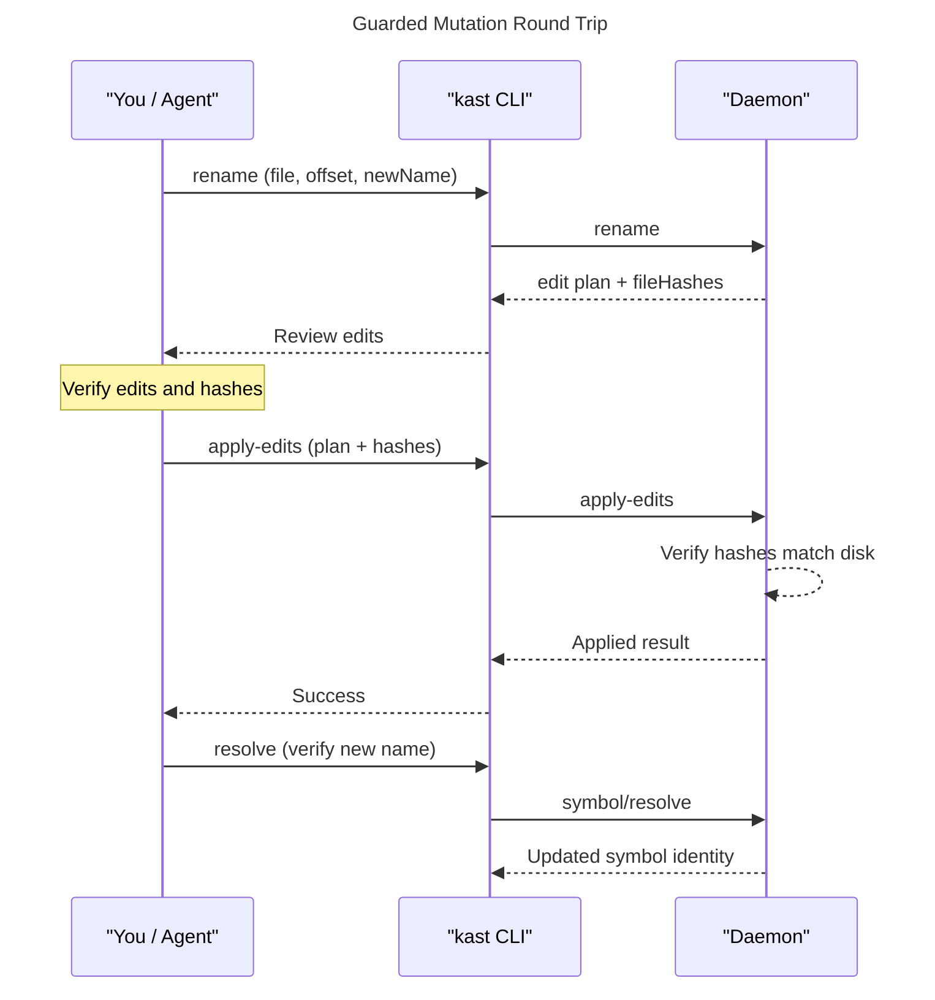

Kast never writes code behind your back. Every mutation follows a
**plan → hash → apply** model: you ask for a change, Kast returns an
edit plan together with content hashes of the files it read, and you
review the plan before sending it back for application. If any file
changed on disk between those two steps, the hashes won't match and
the daemon rejects the apply. This keeps refactors conflict-aware and
fully auditable.

## The plan → hash → apply flow

The sequence below shows the full round-trip for a guarded rename.
The same flow applies to any mutation that returns `fileHashes`.




## Rename a symbol

The `rename` command computes every text edit needed to rename a
symbol across the workspace, without writing anything to disk. The
response includes `fileHashes` so you can feed the plan straight into
`apply-edits` with conflict detection.

=== "CLI"

    ```console title="Plan a rename"
    kast rename \
      --workspace-root=/workspace \
      --file-path=/workspace/src/Sample.kt \
      --offset=20 \
      --new-name=welcome
    ```

=== "JSON-RPC"

    ```json title="rename request"
    {
      "method": "rename",
      "id": 1,
      "jsonrpc": "2.0",
      "params": {
        "position": {
          "filePath": "/workspace/src/Sample.kt",
          "offset": 20
        },
        "newName": "welcome",
        "dryRun": true
      }
    }
    ```

=== "Ask your agent"

    ```text title="Natural-language prompt"
    Use the kast skill to rename the function at offset 20 in
    /workspace/src/Sample.kt to "welcome". Show me the edit plan
    before applying it.
    ```

The response contains the full edit plan:

```json title="rename response" hl_lines="8 9 10"
{
  "edits": [
    {
      "filePath": "/workspace/src/Sample.kt",
      "startOffset": 20,
      "endOffset": 25,
      "newText": "welcome"
    },
    {
      "filePath": "/workspace/src/Sample.kt",
      "startOffset": 48,
      "endOffset": 53,
      "newText": "welcome"
    }
  ],
  "fileHashes": [
    {
      "filePath": "/workspace/src/Sample.kt",
      "hash": "fd31168346a51e49dbb21eca8e5d7cc897afe7116bb3ef21754f782ddb261f72"
    }
  ],
  "affectedFiles": ["/workspace/src/Sample.kt"]
}
```

`fileHashes` captures the content hash of every affected file at
plan time. Keep these hashes — you will send them back when you
apply the edits.

!!! tip
    Rename defaults to `dryRun: true`. Set `dryRun: false` in the
    JSON-RPC request to compute **and** apply in a single call. The
    CLI always uses dry-run mode so you can review before applying.

## Apply edits

Once you have reviewed the plan, send it back to the daemon with the
same `fileHashes`. The daemon re-reads each file, computes the
current hash, and rejects the request if any hash has diverged.

=== "CLI"

    ```console title="Apply the rename plan"
    kast apply-edits \
      --workspace-root=/workspace \
      --request-file=rename-plan.json
    ```

    Write the rename response into `rename-plan.json` and pass it
    with `--request-file`. The CLI forwards the `edits` and
    `fileHashes` fields to the daemon.

=== "JSON-RPC"

    ```json title="edits/apply request" hl_lines="14 15 16 17 18 19"
    {
      "method": "edits/apply",
      "id": 2,
      "jsonrpc": "2.0",
      "params": {
        "edits": [
          {
            "filePath": "/workspace/src/Sample.kt",
            "startOffset": 20,
            "endOffset": 25,
            "newText": "welcome"
          },
          {
            "filePath": "/workspace/src/Sample.kt",
            "startOffset": 48,
            "endOffset": 53,
            "newText": "welcome"
          }
        ],
        "fileHashes": [
          {
            "filePath": "/workspace/src/Sample.kt",
            "hash": "fd31168346a51e49dbb21eca8e5d7cc897afe7116bb3ef21754f782ddb261f72"
          }
        ]
      }
    }
    ```

=== "Ask your agent"

    ```text title="Natural-language prompt"
    Apply the rename plan you just showed me.
    ```

When the hashes match, the daemon writes the edits and responds:

```json title="edits/apply response"
{
  "applied": [
    {
      "filePath": "/workspace/src/Sample.kt",
      "startOffset": 20,
      "endOffset": 25,
      "newText": "welcome"
    },
    {
      "filePath": "/workspace/src/Sample.kt",
      "startOffset": 48,
      "endOffset": 53,
      "newText": "welcome"
    }
  ],
  "affectedFiles": ["/workspace/src/Sample.kt"]
}
```

If a file changed between the plan and the apply, the daemon returns
an error instead of writing partial edits. Re-run the rename to get a
fresh plan with updated hashes.

## Optimize imports

The `optimize-imports` command removes unused imports and sorts the
remainder for the files you specify. Like rename, it returns an edit
plan with `fileHashes` that you can review and apply.

=== "CLI"

    ```console title="Optimize imports"
    kast optimize-imports \
      --workspace-root=/workspace \
      --file-paths=/workspace/src/Sample.kt
    ```

=== "JSON-RPC"

    ```json title="imports/optimize request"
    {
      "method": "imports/optimize",
      "id": 3,
      "jsonrpc": "2.0",
      "params": {
        "filePaths": ["/workspace/src/Sample.kt"]
      }
    }
    ```

=== "Ask your agent"

    ```text title="Natural-language prompt"
    Use the kast skill to optimize imports in
    /workspace/src/Sample.kt.
    ```

The response follows the same shape as rename — an `edits` array,
`fileHashes`, and `affectedFiles`. Send the result to `apply-edits`
when you are ready to write the changes.

## Next steps

- [Validate code](validate-code.md) — run diagnostics after your
  refactor to confirm the workspace compiles cleanly.
- [Behavioral model](../architecture/behavioral-model.md) — learn
  how the daemon manages state, hashing, and conflict detection under
  the hood.
