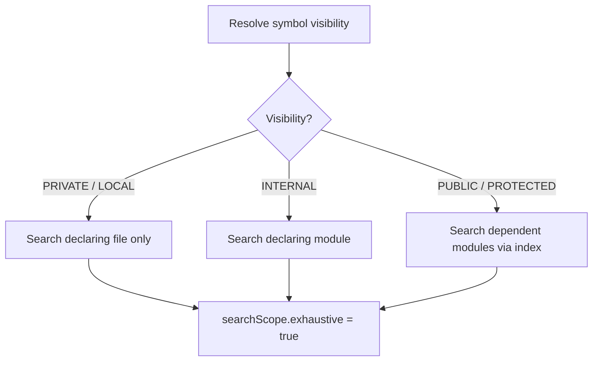
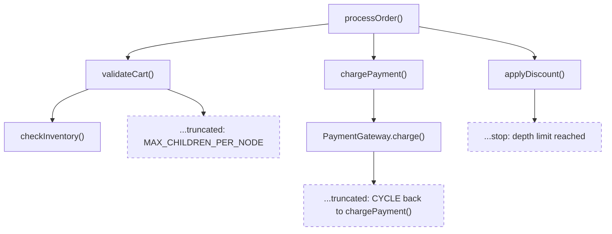

This page covers the operations that trace how symbols are used
across your workspace: finding every reference to a declaration,
expanding incoming or outgoing call trees, and walking type
hierarchies up to supertypes or down to subtypes.

## Find references

The `references` command returns every usage of a resolved symbol
inside the workspace. Kast narrows the file search based on the
symbol's Kotlin visibility, so a `private` function only searches
its declaring file while a `public` function searches dependent
modules through the identifier index.

=== "CLI"

    ```console title="Find all references to a symbol"
    kast references \
      --workspace-root=/workspace \
      --file-path=/workspace/src/main/kotlin/com/shop/OrderService.kt \
      --offset=42 \
      --include-declaration=true
    ```

=== "JSON-RPC"

    ```json title="references request"
    {
      "method": "references",
      "id": 1,
      "jsonrpc": "2.0",
      "params": {
        "position": {
          "filePath": "/workspace/src/main/kotlin/com/shop/OrderService.kt",
          "offset": 42
        },
        "includeDeclaration": true
      }
    }
    ```

=== "Ask your agent"

    ```text title="Natural-language prompt"
    Find every reference to the symbol at offset 42 in
    OrderService.kt. Include the declaration itself.
    ```

The response includes a `searchScope` object that tells you
exactly how Kast searched and whether the results are complete:

```json title="references response" hl_lines="12 13 14 15 16 17 18"
{
  "declaration": {
    "fqName": "com.shop.OrderService.processOrder",
    "kind": "FUNCTION",
    "location": {
      "filePath": "/workspace/src/main/kotlin/com/shop/OrderService.kt",
      "startOffset": 42,
      "endOffset": 54,
      "startLine": 8,
      "startColumn": 7,
      "preview": "processOrder"
    }
  },
  "references": [
    {
      "filePath": "/workspace/src/main/kotlin/com/shop/CheckoutController.kt",
      "startOffset": 128,
      "endOffset": 140,
      "startLine": 15,
      "startColumn": 9,
      "preview": "processOrder"
    },
    {
      "filePath": "/workspace/src/test/kotlin/com/shop/OrderServiceTest.kt",
      "startOffset": 95,
      "endOffset": 107,
      "startLine": 12,
      "startColumn": 15,
      "preview": "processOrder"
    }
  ],
  "searchScope": {
    "visibility": "PUBLIC",
    "scope": "DEPENDENT_MODULES",
    "exhaustive": true,
    "candidateFileCount": 47,
    "searchedFileCount": 47
  },
  "schemaVersion": 3
}
```

### Read `searchScope` before you trust completeness

| Field | Meaning |
|-------|---------|
| `visibility` | Kotlin visibility Kast resolved: `PUBLIC`, `INTERNAL`, `PROTECTED`, `PRIVATE`, `LOCAL`, or `UNKNOWN`. |
| `scope` | Breadth of the search: `FILE`, `MODULE`, or `DEPENDENT_MODULES`. |
| `exhaustive` | `true` when every candidate file was searched. Treat results as partial when `false`. |
| `candidateFileCount` | Files the index identified as possible reference holders. |
| `searchedFileCount` | Files Kast actually analyzed. |

When `exhaustive` is `false`, the index was incomplete or the
scope could not cover all candidates. Widen the search or
refresh the workspace before claiming the reference list is
final.

### How visibility drives scope

Kast uses the resolved visibility to pick the smallest search
scope that still covers every possible reference:



This scoping means private renames touch only one file, while
public renames fan out across every module that depends on the
declaring module.

## Expand the call hierarchy

The `call-hierarchy` command builds a bounded call tree from a
function or method. Set `direction` to `INCOMING` to find callers
or `OUTGOING` to find callees. The tree is never unbounded — Kast
enforces depth, total node, per-node child, and timeout limits.

=== "CLI"

    ```console title="Find incoming callers two levels deep"
    kast call-hierarchy \
      --workspace-root=/workspace \
      --file-path=/workspace/src/main/kotlin/com/shop/OrderService.kt \
      --offset=42 \
      --direction=INCOMING \
      --depth=3 \
      --max-total-calls=256 \
      --max-children-per-node=64
    ```

=== "JSON-RPC"

    ```json title="call-hierarchy request" hl_lines="9 10 11 12"
    {
      "method": "call-hierarchy",
      "id": 1,
      "jsonrpc": "2.0",
      "params": {
        "position": {
          "filePath": "/workspace/src/main/kotlin/com/shop/OrderService.kt",
          "offset": 42
        },
        "direction": "INCOMING",
        "depth": 3,
        "maxTotalCalls": 256,
        "maxChildrenPerNode": 64
      }
    }
    ```

=== "Ask your agent"

    ```text title="Natural-language prompt"
    Show me who calls processOrder in OrderService.kt, up to
    three levels deep.
    ```

The response contains the tree and a `stats` object that reports
whether any bound stopped expansion early:

```json title="call-hierarchy response" hl_lines="36 37 38 39 40 41 42 43"
{
  "root": {
    "symbol": {
      "fqName": "com.shop.OrderService.processOrder",
      "kind": "FUNCTION",
      "location": {
        "filePath": "/workspace/src/main/kotlin/com/shop/OrderService.kt",
        "startOffset": 42,
        "endOffset": 54,
        "startLine": 8,
        "startColumn": 7,
        "preview": "processOrder"
      }
    },
    "children": [
      {
        "symbol": {
          "fqName": "com.shop.CheckoutController.checkout",
          "kind": "FUNCTION",
          "location": {
            "filePath": "/workspace/src/main/kotlin/com/shop/CheckoutController.kt",
            "startOffset": 67,
            "endOffset": 75,
            "startLine": 10,
            "startColumn": 7,
            "preview": "checkout"
          }
        },
        "callSite": {
          "filePath": "/workspace/src/main/kotlin/com/shop/CheckoutController.kt",
          "startOffset": 128,
          "endOffset": 140,
          "startLine": 15,
          "startColumn": 9,
          "preview": "processOrder"
        },
        "children": []
      }
    ]
  },
  "stats": {
    "totalNodes": 2,
    "totalEdges": 1,
    "truncatedNodes": 0,
    "maxDepthReached": 1,
    "timeoutReached": false,
    "maxTotalCallsReached": false,
    "maxChildrenPerNodeReached": false,
    "filesVisited": 2
  },
  "schemaVersion": 3
}
```

### How truncation works

Kast stops expanding the tree whenever it hits a configured bound.
This conceptual tree shows every truncation reason you can
encounter:



Each truncated node carries a `truncation` object with a `reason`
field. These are the possible values:

| Reason | Meaning |
|--------|---------|
| `CYCLE` | The symbol already appears on the current path. Kast stops that branch to keep the tree finite. This is not an error. |
| `MAX_CHILDREN_PER_NODE` | The node had more direct callers or callees than `maxChildrenPerNode` allows. The result is partial at that node. |
| `MAX_TOTAL_CALLS` | The total number of nodes reached `maxTotalCalls`. Remaining branches are not expanded. |
| `TIMEOUT` | The traversal exceeded `timeoutMillis`. Remaining branches are not expanded. |

Depth-limited leaves stop because the configured `depth` ran out.
They do not carry a `truncation` object — read
`stats.maxDepthReached` to see the deepest level the tree
reached.

!!! tip
    Always read `stats` before you claim a call tree is complete.
    If any boolean flag is `true` or `truncatedNodes` is greater
    than zero, the tree is partial. Increase the relevant bound
    and re-run the query to see further.

## Walk the type hierarchy

The `type-hierarchy` command expands supertypes and subtypes from
a class or interface. Use `direction` to control which direction
to walk:

- `SUPERTYPES` — parents, interfaces, and their ancestors.
- `SUBTYPES` — direct and transitive subclasses or implementors.
- `BOTH` — expand in both directions from the root.

=== "CLI"

    ```console title="Get supertypes and subtypes"
    kast type-hierarchy \
      --workspace-root=/workspace \
      --file-path=/workspace/src/main/kotlin/com/shop/Greeter.kt \
      --offset=45 \
      --direction=BOTH \
      --depth=3
    ```

=== "JSON-RPC"

    ```json title="type-hierarchy request" hl_lines="9 10 11"
    {
      "method": "type-hierarchy",
      "id": 1,
      "jsonrpc": "2.0",
      "params": {
        "position": {
          "filePath": "/workspace/src/main/kotlin/com/shop/Greeter.kt",
          "offset": 45
        },
        "direction": "BOTH",
        "depth": 3,
        "maxResults": 50
      }
    }
    ```

=== "Ask your agent"

    ```text title="Natural-language prompt"
    Show me the full type hierarchy for the Greeter interface —
    supertypes and subtypes.
    ```

The response contains a tree rooted at the queried symbol.
Supertypes appear in the `supertypes` array on each node, and
subtypes appear as `children`:

```json title="type-hierarchy response" hl_lines="8 27 28 29"
{
  "root": {
    "symbol": {
      "fqName": "com.shop.FriendlyGreeter",
      "kind": "CLASS",
      "location": {
        "filePath": "/workspace/src/main/kotlin/com/shop/Greeter.kt",
        "startOffset": 45,
        "endOffset": 60,
        "startLine": 4,
        "startColumn": 12,
        "preview": "open class FriendlyGreeter : Greeter"
      },
      "containingDeclaration": "com.shop",
      "supertypes": ["com.shop.Greeter"]
    },
    "children": [
      {
        "symbol": {
          "fqName": "com.shop.Greeter",
          "kind": "INTERFACE",
          "location": {
            "filePath": "/workspace/src/main/kotlin/com/shop/Greeter.kt",
            "startOffset": 26,
            "endOffset": 33,
            "startLine": 3,
            "startColumn": 11,
            "preview": "interface Greeter"
          },
          "containingDeclaration": "com.shop"
        },
        "children": []
      },
      {
        "symbol": {
          "fqName": "com.shop.LoudGreeter",
          "kind": "CLASS",
          "location": {
            "filePath": "/workspace/src/main/kotlin/com/shop/Greeter.kt",
            "startOffset": 77,
            "endOffset": 88,
            "startLine": 5,
            "startColumn": 7,
            "preview": "class LoudGreeter : FriendlyGreeter()"
          },
          "containingDeclaration": "com.shop",
          "supertypes": ["com.shop.FriendlyGreeter"]
        },
        "children": []
      }
    ]
  },
  "stats": {
    "totalNodes": 3,
    "maxDepthReached": 1,
    "truncated": false
  },
  "schemaVersion": 3
}
```

The `stats.truncated` flag tells you whether the tree is
complete. When it is `true`, increase `depth` or `maxResults`
and re-run the query.

## Next steps

- [Refactor safely](refactor-safely.md) — plan and apply
  renames with conflict detection.
- [For agents](../for-agents/index.md) — integrate these
  operations into LLM agent workflows.
