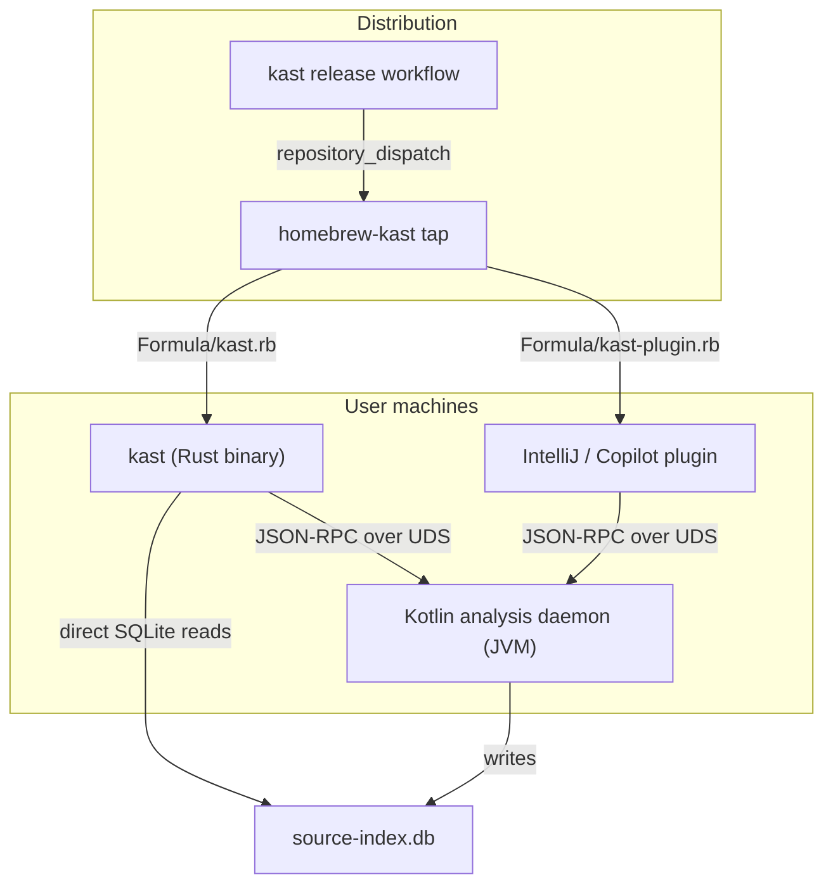
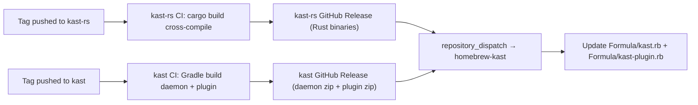

## Ideal End State

Here's what the fully-realized architecture looks like when all migration work is complete:

---

### Architecture Overview




---

### The Rust Binary IS the CLI

The `kast` binary users invoke is always the Rust binary from `amichne/kast-rs`. No GraalVM, no JVM startup cost, no native-image reflection configs. The Kotlin/JVM code exists only as the **headless analysis daemon** — a long-running background process that the Rust CLI starts, manages, and communicates with over a Unix domain socket. [1-cite-0](#1-cite-0)

The Rust CLI owns:
- All user-facing commands (`up`, `stop`, `status`, `rpc`, `config init`, `install`, `doctor`, `info`, `uninstall`, `metrics`, `demo`)
- Daemon lifecycle management (spawn JVM process, wait for socket, health-check, kill)
- The interactive TUI for metrics exploration (direct `rusqlite` reads against `source-index.db`)
- Embedded resource installation (skill files, copilot extension scaffolds) [1-cite-1](#1-cite-1)

The Kotlin `kast-cli` module **ceases to exist as a user-facing artifact**. It's fully absorbed — the Gradle project retains only what's needed to build the daemon's `portableDistZip` (the JVM classpath bundle that `kast daemon start` invokes). [1-cite-2](#1-cite-2)

---

### Single RPC Contract, Three Namespaces

The daemon exposes one JSON-RPC endpoint over UDS. All methods live under three prefixes:

| Prefix | Semantics |
|--------|-----------|
| `symbol/*` | Orchestrated, name-based operations (resolve, references, callers, scaffold, rename, write-and-validate) |
| `raw/*` | Direct offset/path-based LSP-style operations (diagnostics, outline, completions, code-actions, etc.) |
| `database/*` | Index-driven analytics (metrics queries) |

Plus system methods (`health`, `runtime/status`, `capabilities`) at the root. [1-cite-3](#1-cite-3)

The CLI's `kast rpc` command is a transparent passthrough — it sends whatever JSON the user provides. The higher-level commands (`kast up`, `kast status`) construct the right JSON-RPC payloads internally. There is no "skill" concept in the CLI surface anymore; that's an agent/AI-tooling concern only, handled by the embedded skill resources. [1-cite-4](#1-cite-4)

---

### Homebrew Distribution

`amichne/homebrew-kast` contains two formulas in a single tap: [1-cite-5](#1-cite-5)

**`Formula/kast.rb`** — the Rust CLI binary
```ruby
class Kast < Formula
  desc "Workspace control plane for Kotlin analysis daemons"
  url "https://github.com/amichne/kast-rs/releases/download/v#{version}/kast-v#{version}-#{arch}.tar.gz"
  # platform matrix: macos-arm64, macos-x64, linux-x64, linux-arm64

  def install
    bin.install "kast"
  end
end
```

**`Formula/kast-plugin.rb`** — the IntelliJ/Copilot extension bundle (or a Cask if appropriate)
- Downloads the plugin ZIP from `amichne/kast` releases
- Places it where IDE tooling expects it, or provides a convenience path for manual install
- Same versioning cadence as the daemon

Users install everything with:
```bash
brew tap amichne/kast
brew install kast            # Rust CLI
brew install kast-plugin     # IDE integration
```

The tap is the **standalone** tap — there's no separate "dedicated" one. `amichne/homebrew-kast` is already that. The automation (`repository_dispatch` from the release workflow) updates checksums for both formulas. [1-cite-6](#1-cite-6)

---

### Release Flow



The two repos release independently but with compatible version contracts. The Rust CLI embeds the minimum daemon version it's compatible with and `kast doctor` validates the installed daemon version meets that floor. [1-cite-7](#1-cite-7)

---

### What's Gone

| Removed | Replaced By |
|---------|-------------|
| GraalVM native-image pipeline | Rust cross-compilation |
| ProGuard/R8 shrink pipeline | Nothing (unnecessary complexity) |
| `kast-cli` Kotlin module as user artifact | Rust binary |
| `mordant` TUI in Kotlin | `ratatui` TUI in Rust |
| Direct SQLite access from Kotlin CLI | Direct SQLite from Rust CLI (`rusqlite`) |
| `workspace *` command namespace | `up` / `status` / `stop` |
| Bare/`skill/*` RPC method names | `symbol/*` / `raw/*` / `database/*` |
| `CliCommandCatalog` with 1400 lines of metadata | `clap` derive macros in ~200 lines of Rust | [1-cite-8](#1-cite-8) 

---

### Why This Is the Right Long-Term Shape

1. **Instant startup** — Rust binary launches in <5ms. No JVM cold-start for the thing users type interactively. The JVM only runs as a background daemon where startup time is amortized.

2. **Single binary distribution** — `kast` is one statically-linked (or minimally-linked) binary per platform. No JDK required on the user's PATH for CLI usage. The daemon's JVM is bundled in the `portableDistZip` and managed by the CLI.

3. **Clean separation of concerns** — the Kotlin code does what Kotlin is best at (IntelliJ PSI analysis, Kotlin compiler integration). The Rust code does what Rust is best at (fast CLI UX, direct file/DB I/O, TUI rendering, system process management).

4. **Homebrew-native** — formulas are trivial (single binary install) rather than the current complexity of symlinking into `libexec`. The plugin gets its own formula so users opt into IDE integration explicitly.

5. **One communication protocol** — everything (CLI, plugins, CI action, AI agents) talks to the daemon the same way: JSON-RPC over UDS. The method taxonomy is self-documenting via `commands.json` generated from `VersionedCommandSpec`. [1-cite-9](#1-cite-9)

6. **Embedded resources as first-class install** — `kast install skill` and `kast install copilot-extension` ship curated, version-pinned agent scaffolds directly from the binary. No network fetch needed. [1-cite-10](#1-cite-10)
