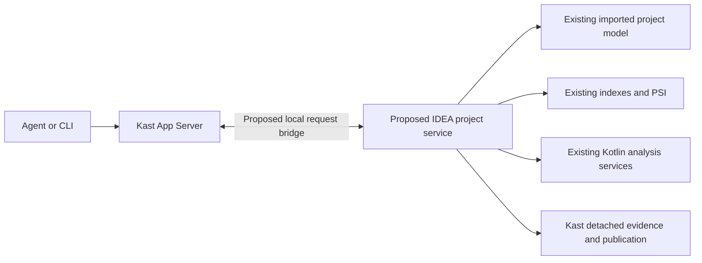

# Querying the Existing IDE Without a Second Workspace

Status: a bounded existing-IDE index endpoint is implemented and qualified;
general production composition remains proposed. The aim is to run Kast semantic
reads against an explicitly admitted open IDEA project and reuse that project's
imported model, indexes, PSI, and Kotlin analysis services.

The first compiled saved-class direct-supertype endpoint is implemented and
manually qualified on the existing Kast project, including restored edits,
cancellation, project closure/restoration, and plugin-manager load/unload. Its
[runbook](HOSTED_QUERY.md) records the exact host, typed results, test evidence,
and remaining qualification limits. The broader production integration below
remains a proposal.

A separate `runtime:hosted` plugin now exposes class-name discovery and direct
supertype reads through a persistent Unix socket. The [endpoint runbook](HOSTED_ENDPOINT.md)
describes the direct client, same-host incremental indexing proof, ownership,
and retirement. Normal queries no longer depend on the manual script carrier.
The primary native `kast index` commands (with compatible `kast ide` spelling)
select this path before isolated-product
bootstrap. General semantic CLI commands and App Server requests retain their
existing runtime selection. Python remains optional acceptance tooling; it is not
a runtime dependency of this indexing path.

The practical architecture is a small semantic host inside IDEA. The existing
CLI/App Server can remain outside the IDE and exchange detached requests and
results with it. The attached mode would create no second IDEA project and
perform no Kast-initiated Gradle import on attachment. IDEA still owns its normal
Gradle synchronization and indexing when the developer changes the build.

This proposal reuses semantic services in their owning process. It does not
assume that copying index storage gives another process access to live project
context. The [Analysis API](https://kotlin.github.io/analysis-api/index_md.html)
is the semantic interface used by Kotlin IDE features. Its symbols and types
must be consumed inside their read/analysis lifetime and projected into Kast
values before leaving the host; see
[Analysis API fundamentals](https://kotlin.github.io/analysis-api/fundamentals.html).

Implemented foundations are already substantial:

| Boundary | Existing source | Remaining integration |
|---|---|---|
| Exact existing project | [ExistingProjectAdmission](../../workspace/intellij-read/src/main/kotlin/io/github/amichne/kast/workspace/intellij/read/ExistingProjectAdmission.kt) validates lifecycle, root, cached model, K2, and host compatibility; retains a session and epoch source. | Install and retire it through a qualified host service; carry its exact identity through transport. |
| Cached model context | [LiveDetachedModelCapture](../../workspace/intellij-read/src/main/kotlin/io/github/amichne/kast/workspace/intellij/read/LiveDetachedModelCapture.kt) captures bounded modules, roots, Gradle identities, SDKs, and classpaths without import. | Prove a mapping to current publication and search-scope contracts for supported builds. |
| Bounded reads | [AdmittedProjectReadExecution](../../workspace/intellij-read/src/main/kotlin/io/github/amichne/kast/workspace/intellij/read/epoch/execution/AdmittedProjectReadExecution.kt) rechecks lifecycle in cancellable reads. | Qualify the actual semantic request against edits, cancellation, and disposal; detach all results. |
| Semantic adapters | Hosted [relation](../../relation/intellij/src/main/kotlin/io/github/amichne/kast/relation/intellij/HostedIntellijRelationPorts.kt), [diagnostic](../../diagnostic/intellij/src/main/kotlin/io/github/amichne/kast/diagnostic/intellij/HostedIntellijDiagnosticPorts.kt), and [topology](../../topology/intellij/src/main/kotlin/io/github/amichne/kast/topology/intellij/HostedIntellijTopologyPorts.kt) factories accept an existing Project. | Complete the selected operation's symbol/source and publication graph; factory availability is not endpoint qualification. |
| Runtime composition | [InstalledRuntimeAssembly](../../runtime/composition/src/main/kotlin/io/github/amichne/kast/runtime/composition/bootstrap/InstalledRuntimeAssembly.kt) already separates model reads, physical ports, and graph construction. | Add an existing-project assembly path that never calls `InstalledIntellijWorkspace.open`. |

The hardest contract gaps are model provenance, content identity, and host
lifetime. They should determine the first supported operation and project scope.

The isolated runtime's
[Gradle resolver](../../workspace/intellij/src/main/kotlin/io/github/amichne/kast/workspace/intellij/provenance/GradleSourceRootBridge.kt)
adds producer evidence during import. Its
[source-root capture](../../workspace/intellij/src/main/kotlin/io/github/amichne/kast/workspace/intellij/provenance/InstalledGradleSourceRootCapture.kt)
uses those nodes to preserve source-set ownership and authored/generated
provenance. An ordinary existing IDEA import may not contain that evidence.
The hosted adapter must prove what can be established from the already loaded
model. Unsupported mappings stay rejected or require a separately selected sync
of the same project with the required extension. No second workspace is needed
for such a sync, but zero additional import for every feature is not proven.

IDE context also has several distinct content states. A file can have unsaved
document changes, and document contents can be uncommitted to PSI. The current
[source reader](../../source/intellij/src/main/kotlin/io/github/amichne/kast/source/intellij/InstalledIntellijSourceReadPort.kt)
rejects both conditions. Start with saved-content semantics and verify that dirty
dependencies cannot silently change the meaning of a supposedly disk-backed
answer. Later support for editor buffers needs explicit document identities,
snapshots, offsets, and cross-file consistency. Reading a caret or selection is
additional context acquisition, not proof of workspace readiness; see
[IDE document APIs](https://plugins.jetbrains.com/docs/intellij/documents.html).

Project/model change, dumb mode, and closure must invalidate the relevant read
authority. Run semantic work in short cancellable reads and release locks before
transport or persistence I/O. Do not retain `KaSession`, live symbols, or PSI
across requests. These constraints follow the
[platform threading model](https://plugins.jetbrains.com/docs/intellij/threading-model.html).
Reusing indexes still consumes IDE CPU, memory, and analysis time; it does not
make queries free or guarantee that all analysis caches are already warm.

For production, the recommended delivery is a small IDEA plugin with a
project-level service and an explicit local endpoint. Platform
[service lifetimes](https://plugins.jetbrains.com/docs/intellij/plugin-services.html)
provide project-close and plugin-unload cancellation boundaries. The implementation
still needs disposal and load/unload evidence. The current
[indexer descriptor](../../indexer/src/main/resources/META-INF/plugin.xml)
includes an application starter, exclusion policy, and Gradle extensions for the
isolated host; it should not be installed unchanged into a developer IDE.
Audit dependencies against the host's
[class loading](https://plugins.jetbrains.com/docs/intellij/plugin-class-loaders.html)
and [bundled Kotlin libraries](https://plugins.jetbrains.com/docs/intellij/using-kotlin.html).

The script carrier remains useful for a manually bounded feasibility check.
Its recorded compiler resource exhaustion and unqualified dynamic unload make
it insufficient evidence for unattended hosting. Loading existing Kast adapters
through a script also needs its own class-loading proof; the observer currently
contains no such semantic endpoint.

The recommended next milestone is one bounded semantic query in the exact open
project. Select a saved Kotlin declaration and return compiler identity plus a
resolved relationship through the existing domain/wire contracts. Start with
only the capabilities whose model and content proof can be established.
Qualification must establish:

1. The same host incarnation and Project object serve the request, with no new
   Kast worker/project and no Kast-initiated Gradle link/import.
2. A known compiler-resolved relationship matches the IDE's current model and
   the result carries explicit scope/content/publication evidence.
3. Dirty input, an edit during analysis, indexing, cancellation, wrong-project
   routing, and project closure yield the correct closed outcomes.
4. Semantic objects do not escape the read lifetime; transport does not hold a
   platform read lock; the query respects its budget and preserves UI responsiveness.
5. Detachment retires the original service's work and invalidates its endpoint.

After that proof, extend query coverage and host routing. In the mode that
promises no second workspace, missing or closed IDE state should report
unavailability. An isolated worker remains an explicit separate policy for
headless use, not automatic recovery from a lost IDE attachment.

This changes the next-step recommendation for the no-second-workspace goal:
prioritize the hosted-query proof over advisory replay. The observer still contributes host/project
correlation, bounded diagnostics, and retirement lessons, while semantic
authority comes from the admitted project and actual analysis.
