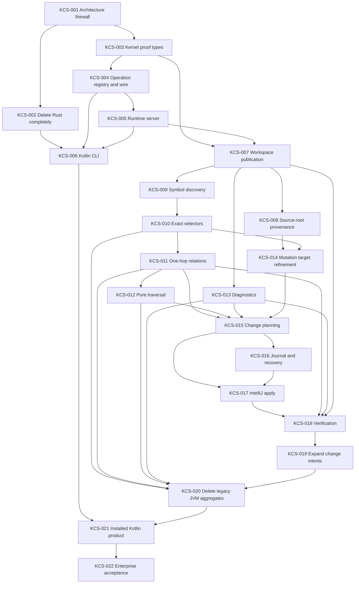

# Kast Clean-Slate Architecture and Delivery Plan

**Status:** Normative  
**Authority:** This document defines the target product architecture, public surface, internal boundaries, and delivery order for Kast.  
**Implementation baseline:** `amichne/kast@cc240288ee6629c070a48046dda59687cd12df04` is used only to locate code that must be replaced or retained.

## 1. Product definition

Kast is a compiler-grounded semantic control plane for coding agents operating on Kotlin/Gradle repositories.

Kast has exactly two runtime processes:

1. `kast` — one Kotlin CLI executable.
2. `kast-indexer` — one isolated JVM process hosting IntelliJ/K2 semantic authority for one canonical repository root.

There is no Rust in the product, repository, build, release, test harness, fixture set, cache, compatibility layer, or retained binary archive.

There is one public machine contract between `kast` and `kast-indexer`. There is one public operation registry. There is one compiler authority. There is one published semantic generation per repository root. There is one canonical outcome algebra.

Kast preserves no current command, schema, binary, state layout, catalog, or behavior unless that behavior is explicitly restated here.

## 2. Non-negotiable laws

### 2.1 One authority per fact

| Fact | Sole authority |
|---|---|
| Kotlin symbol identity, type, invocation, relationship | IntelliJ/K2 compiler analysis |
| Gradle module, source-set, source-root ownership | Imported Gradle/IntelliJ project model |
| Canonical repository root | Workspace admission |
| Current semantic state | `PublishedWorkspace` |
| Public operation identity | `OperationRegistry` |
| Persisted evidence | Evidence store carrying compiler provenance |
| Source mutation permission | `MutationAuthority` bound to one plan and repository state |
| Final mutation success | `VerifiedReceipt` |

A second authority for the same fact is prohibited.

### 2.2 Parse once, then remove the primitive

Every trust transition is a type transition:

```text
raw value -> parsed value -> admitted value -> capability
```

Expected failure is always closed:

```text
T -> Result<S, E>
```

After `S` exists, downstream code receives `S`. It does not receive `T` plus a Boolean, nullable field, comment, convention, or repeated validator.

### 2.3 Capability is the only permission

A service can perform an effect only when its function receives the capability for that effect.

There is no service locator, runtime handle, backend aggregate, dependency map, generic context, `Project`, database connection, or filesystem handle from which stronger authority can be recovered.

### 2.4 Cost escalation is explicit

A read cannot trigger a stronger operation.

A symbol read cannot import Gradle, refresh the workspace, build derived evidence, scan the repository, write SQLite, or mutate source. Missing evidence produces a typed result. It never causes hidden repair.

### 2.5 Live platform objects never cross a boundary

`Project`, `PsiElement`, `KaSession`, `VirtualFile`, `Document`, search scopes, IntelliJ model entities, JDBC connections, and Gradle Tooling API values stay inside their adapter module and request lifetime.

Cross-module values are detached immutable values.

### 2.6 Persistence is evidence, never semantic authority

SQLite stores detached evidence, generation identity, coverage, journals, and receipts. SQLite cannot manufacture symbol identity, semantic relationships, completeness, or mutation permission.

### 2.7 Mutation and proof are different states

```text
Planned
-> Authorized
-> AppliedUnverified
-> Verified | Rejected | RolledBack | RecoveryRequired
```

`change.apply` cannot return success. Only `change.verify` can produce `VerifiedReceipt`.

### 2.8 Unknown fails closed only where the unknown matters

Unknown target provenance cannot authorize a write. Unknown unrelated proof context does not block an operation unless the operation requires that evidence.

### 2.9 No compatibility architecture

There is no compatibility adapter for `AnalysisBackend`, Rust commands, legacy JSON, TOON, direct SQLite CLI reads, task workflow, setup transactions, developer RPC, or retained binaries.

When a replacement vertical slice is green, the displaced implementation is deleted in the same delivery wave.

## 3. Public product surface

The public product surface is exactly:

```text
kast workspace inspect

kast symbol discover
kast symbol resolve
kast symbol describe

kast relation read
kast traversal run
kast diagnostic check

kast change plan
kast change apply
kast change verify
kast change recover
```

These commands are projections of exactly eleven canonical operation IDs:

```text
workspace.inspect
symbol.discover
symbol.resolve
symbol.describe
relation.read
traversal.run
diagnostic.check
change.plan
change.apply
change.verify
change.recover
```

No other public operation exists until it has a typed contract, an operation-registry entry, an isolated RED/GREEN proof, and an explicit capability boundary.

There is no public `up`, `refresh`, raw RPC, SQL, graph rebuild, setup, lifecycle, daemon, installer, hook, task, or developer-control operation.

Semantic demand starts or reuses the exact-root indexer automatically. `workspace.inspect` reports state; it does not mutate state.

### 3.1 Canonical public result

Every public operation returns exactly one:

```kotlin
sealed interface Outcome<out T> {
    data class Complete<T>(
        val value: T,
        val evidence: CompleteEvidence,
    ) : Outcome<T>

    data class Qualified<T>(
        val value: T,
        val evidence: QualifiedEvidence,
        val limitations: NonEmptyList<Limitation>,
    ) : Outcome<T>

    data class Rejected(
        val failure: OperationFailure,
        val evidence: RejectedEvidence,
    ) : Outcome<Nothing>
}
```

`Qualified` is structurally incapable of being interpreted as `Complete`. Transport success and semantic success are separate.

### 3.2 Change intents

`change.plan` accepts one closed intent:

```kotlin
sealed interface ChangeIntent {
    data class AddFile(...) : ChangeIntent
    data class AddDeclaration(...) : ChangeIntent
    data class ReplaceDeclaration(...) : ChangeIntent
    data class RenameSymbol(...) : ChangeIntent
}
```

No raw edit operation exists.

## 4. Runtime state

For one canonical root, exactly one runtime state exists:

```text
Absent
Starting
Reconciling
Ready(PublishedWorkspace)
Blocked(Blocker)
Stopping
```

Only `Ready(PublishedWorkspace)` admits semantic reads.

`PublishedWorkspace` binds canonical root, admitted source state, Gradle ownership, compiler configuration, dependency/classpath identity, source-root provenance, semantic generation, and evidence coverage.

Relevant VFS or build events immediately withdraw `Ready` and request reconciliation. Events are signals only. Reconciliation is the only transition that can publish a new `Ready` state.

A reconciliation pass that observes workspace movement is discarded. The previous valid generation remains intact.

## 5. Target Gradle topology

```text
:kernel

:protocol:contract
:protocol:registry
:protocol:wire

:workspace:contract
:workspace:service
:workspace:intellij

:symbol:contract
:symbol:service
:symbol:intellij

:relation:contract
:relation:service
:relation:intellij

:traversal:contract
:traversal:service

:diagnostic:contract
:diagnostic:service
:diagnostic:intellij

:change:contract
:change:plan
:change:apply
:change:verify
:change:recovery
:change:intellij

:evidence:contract
:evidence:sqlite

:runtime:server
:runtime:composition

:cli
:indexer
```

There are no `analysis-api`, `analysis-server`, `index-store`, or `cli-rs` modules in the terminal repository.

## 6. Module roles

### `contract`

Owns public domain types, requests, results, closed failures, and capabilities for one family.

It has explicit API and depends only on `:kernel` and narrower contracts. It has no platform implementation, filesystem write, JDBC, IntelliJ, Gradle API, transport, or service implementation.

### `service`

Owns workflow semantics. It consumes contracts and narrow ports. Pure functions are preferred. Expected failure is data. Platform classes and persistence implementations are absent.

### `intellij`

Owns IntelliJ/K2/Gradle interaction. It converts platform values to detached contract values before returning. It does not own product workflow or persistence.

Only `:change:intellij` may execute modeled source mutation. Only `:workspace:intellij` may execute Gradle import or VFS reconciliation.

### `sqlite`

Owns physical persistence. It is the only module family allowed to use JDBC/SQLite. It implements evidence contracts and cannot create semantic facts without provenance.

### `runtime:composition`

The only module allowed to construct the complete implementation graph.

### `runtime:server`

Owns typed dispatch. It depends on contracts, registry, and operation bindings. It does not depend directly on IntelliJ, Gradle, JDBC, source writers, or filesystem mutation.

### `cli`

Owns only command parsing, canonical root discovery, indexer process admission, UDS connection, wire serialization, canonical JSON projection, and exit status.

It owns no semantics, SQLite, workspace reconciliation, source mutation, or business workflow.

## 7. Public versus internal interfaces

The boundary rule is strict:

```text
PUBLIC BETWEEN MODULES
    immutable contract values
    closed failures
    proof-carrying capabilities
    narrow ports
    canonical outcomes

INTERNAL TO A MODULE
    algorithms
    collections
    caches
    batching
    memoization
    platform handles
    transactions
    mutable work queues
    implementation-specific state
```

Public symbol API:

```kotlin
interface SymbolOperations {
    suspend fun discover(request: SymbolDiscoveryRequest): Outcome<SymbolCandidatePage>
    suspend fun resolve(request: SymbolResolutionRequest): Outcome<ResolvedSymbol>
    suspend fun describe(request: ExactSymbolRequest): Outcome<SymbolDescription>
}
```

Identity refines monotonically:

```text
SymbolQuery
-> SymbolCandidateSelector
-> SymbolSelector
```

An exact operation accepts `SymbolSelector`, never a string, qualified name, path+offset, graph node, or display value.

An internal port is narrow and module-private:

```kotlin
internal interface SymbolCompilerPort {
    suspend fun discover(
        lease: SemanticReadLease,
        request: SymbolDiscoveryRequest,
    ): CompilerSymbolCandidates
}
```

Traversal has no IntelliJ adapter:

```text
TraversalPlan
+ OneHopRelationReader
-> TraversalResult
```

It is tested against an in-memory reader. The same pure-core rule applies to workspace delta classification, plan construction, obligation evaluation, and expected/observed semantic delta comparison.

## 8. Architecture firewall

The build fails on every forbidden edge.

| Consumer | Forbidden |
|---|---|
| any `:contract` | service, adapter, JDBC, IntelliJ, Gradle, filesystem mutation |
| `:symbol:*` | workspace transition service, traversal service, change modules, JDBC |
| `:relation:*` | traversal service, change modules, JDBC |
| `:traversal:*` | IntelliJ, Gradle, JDBC, source write |
| `:diagnostic:*` | change modules, workspace transition, JDBC |
| `:change:plan` | `:change:apply`, `:change:intellij`, JDBC |
| `:change:verify` | source writer |
| `:runtime:server` | IntelliJ, Gradle, JDBC, source writer |
| `:cli` | IntelliJ, Gradle, JDBC, evidence implementation |
| every module except `:workspace:intellij` | Gradle import implementation |
| every module except `:change:intellij` | IntelliJ source write implementation |
| every module except `:evidence:sqlite` | JDBC/SQLite |
| every module except `:runtime:composition` | complete implementation graph |

`build-logic` owns:

```text
verifyKastModuleGraph
verifyForbiddenEffects
verifyContractApi
```

The firewall checks project dependencies and forbidden bytecode/source references. Every privileged effect has one explicit allowlisted owner.

## 9. Core semantic slices

### Workspace

Public:

```text
WorkspaceInspectRequest
-> Outcome<WorkspaceStatus>
```

Internal:

```text
VFS signals
-> CandidateWorkspace
-> WorkspaceDelta
-> reconciliation
-> PublishedWorkspace
```

Source roots are typed at the Gradle bridge:

```kotlin
sealed interface SourceRootProvenance {
    data object Authored : SourceRootProvenance
    data object Generated : SourceRootProvenance
    data class Unknown(val reason: ProvenanceFailure) : SourceRootProvenance
}
```

Path naming does not establish provenance.

### Symbol

```text
query -> candidates -> candidate selector -> exact selector -> description
```

Exact identity comes only from compiler analysis.

### Relation

One operation means one semantic hop. Relation meaning is a closed type, not arbitrary `kind + direction` composition.

Initial relation families:

```text
References
Callers
Callees
Implementations
Inheritors
Overrides
TypeUses
```

Every relation carries source, target, occurrence, generation, provenance, and coverage.

### Traversal

Traversal is bounded composition over one-hop relations. It cannot refresh, import, persist, build hidden derived state, or mutate source. Every bound hit returns `Qualified`.

### Diagnostics

Diagnostics are generation-bound reads. They cannot repair workspace state or perform mutation.

### Change planning

Planning is pure orchestration over detached evidence. A plan contains source snapshot, exact target identities, obligations, planned edits, expected semantic delta, and required verification. Planning has no source-write capability.

### Change application

Admission produces capability:

```text
ChangePlan
+ exact root
+ exact generation
+ exact source content
+ source-root ownership
+ provenance
+ write scope
-> MutationAuthority
```

Only `MutationAuthority` can reach `:change:intellij`. Application returns `AppliedUnverified`.

### Verification

Verification observes a distinct resulting generation, re-evaluates obligations, diagnostics, relationships, and expected semantic delta, and only a complete match produces `VerifiedReceipt`.

## 10. Rust deletion rule

Rust removal is the first destructive task after the architecture firewall exists.

Delete all Rust source, Cargo manifests and lockfiles, Rust CI/caches/build/release steps, Rust-derived protocol artifacts, TOON support, `kastctl`, Rust setup/install transactions, direct SQLite CLI queries, raw developer RPC, Rust TUI/demo surfaces, Rust task workflow, Rust hooks/provider resources owned by the CLI, retained release binaries, retained benchmark/oracle binaries, compatibility readers for Rust state, and documentation that specifies Rust behavior as product behavior.

A repository check fails if a tracked file, build task, release task, test, documentation path, or artifact manifest retains Rust product ownership.

Historical Git history is not a product artifact and is not rewritten.

## 11. Delivery waves

### Wave 0 — Architecture firewall

Make the target graph mechanically enforceable before moving behavior.

Exit: impossible dependency edges and forbidden effects fail the build.

### Wave 1 — Rust deletion

Delete Rust and every compatibility obligation.

Exit: repository and release graph contain no Rust-owned product path or retained binary.

### Wave 2 — Canonical protocol substrate

Implement kernel, protocol contract, wire serialization, operation registry, runtime server, Kotlin CLI transport, and exact-root process admission.

Exit: installed Kotlin `kast workspace inspect` travels through the canonical typed wire contract.

### Wave 3 — Exact read authority

Implement workspace publication, source-root provenance, symbol discovery, exact selectors, one-hop relations, traversal, and diagnostics.

Exit: exact identities round-trip and bounded reads cannot escalate cost or effect.

### Wave 4 — Verified mutation

Implement mutation target refinement, planning, journal/recovery, application, resulting workspace publication, and verification.

Exit: add-declaration ends only as Verified, Rejected, RolledBack, or RecoveryRequired.

### Wave 5 — Closed intent expansion

Add rename, add-file, and replace-declaration through the same plan/apply/verify protocol.

Exit: each intent is a vertical slice; no generic edit endpoint appears.

### Wave 6 — Legacy JVM deletion

Delete `analysis-api`, `analysis-server`, `index-store`, `AnalysisBackend`, and aggregate routing.

Exit: only the target module graph exists.

### Wave 7 — Installed-system acceptance

Prove packaging, crash recovery, event storms, large checkouts, multi-module exactness, bounded output, and architecture isolation.

Exit: installed product demonstrates exact read -> plan -> apply -> new generation -> verified proof without hidden authority or compatibility path.

## 12. Delivery task graph



## 13. Task table

| ID | Wave | Depends on | Location | Scope | RED | GREEN |
|---|---:|---|---|---|---|---|
| KCS-001 | 0 | — | `build-logic/`, `gradle/architecture/`, `settings.gradle.kts` | Encode target module roles, allowed edges, and effect owners. | `./gradlew verifyKastModuleGraph` must fail on current forbidden graph. | `./gradlew verifyKastModuleGraph verifyForbiddenEffects` passes; injected bad edge/effect fails. |
| KCS-002 | 1 | KCS-001 | `cli-rs/`, Cargo files, CI/release/docs/resources | Delete Rust and every Rust-owned product artifact. | `python3 .github/scripts/check-no-rust-product.py --root .` finds current Rust ownership. | Same check passes with zero Rust product ownership or retained binary. |
| KCS-003 | 2 | KCS-001 | `kernel/` | Define root, generation, budgets, evidence, closed outcomes/failures/capabilities. | `:kernel:test --tests '*KernelContractTest'` exposes representable invalid states. | `./gradlew :kernel:test` passes and kernel has no platform dependency. |
| KCS-004 | 2 | KCS-003 | `protocol/contract/`, `protocol/registry/`, `protocol/wire/` | Define exactly eleven typed operations and one generated wire contract. | Registry/wire tests fail on missing/duplicate/untyped operation metadata. | All eleven operations round-trip every outcome variant; unknown schema/operation rejects. |
| KCS-005 | 2 | KCS-004 | `runtime/server/` | Dispatch typed operations without platform dependencies. | Server test or firewall fails if aggregate/platform authority is required. | Fake dispatch proves all outcomes and server classpath is contract-only. |
| KCS-006 | 2 | KCS-002, KCS-004, KCS-005 | `cli/` | Kotlin command parser, exact-root runtime admission, UDS client, JSON output, exit status. | CLI/native test cannot execute `workspace.inspect` through typed wire. | CLI and native tests pass; CLI has no semantic/JDBC dependency or fallback executable. |
| KCS-007 | 3 | KCS-003, KCS-005 | `workspace/*`, `evidence/*`, `runtime/composition/`, `indexer/` | Publish one immutable `PublishedWorkspace`; event-driven invalidation and generation lease. | Moving workspace can publish Ready or mixed generation. | Movement discards candidate; previous generation survives failed publication. |
| KCS-008 | 3 | KCS-007 | `workspace/*` | Preserve model-derived Authored/Generated/Unknown source-root provenance. | Path inference or raw source-root `Path` escapes bridge. | Every root is typed from model evidence; Unknown remains explicit. |
| KCS-009 | 3 | KCS-007 | `symbol/*` | Bounded detached symbol discovery. | Collision or limit fixtures expose textual identity or unbounded work. | Candidates are bounded, detached, generation-bound; limit returns Qualified. |
| KCS-010 | 3 | KCS-009 | `symbol/*` | Candidate -> exact compiler-grounded selector. | Overloads collapse or stale selector remains valid. | Exact selector round-trips; stale selector rejects. |
| KCS-011 | 3 | KCS-010 | `relation/*` | Exact one-hop relation facts and coverage. | Invalid relation semantics or incomplete evidence can look complete/absent. | Relation families return exact detached facts; incomplete evidence qualifies. |
| KCS-012 | 3 | KCS-011 | `traversal/*` | Pure bounded composition over one-hop reads. | Cycle/order/bound tests fail or platform dependency appears. | In-memory deterministic tests pass; bounds qualify; no platform adapter. |
| KCS-013 | 3 | KCS-007 | `diagnostic/*` | Generation-bound diagnostics. | Diagnostic read can refresh or cross generation. | Detached exact-scope diagnostics pass without stronger effects. |
| KCS-014 | 4 | KCS-008, KCS-010 | `change/contract/`, `change/plan/` | Refine exact editable targets and closed admission failures. | Generated/unknown/escaped/stale/wrong-owner targets can pass. | Only stronger capability enters planning; every failed predicate is distinct. |
| KCS-015 | 4 | KCS-011, KCS-012, KCS-013, KCS-014 | `change/contract/`, `change/plan/` | Pure deterministic AddDeclaration plan with obligations and expected semantic delta. | Planner can mutate, omit obligations, depend on order, or accept required incomplete evidence. | Equivalent inputs yield equivalent plan; no write implementation on classpath. |
| KCS-016 | 4 | KCS-015 | `change/recovery/`, `evidence/*` | Durable pre-write journal and truthful recovery state. | Crash state can appear successful or cannot determine recovery. | Fault injection ends prior state, RolledBack, or RecoveryRequired. |
| KCS-017 | 4 | KCS-015, KCS-016 | `change/apply/`, `change/intellij/` | Revalidate and execute one admitted short IntelliJ mutation. | Wrong-root/stale/content-changed/out-of-scope/unplanned write reaches mutation. | Exact write set only; faults rollback/recover; success is AppliedUnverified. |
| KCS-018 | 4 | KCS-007, KCS-011, KCS-013, KCS-017 | `change/verify/`, `workspace/service/` | Publish resulting generation and issue `VerifiedReceipt` only on complete proof. | Applied source can report success without new generation or discharged obligations. | Verification requires complete coverage, diagnostics, obligations, and accepted delta. |
| KCS-019 | 5 | KCS-018 | `change/*` | Add RenameSymbol, AddFile, ReplaceDeclaration as closed vertical intents. | Each intent begins with focused failing semantic fixture. | Each passes exact-target, stale, rollback, unrelated-code, and proof fixtures. |
| KCS-020 | 6 | KCS-010, KCS-011, KCS-012, KCS-013, KCS-019 | legacy JVM roots, `settings.gradle.kts`, `indexer/` | Delete `analysis-api`, `analysis-server`, `index-store`, `AnalysisBackend`, compatibility routing. | `verifyNoLegacyArchitecture` finds legacy owner/symbol/route. | `verifyNoLegacyArchitecture verifyKastModuleGraph build` passes. |
| KCS-021 | 7 | KCS-006, KCS-020 | `cli/`, `indexer/`, packaging, CI | Build and install one Kotlin product. | `installedProductTest` fails without development classpaths or old artifacts. | Clean install performs workspace inspect, exact read, and verified mutation. |
| KCS-022 | 7 | KCS-021 | integration fixtures and benchmarks | Prove multi-module scale, event storms, checkout movement, exact identity, crash recovery, bounded work/output. | `enterpriseAcceptance` exposes any unproven fault/scale invariant. | Entire correctness, fault, security, determinism, architecture, and performance suite passes together. |

## 14. Task execution contract

Each task is executed independently. Before source modification, create `.agent/TASK.md` from exactly one graph node. Its Allowed Writes are the node's `Location`; its Goal is the node's `Scope`; its RED and GREEN are copied verbatim. Dependencies must already be green. A node cannot absorb adjacent work.

The machine-readable graph is the canonical source for dependency ordering. This Markdown plan is the canonical source for architectural rules and terminal state.

## 15. Terminal state

The program is complete only when all statements below are true:

- The repository contains no Rust product code or binary.
- `settings.gradle.kts` contains only the target module families.
- `AnalysisBackend` does not exist.
- `analysis-api`, `analysis-server`, and `index-store` do not exist.
- The public operation registry contains exactly the eleven operations in this document.
- The CLI has no semantic implementation.
- The server has no platform implementation dependency.
- Every semantic fact comes from compiler-grounded evidence.
- Every public read is generation-bound.
- Every exact operation consumes exact typed identity.
- Every traversal is explicitly bounded.
- Every mutation is plan-derived and capability-authorized.
- Every applied mutation is unverified until a new generation is proven.
- Every expected failure is a closed value.
- Every architectural privilege has one physical owner.
- Every non-adapter module can be tested with in-memory or fake ports without booting the full runtime.
- The full runtime is assembled in exactly one module: `:runtime:composition`.
- The only path to product success is the canonical typed path. There is no fallback.
