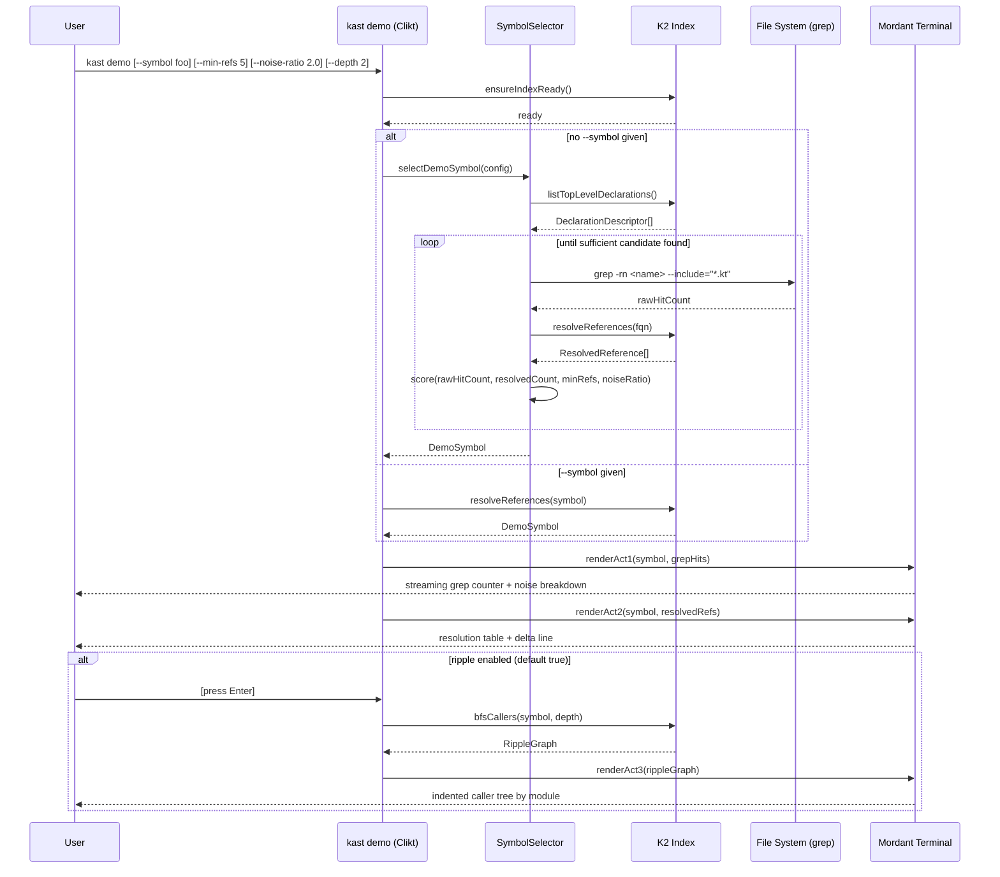

# `kast demo` — Implementation Spec

**Context**: A self-contained subcommand inside the `kast` binary that runs an impromptu,
zero-prep demo of compiler-accurate symbol resolution vs. grep. The goal is a single command
that produces an "oh wait, that's insane" moment in under 60 seconds with no pre-configuration.

**Constraints**:
- Lives inside the existing `kast` Kotlin/Clikt binary — no new processes, no separate tooling
- Rendering via Mordant (already a natural Clikt companion, zero new dependency weight)
- Must work from any Kotlin project root with no arguments
- K2 / Kotlin Analysis API is the resolution backend
- Configuration cache and portability concerns don't apply — this is a demo UX layer

**Inferences**:
- `kast` already has a daemon/index and a Clikt command tree; `demo` is a new leaf subcommand
- The K2 index is already warm (or warmed on `kast demo` invocation) before the demo begins
- "Sufficient" replaces "maximum" as the symbol selection goal — first symbol that clears
  configurable thresholds, not the globally optimal one

---

## Architecture Overview

`kast demo` is a three-act terminal presentation driven by a single `DemoOrchestrator` that
sequences `SymbolSelector → Act1GrepRenderer → Act2ResolutionRenderer → Act3RippleRenderer`.
Each act is a pure rendering concern; all data retrieval is done through the existing `kast`
resolution APIs. The `SymbolSelector` applies a "sufficient demo candidate" heuristic: walk
the K2 declaration index in descending noise-ratio order, return the first symbol that clears
both a minimum-references floor and a minimum grep-to-resolved ratio. This guarantees the demo
is always honest (thresholds are real), fast to select (stops at first hit), and predictable
across codebases.

---

## Sequence Diagram



---

## CLI Contract

```
kast demo [OPTIONS]

Options:
  -s, --symbol TEXT         Fully-qualified symbol name to demo (skips auto-selection)
  --min-refs INT            Minimum resolved reference count to qualify a symbol [default: 5]
  --noise-ratio FLOAT       Minimum ratio of grep hits to resolved refs [default: 2.0]
  --depth INT               BFS depth for ripple traversal in Act 3 [default: 2]
  --no-ripple               Skip Act 3 entirely
  -h, --help                Show this message and exit

Exit codes:
  0   Demo ran successfully
  1   No qualifying symbol found (increase --min-refs or --noise-ratio, or pass --symbol)
  2   K2 index unavailable (run `kast index` first)
```

---

## Component Breakdown

| Component | File | Responsibility |
|-----------|------|----------------|
| `DemoCommand` | `cli/DemoCommand.kt` | Clikt leaf command; owns flags, sequences the three acts, handles `ensureIndexReady` |
| `SymbolSelector` | `demo/SymbolSelector.kt` | Heuristic selection of demo-worthy symbol from K2 index |
| `DemoSymbol` | `demo/DemoSymbol.kt` | Value type: fqn, simpleName, declarationSite, resolvedRefs, grepHits, noiseRatio |
| `GrepRunner` | `demo/GrepRunner.kt` | Thin shell wrapper around `grep -rn`; returns `GrepResult` (hits with file/line/lineText) |
| `GrepCategorizer` | `demo/GrepCategorizer.kt` | Classifies each grep hit as: RESOLVED_MATCH, COMMENT, STRING_LITERAL, UNRELATED_SCOPE |
| `Act1Renderer` | `demo/Act1Renderer.kt` | Mordant streaming counter + noise breakdown panel |
| `Act2Renderer` | `demo/Act2Renderer.kt` | Mordant resolution table + delta summary line |
| `Act3Renderer` | `demo/Act3Renderer.kt` | Mordant indented ripple tree with module-colored nodes |
| `RippleTraverser` | `demo/RippleTraverser.kt` | BFS over K2 caller graph up to configurable depth |

---

## Data Types

```kotlin
// Core value types — no framework dependencies

data class DemoConfig(
    val minRefs: Int = 5,
    val noiseRatio: Double = 2.0,
    val rippleDepth: Int = 2,
    val rippleEnabled: Boolean = true,
    val explicitSymbol: String? = null
)

data class GrepHit(
    val file: String,
    val line: Int,
    val text: String,
    val category: HitCategory
)

enum class HitCategory { RESOLVED_MATCH, COMMENT, STRING_LITERAL, UNRELATED_SCOPE }

data class GrepResult(
    val symbolName: String,
    val hits: List<GrepHit>
) {
    val totalCount get() = hits.size
    fun byCategory() = hits.groupBy { it.category }
}

data class ResolvedReference(
    val file: String,
    val line: Int,
    val kind: String,       // "call", "read", "write", "import"
    val resolvedType: String,
    val module: String
)

data class DemoSymbol(
    val fqn: String,
    val simpleName: String,
    val declarationFile: String,
    val declarationLine: Int,
    val resolvedRefs: List<ResolvedReference>,
    val grepResult: GrepResult
) {
    val noiseRatio get() = grepResult.totalCount.toDouble() / resolvedRefs.size.coerceAtLeast(1)
}

data class RippleNode(
    val symbol: String,
    val module: String,
    val kind: String,
    val depth: Int,
    val children: List<RippleNode> = emptyList()
)
```

---

## SymbolSelector Algorithm

This is the most important component. Get this right.

```
1. listTopLevelDeclarations() from K2 index
   → filter: simpleName.length <= 20 (short names are grep-noisy)
   → filter: not @private visibility (private symbols have no cross-file refs)
   → sort descending by: estimated grep noise (heuristic: prefer common names)
     Use a pre-scored name list for speed: ["id","name","type","execute","handle","build",
     "create","get","set","run","map","parse","load","init","update","apply","invoke","emit"]
     Score = nameListBonus + crossModuleBonus (if K2 reports refs across multiple modules)

2. For each candidate (in scored order):
   a. Run GrepRunner for simpleName
   b. Resolve references via K2 for fqn
   c. Check: resolvedRefs.size >= config.minRefs
              AND grepHits / resolvedRefs >= config.noiseRatio
              AND resolvedRefs span >= 2 distinct files
   d. If all pass → return DemoSymbol immediately (stop iterating)

3. If no candidate found after checking top 20 → fail with exit code 1 and helpful message:
   "No qualifying symbol found in this project. Try --min-refs 3 or --noise-ratio 1.5,
    or specify a symbol directly with --symbol com.example.MyClass.myMethod"
```

**Why "first sufficient" not "global maximum"**: selection speed matters for the demo feel.
Scanning every symbol to find the global maximum adds latency. "Sufficient" means the demo
story is always honest and the selection is perceptibly instant.

---

## Rendering Specification

### Shared Setup

```kotlin
val terminal = Terminal()
// All three acts use the same Terminal instance
// TextColors used throughout: brightCyan, brightYellow, brightGreen, brightRed, gray
```

---

### Act 1 — GrepAct

**Goal**: make the volume of noise visceral. Stream the count live, then categorize it.

**Layout**:
```
┌─────────────────────────────────────────────────────┐
│  Act 1 of 3 — Text Search                           │
│  grep -rn "execute" --include="*.kt"                │
└─────────────────────────────────────────────────────┘

  Scanning... ████████████████████░░░░  38 hits

  ┌──────────────────┬───────┬──────────────────────────────┐
  │ Category         │ Count │ Example                      │
  ├──────────────────┼───────┼──────────────────────────────┤
  │ String literals  │    12 │ "execute this command"       │
  │ Comments         │     9 │ // TODO: execute after init  │
  │ Unrelated scope  │     8 │ SqlRunner.execute(): Unit    │
  │ Possible matches │    19 │                              │
  └──────────────────┴───────┴──────────────────────────────┘

  38 grep hits. No type information. No scope. Just noise.
```

**Implementation notes**:
- Use `terminal.animation {}` for the streaming counter — tick it every 50ms with a fake
  progress fill as lines arrive from the grep process stdout stream
- The progress bar fills based on `hitsSeenSoFar / estimatedTotal` where estimatedTotal
  starts at `resolvedRefs.size * noiseRatio` (known from selection) — feels responsive
- After streaming completes, render the category table via `terminal.println(table {})`
- Pause 1200ms before clearing to let the "38 hits" number land
- The bottom line is rendered in `brightRed` — it's the setup for the punchline

---

### Act 2 — ResolutionAct

**Goal**: surgical contrast. Fewer rows, more information per row.

**Layout**:
```
┌─────────────────────────────────────────────────────┐
│  Act 2 of 3 — Symbol Resolution                     │
│  kast resolve "execute" → WorkflowEngine.execute    │
└─────────────────────────────────────────────────────┘

  Declared in: core/src/main/kotlin/WorkflowEngine.kt:42
  Type:        suspend (context: ExecutionContext) → Result<Unit>

  ┌────────────────────────────────┬──────┬───────┬────────────────────┬──────────────┐
  │ File                           │ Line │ Kind  │ Resolved Type      │ Module       │
  ├────────────────────────────────┼──────┼───────┼────────────────────┼──────────────┤
  │ orchestration/Scheduler.kt     │   87 │ call  │ WorkflowEngine     │ :orchestration│
  │ orchestration/Scheduler.kt     │  143 │ call  │ WorkflowEngine     │ :orchestration│
  │ api/WorkflowResource.kt        │   31 │ call  │ WorkflowEngine     │ :api         │
  │ test/WorkflowEngineTest.kt     │   19 │ call  │ WorkflowEngine     │ :core        │
  │ test/WorkflowEngineTest.kt     │   67 │ call  │ WorkflowEngine     │ :core        │
  │ integration/PipelineRunner.kt  │  204 │ call  │ WorkflowEngine     │ :integration │
  └────────────────────────────────┴──────┴───────┴────────────────────┴──────────────┘

  ──────────────────────────────────────────────────────────────────
  38 text matches  →  6 actual references to WorkflowEngine.execute
  Noise eliminated: 84%
  ──────────────────────────────────────────────────────────────────
```

**Implementation notes**:
- Render the table immediately (no streaming — the instant appearance is itself part of the effect)
- The declaration header line uses `brightCyan` for the fqn
- Module column values are colored by a rotating palette from a fixed set of 6 `TextColors`
  (stable per module name, not per row — use `moduleName.hashCode() % palette.size`)
- The delta summary block uses `brightGreen` for the reference count and percentage
- If `rippleEnabled`, append below the summary: `  [Enter] → explore caller graph`
  in `gray`

---

### Act 3 — RippleAct

**Goal**: show the graph is live and navigable, not a static list.

**Layout**:
```
┌─────────────────────────────────────────────────────┐
│  Act 3 of 3 — Caller Graph (depth 2)                │
└─────────────────────────────────────────────────────┘

  WorkflowEngine.execute                       [:core]
  ├── Scheduler.scheduleNext()                 [:orchestration]
  │   ├── PipelineCoordinator.start()          [:integration]
  │   └── RetryPolicy.attempt()                [:orchestration]
  ├── WorkflowResource.POST /workflows/run     [:api]
  │   └── AuthMiddleware.withContext()         [:api]
  └── PipelineRunner.executePipeline()         [:integration]
      └── BatchProcessor.processBatch()        [:integration]

  4 modules. 8 symbols reachable in 2 hops.
  Every edge is a compiler-verified call site.
```

**Implementation notes**:
- `RippleTraverser` does BFS via K2 `findCallers(fqn)` for each node up to `depth`
- Render via recursive `printTree()` — build the prefix string (`├──`, `│   `, `└──`)
  manually; no library needed for this
- Module label `[:module]` right-aligned to terminal width using `terminal.info.width`
- Module names colored with the same stable palette from Act 2 (visual continuity)
- Root node in `brightCyan`, depth-1 nodes in `brightYellow`, depth-2+ nodes in default
- Summary line at bottom: `brightGreen` for counts, `gray` for the last sentence
- After rendering, hold — don't exit. Print `  kast demo --symbol <fqn> --depth 3` in
  gray as a hint that they can go deeper

---

## File Layout within `kast`

```
kast/
├── cli/
│   └── DemoCommand.kt           ← Clikt subcommand, registered on root command
└── demo/
    ├── DemoConfig.kt
    ├── DemoSymbol.kt
    ├── GrepHit.kt / GrepResult.kt
    ├── GrepRunner.kt
    ├── GrepCategorizer.kt
    ├── ResolvedReference.kt
    ├── RippleNode.kt
    ├── SymbolSelector.kt
    ├── RippleTraverser.kt
    ├── DemoOrchestrator.kt      ← sequences the three acts; owns Terminal instance
    ├── Act1Renderer.kt
    ├── Act2Renderer.kt
    └── Act3Renderer.kt
```

`DemoCommand` is a thin Clikt shell — it reads flags, constructs `DemoConfig`, calls
`DemoOrchestrator.run(config)`, and handles exit code mapping from thrown exceptions.
All logic lives in `demo/`.

---

## Dependencies

Add to the `kast` module's `build.gradle.kts` if not already present:

```kotlin
dependencies {
    implementation("com.github.ajalt.mordant:mordant:2.7.2")
    // clikt already present (assumed)
    // kotlin-analysis-api already present (assumed)
}
```

No other new dependencies. Mordant's `mordant-jvm` artifact bundles ANSI detection and
the full rendering API. Do not add Mosaic — it's Compose-based and adds startup overhead
that breaks the snappy feel.

---

## Implementation Order

Build in this sequence — each step is independently testable:

1. **`GrepRunner` + `GrepCategorizer`** — pure filesystem + string logic, no K2 needed.
   Write a unit test against a fixture `.kt` file. Categorization heuristic:
   - Line trimmed starts with `//` or `*` → `COMMENT`
   - Symbol appears inside a double-quoted region on the line → `STRING_LITERAL`
   - Remaining hits: compare file+line against K2 resolved refs list →
     `RESOLVED_MATCH` if present, `UNRELATED_SCOPE` if not

2. **`SymbolSelector`** — depends on GrepRunner + K2. The selection loop is the core
   algorithm; validate it returns a reasonable symbol on 2-3 real Kotlin projects before
   proceeding.

3. **`Act2Renderer`** — start with the static table. This is the visual centerpiece and
   the easiest to get right without animation complexity. Get the column widths and
   module coloring working first.

4. **`Act1Renderer`** — add the animation layer. Use `terminal.animation { state -> ... }`
   where state is `Pair<Int, Boolean>` (hitsCount, done). Drive state updates from a
   coroutine that reads the grep process stdout line-by-line.

5. **`RippleTraverser` + `Act3Renderer`** — wire BFS and the tree printer last. The
   tree rendering is straightforward once the data structure is right.

6. **`DemoOrchestrator` + `DemoCommand`** — wire everything together. Add the "press
   Enter to continue" gate between acts.

---

## Edge Cases the Agent Must Handle

- **Zero grep hits**: symbol is too obscure for grep to find at all — skip this candidate
  in `SymbolSelector`, don't crash
- **Resolved refs > grep hits** (noiseRatio < 1.0): symbol appears in generated or
  compiled-only code. Skip this candidate.
- **Terminal too narrow** (< 80 cols): skip the table borders, render plain aligned text.
  Check `terminal.info.width` before table render.
- **No callers at depth 1** (Act 3): render a single-node tree with the message
  `"No callers found — this is a root entry point"` below it. Do not crash or skip Act 3.
- **K2 index cold**: `DemoCommand` should call `ensureIndexReady()` and print a
  `"Warming index..."` spinner via Mordant `animation` before running selection.
  If index warm time > 5s, print estimated time remaining.
